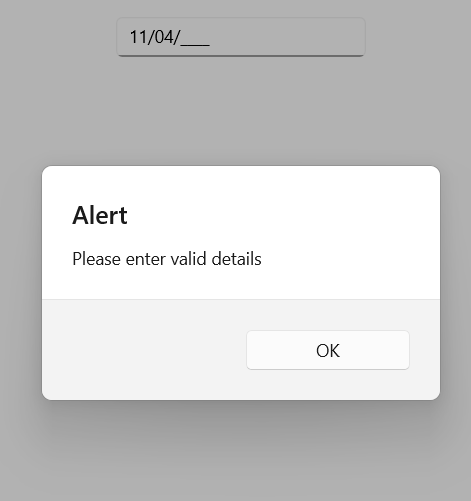

# Validation in in .NET MAUI Masked Entry (SfMaskedEntry)

## Validation Mode

Input validation happens based on the value of the `ValidationMode` property. The enum values of this property are:

* KeyPress
* LostFocus

The default value for validation mode is `KeyPress`.



<editors:SfMaskedEntry x:Name="maskedEntry"
                        WidthRequest="200"
                        MaskType="Simple" Mask="00/00/0000" ValidationMode="KeyPress"/>


maskedEntry.ValidationMode = InputValidationMode.KeyPress;



When the ValidationMode is LostFocus, the validation takes place when the control lost its focus. For KeyPress, the validation triggers for each key press.

## HasError

This read only property is used to check whether the validation succeeds or not. It returns true once validation succeeds or else returns false. The following code example shows the usage of `HasError` property.



SfMaskedEntry maskedEntry = new SfMaskedEntry();
maskedEntry.MaskType = MaskedEntryMaskType.Simple;
maskedEntry.Mask = "00/00/0000";
maskedEntry.ValidationMode = InputValidationMode.LostFocus;
maskedEntry.ValueChanged += maskedEntry_ValueChanged;

 private void maskedEntry_ValueChanged(object sender, Syncfusion.Maui.Inputs.MaskedEntryValueChangedEventArgs e)
 {
     SfMaskedEntry maskedEntry = sender as SfMaskedEntry;
     if (maskedEntry.HasError)
     {
         DisplayAlert("Alert", "Please enter valid details", "OK");
     }
 }



