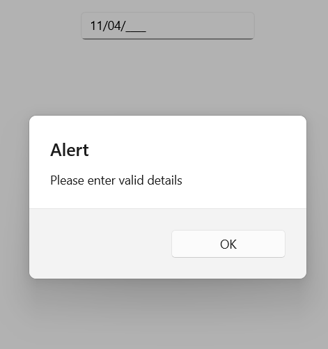

# Validation in .NET MAUI Masked Entry

The SfMaskedEntry control validates user input against the configured `Mask` and exposes the result through the [HasError](#haserror) property. Use the [ValidationMode](#validation-mode) property to choose when validation is performed.

## Prerequisites

Before using the [SfMaskedEntry](https://help.syncfusion.com/cr/maui/Syncfusion.Maui.Inputs.SfMaskedEntry.html), Install the [Syncfusion.Maui.Inputs](https://www.nuget.org/packages/Syncfusion.Maui.Inputs) NuGet package in your .NET MAUI project.

For a step-by-step setup, refer to the [Getting Started](getting-started.md) documentation.

## Validation Mode

Use the [ValidationMode](https://help.syncfusion.com/cr/maui/Syncfusion.Maui.Inputs.SfMaskedEntry.html#Syncfusion_Maui_Inputs_SfMaskedEntry_ValidationMode) property of type [InputValidationMode](https://help.syncfusion.com/cr/maui/Syncfusion.Maui.Inputs.InputValidationMode.html) to choose when the input is validated. The available enum values are:

- [`KeyPress`](https://help.syncfusion.com/cr/maui/Syncfusion.Maui.Inputs.InputValidationMode.html#Syncfusion_Maui_Inputs_InputValidationMode_KeyPress): validation is triggered for each key press.
- [`LostFocus`](https://help.syncfusion.com/cr/maui/Syncfusion.Maui.Inputs.InputValidationMode.html#Syncfusion_Maui_Inputs_InputValidationMode_LostFocus): validation is performed only when the control loses focus.

The default value is `KeyPress`. The selected mode works the same for both `Simple` and `RegEx` [MaskType](mask-types.md) values.




<editors:SfMaskedEntry x:Name="maskedEntry"
                       WidthRequest="200"
                       MaskType="Simple"
                       Mask="00/00/0000"
                       ValidationMode="KeyPress"/>




SfMaskedEntry maskedEntry = new SfMaskedEntry
{
    WidthRequest = 200,
    MaskType = MaskedEntryMaskType.Simple,
    Mask = "00/00/0000",
    ValidationMode = InputValidationMode.KeyPress
};




The following image illustrates the validation behavior: with `LostFocus`, the `HasError` flag becomes `true` only after the user leaves the control, while with `KeyPress` it is updated on every keystroke.

## HasError

The [HasError](https://help.syncfusion.com/cr/maui/Syncfusion.Maui.Inputs.SfMaskedEntry.html#Syncfusion_Maui_Inputs_SfMaskedEntry_HasError) property of type `bool` indicates the result of the most recent validation. It is a read-only property that returns `true` when validation **fails** and `false` when validation succeeds. The property is updated only after a `ValueChanged` event, so check it inside the event handler (or use a `Binding` to react to the change in MVVM scenarios).

`HasError` is `true` while the input is incomplete for the configured `Simple` mask (for example, an unfinished date), or when the typed value does not match the `RegEx` pattern.

The following example shows how to surface the validation result in the UI. Bind the `HasError` property to a `Label.IsVisible` (or a `Label.Text` for a custom error message) to avoid relying on `DisplayAlert` for inline validation feedback.



<VerticalStackLayout>
    <editors:SfMaskedEntry x:Name="maskedEntry"
                           WidthRequest="200"
                           MaskType="Simple"
                           Mask="00/00/0000"
                           ValidationMode="LostFocus"/>
    <Label Text="Please enter a valid date."
           TextColor="Red"
           IsVisible="{Binding HasError, Source={x:Reference maskedEntry}}"/>
</VerticalStackLayout>



SfMaskedEntry maskedEntry = new SfMaskedEntry
{
    WidthRequest = 200,
    MaskType = MaskedEntryMaskType.Simple,
    Mask = "00/00/0000",
    ValidationMode = InputValidationMode.LostFocus
};
maskedEntry.ValueChanged += MaskedEntry_ValueChanged;

private void MaskedEntry_ValueChanged(object sender, MaskedEntryValueChangedEventArgs e)
{
    if (sender is SfMaskedEntry entry && entry.HasError)
    {
        var page = Application.Current?.Windows[0]?.Page;
        page?.DisplayAlert("Alert", "Please enter valid details", "OK");
    }
}




The following image illustrates an invalid input that triggers `HasError = true`:

## See Also

* [Getting Started](getting-started.md)
* [Basic Features](basic-features.md)
* [Mask Types](Mask-Types.md)
* [Formatting Value](formatting-value.md)
