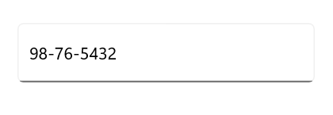
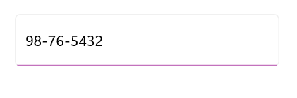
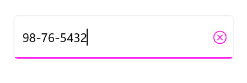
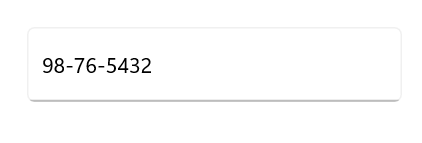

# Visual States in .NET MAUI Masked Entry

Visual states let you change the appearance of [.NET MAUI Masked Entry](https://help.syncfusion.com/cr/maui/Syncfusion.Maui.Inputs.SfMaskedEntry.html) in response to user interaction. Use them to apply different colors, borders, or other properties for each state without writing code-behind handlers.

`Masked Entry` supports the following visual states through the [`VisualStateManager`](https://learn.microsoft.com/en-us/dotnet/maui/user-interface/visual-states?view=net-maui-10.0):

* `Normal` - The default resting state of the Masked Entry.
* `Focused` - The Masked Entry has keyboard or input focus.
* `Disabled` - The Masked Entry is disabled (`IsEnabled` is `false`).
* `Hover` - The pointer is over the Masked Entry (desktop platforms).

## Prerequisites

Before using the [SfMaskedEntry](https://help.syncfusion.com/cr/maui/Syncfusion.Maui.Inputs.SfMaskedEntry.html), ensure the following NuGet package is installed in your .NET MAUI project:

- `Syncfusion.Maui.Inputs`

For a step-by-step setup, refer to the [Getting Started](https://help.syncfusion.com/maui/masked-entry/getting-started) documentation.

## Defining visual states

`Masked Entry` exposes its visual states through a single `VisualStateGroup` named `CommonStates`. Each `VisualState` contains a collection of `Setter` objects that target bindable properties on the Masked Entry. Commonly customized properties include `Stroke`, `TextColor` and `ClearButtonColor`.




<editors:SfMaskedEntry x:Name="maskedEntry"
           WidthRequest="250" 
           HeightRequest="50"
           Value="9876543201"
           Mask="(000) 000-0000"
           ClearButtonVisibility="WhileEditing"
           Placeholder="Enter a value">
    <VisualStateManager.VisualStateGroups>
        <VisualStateGroup x:Name="CommonStates">
            <VisualState x:Name="Normal">
                <VisualState.Setters>
                    <Setter Property="Stroke" Value="#707070" />
                    <Setter Property="TextColor" Value="Black" />
                    <Setter Property="ClearButtonColor" Value="#707070" />
                </VisualState.Setters>
            </VisualState>
            <VisualState x:Name="Focused">
                <VisualState.Setters>
                    <Setter Property="Stroke" Value="#f903e9" />
                    <Setter Property="TextColor" Value="Black" />
                    <Setter Property="ClearButtonColor" Value="#f903e9" />
                </VisualState.Setters>
            </VisualState>
            <VisualState x:Name="PointerOver">
                <VisualState.Setters>
                    <Setter Property="Stroke" Value="#c372bd" />
                    <Setter Property="TextColor" Value="Black" />
                    <Setter Property="ClearButtonColor" Value="#c372bd" />
                </VisualState.Setters>
            </VisualState>
            <VisualState x:Name="Disabled">
                <VisualState.Setters>
                    <Setter Property="Stroke" Value="#BDBDBD" />
                    <Setter Property="TextColor" Value="Black" />
                    <Setter Property="ClearButtonColor" Value="#BDBDBD" />
                </VisualState.Setters>
            </VisualState>
        </VisualStateGroup>
    </VisualStateManager.VisualStateGroups>
</editors:SfMaskedEntry>
            



SfMaskedEntry maskedEntry = new SfMaskedEntry
{
    WidthRequest = 250,
    HeightRequest = 50,
    Placeholder = "Enter a value",
};
VisualStateGroupList visualStateGroupList = new VisualStateGroupList();
VisualStateGroup commonStateGroup = new VisualStateGroup { Name = "CommonStates" };

VisualState normalState = new VisualState { Name = "Normal" };
normalState.Setters.Add(new Setter { Property = SfMaskedEntry.StrokeProperty, Value = Color.FromArgb("#707070") });
normalState.Setters.Add(new Setter { Property = SfMaskedEntry.TextColorProperty, Value = Colors.Black });
normalState.Setters.Add(new Setter { Property = SfMaskedEntry.ClearButtonColorProperty, Value = Color.FromArgb("#707070") });

VisualState focusedState = new VisualState { Name = "Focused" };
focusedState.Setters.Add(new Setter { Property = SfMaskedEntry.StrokeProperty, Value = Color.FromArgb("#f903e9") });
focusedState.Setters.Add(new Setter { Property = SfMaskedEntry.TextColorProperty, Value = Colors.Black });
focusedState.Setters.Add(new Setter { Property = SfMaskedEntry.ClearButtonColorProperty, Value = Color.FromArgb("#f903e9") });

VisualState pointerOverState = new VisualState { Name = "PointerOver" };
pointerOverState.Setters.Add(new Setter { Property = SfMaskedEntry.StrokeProperty, Value = Color.FromArgb("#c372bd") });
pointerOverState.Setters.Add(new Setter { Property = SfMaskedEntry.TextColorProperty, Value = Colors.Black });
pointerOverState.Setters.Add(new Setter { Property = SfMaskedEntry.ClearButtonColorProperty, Value = Color.FromArgb("#c372bd") });

VisualState disabledState = new VisualState { Name = "Disabled" };
disabledState.Setters.Add(new Setter { Property = SfMaskedEntry.StrokeProperty, Value = Color.FromArgb("#BDBDBD") });
disabledState.Setters.Add(new Setter { Property = SfMaskedEntry.TextColorProperty, Value = Colors.Black });
disabledState.Setters.Add(new Setter { Property = SfMaskedEntry.ClearButtonColorProperty, Value = Color.FromArgb("#BDBDBD") });

commonStateGroup.States.Add(normalState);
commonStateGroup.States.Add(focusedState);
commonStateGroup.States.Add(pointerOverState);
commonStateGroup.States.Add(disabledState);

visualStateGroupList.Add(commonStateGroup);
VisualStateManager.SetVisualStateGroups(maskedEntry, visualStateGroupList);
Content = maskedEntry;




### Normal visual state

### Hover visual state

### Focused visual state

### Disabled visual state

## See Also

* [Getting Started](https://help.syncfusion.com/maui/masked-entry/getting-started)
* [Basic Features](https://help.syncfusion.com/maui/masked-entry/basic-features)
* [Mask Types](https://help.syncfusion.com/maui/masked-entry/mask-types)
* [Formatting Value](https://help.syncfusion.com/maui/masked-entry/formatting-value)
