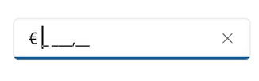

# Culture in MAUI MaskedEntry

The MaskedEntry allows you to set any [Culture]support for currency symbols, date separators, time separators, group separators, and decimal separators by using the below special symbols.

<table>
<tr>
<th>
Characters</th><th>
Description</th>
</tr>
<tr>
<td>
.
</td>
<td>
Decimal separator determined by current culture.
</td>
</tr>
<tr>
<td>
,
</td>
<td>
Group separator determined by current culture.
</td>
</tr>
<tr>
<td>
/
</td>
<td>
Date separator determined by current culture.
</td>
</tr>
<tr>
<td>
:
</td>
<td>
Time separator determined by current culture.
</td>
</tr>
<tr>
<td>
$
</td>
<td>
Currency symbol determined by current culture.
</td>
</tr>
</table>

The following example shows how to set the the France culture for currency symbol, group separator and decimal separator.




SfMaskedEntry maskedEntry;
public MainPage()
{
    InitializeComponent();
    maskedEntry = new SfMaskedEntry();
    maskedEntry.Width = "200";
    maskedEntry.MaskType = MaskedEntryMaskType.Simple;
    maskedEntry.Mask = "$ 0,000.00";
    maskedEntry.Culture = new CultureInfo("fr-FR");
    this.Content = maskedEntry;
} 




Based on the France Culture, the ‘$’ will be localized to ‘€’; ‘.’ will be localized to ‘,’ and ‘,’ will be localized to ‘ ‘(single white space).

