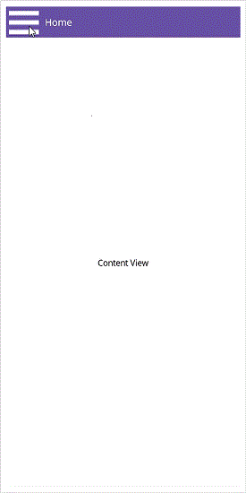

# Animation Duration in .NET MAUI Navigation Drawer (SfNavigationDrawer)

## Animation Duration in SfNavigationDrawer

The [Duration](https://help.syncfusion.com/cr/maui/Syncfusion.Maui.NavigationDrawer.DrawerSettings.html#Syncfusion_Maui_NavigationDrawer_DrawerSettings_Duration) property of the [SfNavigationDrawer](https://help.syncfusion.com/cr/maui/Syncfusion.Maui.NavigationDrawer.SfNavigationDrawer.html) indicates the timeline for completing one animation cycle. Setting a smaller duration value accelerates animation speed.





<navigationdrawer:SfNavigationDrawer x:Name="navigationDrawer">
    <navigationdrawer:SfNavigationDrawer.DrawerSettings>
        <navigationdrawer:DrawerSettings  Duration="200"/>
    </navigationdrawer:SfNavigationDrawer.DrawerSettings>
</navigationdrawer:SfNavigationDrawer>





SfNavigationDrawer navigationDrawer = new SfNavigationDrawer();
navigationDrawer.DrawerSettings = new DrawerSettings()
{
    Duration = 200,
};
this.Content = navigationDrawer;





N> The [Duration](https://help.syncfusion.com/cr/maui/Syncfusion.Maui.NavigationDrawer.DrawerSettings.html#Syncfusion_Maui_NavigationDrawer_DrawerSettings_Duration) property for the [SfNavigationDrawer](https://help.syncfusion.com/cr/maui/Syncfusion.Maui.NavigationDrawer.SfNavigationDrawer.html) is measured in milliseconds.

The following screenshot illustrates the result of the above code.

## See also 

[How to Customize the Animation Duration in .NET MAUI Navigation Drawer?](https://support.syncfusion.com/kb/article/15504/how-to-customize-the-animation-duration-in-net-maui-navigation-drawer)