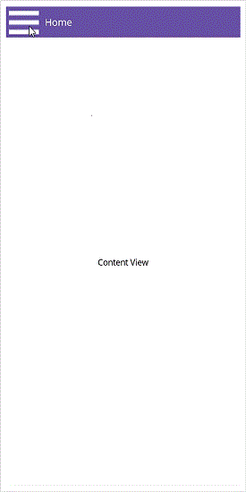

# Animation Duration in .NET MAUI Navigation Drawer

## Prerequisites

Before using the [SfNavigationDrawer](https://help.syncfusion.com/cr/maui/Syncfusion.Maui.NavigationDrawer.SfNavigationDrawer.html), ensure the following NuGet package is installed in your .NET MAUI project:

- `Syncfusion.Maui.NavigationDrawer`

For step-by-step setup, refer to the [Getting Started](https://help.syncfusion.com/maui/navigationdrawer/getting-started) documentation.

## Duration

The [Duration](https://help.syncfusion.com/cr/maui/Syncfusion.Maui.NavigationDrawer.DrawerSettings.html#Syncfusion_Maui_NavigationDrawer_DrawerSettings_Duration) property of the [Navigation Drawer](https://help.syncfusion.com/cr/maui/Syncfusion.Maui.NavigationDrawer.SfNavigationDrawer.html) specifies the timeline for completing one animation cycle. Setting a smaller duration value accelerates animation speed.

The following code example illustrates how to set the animation duration of the Navigation Drawer.




<navigationDrawer:SfNavigationDrawer x:Name="navigationDrawer">
    <navigationDrawer:SfNavigationDrawer.DrawerSettings>
        <navigationDrawer:DrawerSettings Duration="2000"/>
    </navigationDrawer:SfNavigationDrawer.DrawerSettings>
</navigationDrawer:SfNavigationDrawer>




SfNavigationDrawer navigationDrawer = new SfNavigationDrawer
{
    DrawerSettings = new DrawerSettings
    {
        Duration = 2000
    }
};



N> The `Duration` property for the `Navigation Drawer` is measured in milliseconds.

The following screenshot illustrates the result of the above code.

## See also

- [How to Customize the Animation Duration in .NET MAUI Navigation Drawer?](https://support.syncfusion.com/kb/article/15504/how-to-customize-the-animation-duration-in-net-maui-navigation-drawer)
- [Setting Toggle Animations in .NET MAUI Navigation Drawer](https://help.syncfusion.com/maui/navigationdrawer/toggle-animations)
- [Set Sliding Panel Content in .NET MAUI Navigation Drawer](https://help.syncfusion.com/maui/navigationdrawer/side-pane-content)
- [Setting Sliding Panel Size in .NET MAUI Navigation Drawer](https://help.syncfusion.com/maui/navigationdrawer/side-pane-sizing)