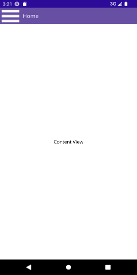
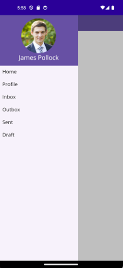

>**Notice:** After **Volume 1 2025 (Mid of March 2025)**, feature enhancements for this control will no longer be available in the Syncfusion® package. Please switch to the **Syncfusion® Toolkit for .NET MAUI** for continued support. For a smooth transition, refer to this [migration document](https://help.syncfusion.com/maui-toolkit/migration).

# Getting Started with .NET MAUI Navigation Drawer

This section guides you through setting up and configuring a [SfNavigationDrawer](https://help.syncfusion.com/cr/maui/Syncfusion.Maui.NavigationDrawer.SfNavigationDrawer.html) in your .NET MAUI application. Follow the steps below to add a basic Navigation Drawer to your project.

To quickly get started with the .NET MAUI Navigation Drawer, watch this video.






## Prerequisites

Before proceeding, ensure the following are set up:

1. Install [.NET 8 SDK](https://dotnet.microsoft.com/en-us/download/dotnet/8.0) or later.
2. Set up a .NET MAUI environment with Visual Studio 2022 (v17.3 or later).

## Step 1: Create a new .NET MAUI project

1. Go to **File > New > Project** and choose the **.NET MAUI App** template.
2. Name the project and choose a location. Then, click **Next**.
3. Select the .NET framework version and click **Create**.

## Step 2: Install the Syncfusion® MAUI Navigation Drawer NuGet package

1. In **Solution Explorer**, right-click the project and choose **Manage NuGet Packages**.
2. Search for [Syncfusion.Maui.NavigationDrawer](https://www.nuget.org/packages/Syncfusion.Maui.NavigationDrawer) and install the latest version.
3. Ensure the necessary dependencies are installed correctly, and the project is restored.

## Step 3: Register the handler

The [Syncfusion.Maui.Core](https://www.nuget.org/packages/Syncfusion.Maui.Core/) NuGet is a dependent package for all Syncfusion® controls in .NET MAUI. In the `MauiProgram.cs` file, register the handler for Syncfusion® core.


using Microsoft.Extensions.Logging;
using Syncfusion.Maui.Core.Hosting;

namespace NavigationDrawerGettingStarted
{
    public static class MauiProgram
    {
    public static MauiApp CreateMauiApp()
    {
        var builder = MauiApp.CreateBuilder();
        builder
        .UseMauiApp<App>()
        .ConfigureSyncfusionCore()
        .ConfigureFonts(fonts =>
        {
            fonts.AddFont("OpenSans-Regular.ttf", "OpenSansRegular");
        });

        return builder.Build();
        }      
    }
}     



## Step 4: Add a basic Navigation Drawer

1. To initialize the control, import the Navigation Drawer namespace into your code.

2. Initialize [SfNavigationDrawer](https://help.syncfusion.com/cr/maui/Syncfusion.Maui.NavigationDrawer.SfNavigationDrawer.html).




<ContentPage
    . . .    
    xmlns:navigationDrawer="clr-namespace:Syncfusion.Maui.NavigationDrawer;assembly=Syncfusion.Maui.NavigationDrawer">
    <navigationDrawer:SfNavigationDrawer x:Name="navigationDrawer">
    <navigationDrawer:SfNavigationDrawer.ContentView>
        <Grid/>
    </navigationDrawer:SfNavigationDrawer.ContentView>
    </navigationDrawer:SfNavigationDrawer>
</ContentPage>




    using Syncfusion.Maui.NavigationDrawer;
    namespace NavigationDrawerGettingStarted
    {
        public partial class MainPage : ContentPage
        {
            public MainPage()
            {
                InitializeComponent();           
                SfNavigationDrawer navigationDrawer = new SfNavigationDrawer();
                Grid grid = new Grid();
                navigationDrawer.ContentView = grid;
                this.Content = navigationDrawer; 
            }
        }   
    }







## Prerequisites

Before proceeding, ensure the following are set up:

1. Install [.NET 8 SDK](https://dotnet.microsoft.com/en-us/download/dotnet/8.0) or later.
2. Set up a .NET MAUI environment with Visual Studio Code.
3. Ensure that the .NET MAUI extension is installed and configured as described [here](https://learn.microsoft.com/en-us/dotnet/maui/get-started/installation?view=net-maui-8.0&tabs=visual-studio-code).

## Step 1: Create a new .NET MAUI project

1. Open the command palette by pressing `Ctrl+Shift+P` and type **.NET:New Project** and enter.
2. Choose the **.NET MAUI App** template.
3. Select the project location, type the project name and press **Enter**.
4. Then choose **Create project**.

## Step 2: Install the Syncfusion® MAUI Navigation Drawer NuGet package

1. Press <kbd>Ctrl</kbd> + <kbd>`</kbd> (backtick) to open the integrated terminal in Visual Studio Code.
2. Ensure you're in the project root directory where your .csproj file is located.
3. Run the command `dotnet add package Syncfusion.Maui.NavigationDrawer` to install the Syncfusion® .NET MAUI Navigation Drawer package.
4. To ensure all dependencies are installed, run `dotnet restore`.

## Step 3: Register the handler

The [Syncfusion.Maui.Core](https://www.nuget.org/packages/Syncfusion.Maui.Core/) NuGet is a dependent package for all Syncfusion® controls of .NET MAUI. In the `MauiProgram.cs` file, register the handler for Syncfusion® core.


using Microsoft.Extensions.Logging;
using Syncfusion.Maui.Core.Hosting;

namespace NavigationDrawerGettingStarted
{
    public static class MauiProgram
    {
    public static MauiApp CreateMauiApp()
    {
        var builder = MauiApp.CreateBuilder();
        builder
        .UseMauiApp<App>()
        .ConfigureSyncfusionCore()
        .ConfigureFonts(fonts =>
        {
            fonts.AddFont("OpenSans-Regular.ttf", "OpenSansRegular");
        });

        return builder.Build();
        }      
    }
}     



## Step 4: Add a basic Navigation Drawer

1. To initialize the control, import the Navigation Drawer namespace into your code.

2. Initialize [SfNavigationDrawer](https://help.syncfusion.com/cr/maui/Syncfusion.Maui.NavigationDrawer.SfNavigationDrawer.html).




<ContentPage
    . . .    
    xmlns:navigationDrawer="clr-namespace:Syncfusion.Maui.NavigationDrawer;assembly=Syncfusion.Maui.NavigationDrawer">
    <navigationDrawer:SfNavigationDrawer x:Name="navigationDrawer">
    <navigationDrawer:SfNavigationDrawer.ContentView>
        <Grid/>
    </navigationDrawer:SfNavigationDrawer.ContentView>
    </navigationDrawer:SfNavigationDrawer>
</ContentPage>




    using Syncfusion.Maui.NavigationDrawer;
    namespace NavigationDrawerGettingStarted
    {
        public partial class MainPage : ContentPage
        {
            public MainPage()
            {
                InitializeComponent();           
                SfNavigationDrawer navigationDrawer = new SfNavigationDrawer();
                Grid grid = new Grid();
                navigationDrawer.ContentView = grid;
                this.Content = navigationDrawer; 
            }
        }   
    }








## Prerequisites

Before proceeding, ensure the following are set up:

1. Ensure you have the latest version of JetBrains Rider.
2. Install [.NET 8 SDK](https://dotnet.microsoft.com/en-us/download/dotnet/8.0) or later.
3. Make sure the MAUI workloads are installed and configured as described [here](https://www.jetbrains.com/help/rider/MAUI.html#before-you-start).

## Step 1: Create a new .NET MAUI project

1. Go to **File > New Solution**, select .NET (C#) and choose the **.NET MAUI App** template.
2. Enter the Project Name, Solution Name, and Location.
3. Select the .NET framework version and click **Create**.

## Step 2: Install the Syncfusion® MAUI Navigation Drawer NuGet package

1. In **Solution Explorer**, right-click the project and choose **Manage NuGet Packages**.
2. Search for [Syncfusion.Maui.NavigationDrawer](https://www.nuget.org/packages/Syncfusion.Maui.Core/) and install the latest version.
3. Ensure the necessary dependencies are installed correctly, and the project is restored. If not, open the Terminal in Rider and manually run: `dotnet restore`.

## Step 3: Register the handler

The [Syncfusion.Maui.Core](https://www.nuget.org/packages/Syncfusion.Maui.Core/) NuGet is a dependent package for all Syncfusion® controls of .NET MAUI. In the `MauiProgram.cs` file, register the handler for Syncfusion® core.


using Microsoft.Extensions.Logging;
using Syncfusion.Maui.Core.Hosting;

namespace NavigationDrawerGettingStarted
{
    public static class MauiProgram
    {
    public static MauiApp CreateMauiApp()
    {
        var builder = MauiApp.CreateBuilder();
        builder
        .UseMauiApp<App>()
        .ConfigureSyncfusionCore()
        .ConfigureFonts(fonts =>
        {
            fonts.AddFont("OpenSans-Regular.ttf", "OpenSansRegular");
        });

        return builder.Build();
        }      
    }
}     



## Step 4: Add a basic Navigation Drawer

1. To initialize the control, import the Navigation Drawer namespace into your code.

2. Initialize [SfNavigationDrawer](https://help.syncfusion.com/cr/maui/Syncfusion.Maui.NavigationDrawer.SfNavigationDrawer.html).




<ContentPage
    . . .    
    xmlns:navigationDrawer="clr-namespace:Syncfusion.Maui.NavigationDrawer;assembly=Syncfusion.Maui.NavigationDrawer">
    <navigationDrawer:SfNavigationDrawer x:Name="navigationDrawer">
    <navigationDrawer:SfNavigationDrawer.ContentView>
        <Grid/>
    </navigationDrawer:SfNavigationDrawer.ContentView>
    </navigationDrawer:SfNavigationDrawer>
</ContentPage>




    using Syncfusion.Maui.NavigationDrawer;
    namespace NavigationDrawerGettingStarted
    {
        public partial class MainPage : ContentPage
        {
            public MainPage()
            {
                InitializeComponent();           
                SfNavigationDrawer navigationDrawer = new SfNavigationDrawer();
                Grid grid = new Grid();
                navigationDrawer.ContentView = grid;
                this.Content = navigationDrawer; 
            }
        }   
    }







N> It is mandatory to set [ContentView](https://help.syncfusion.com/cr/maui/Syncfusion.Maui.NavigationDrawer.SfNavigationDrawer.html#Syncfusion_Maui_NavigationDrawer_SfNavigationDrawer_ContentView) for [SfNavigationDrawer](https://help.syncfusion.com/cr/maui/Syncfusion.Maui.NavigationDrawer.SfNavigationDrawer.html) upon initializing.

## Adjust drawer size

The default position of the navigation pane is on the left. Change the drawer width to 250 using the [DrawerWidth](https://help.syncfusion.com/cr/maui/Syncfusion.Maui.NavigationDrawer.DrawerSettings.html#Syncfusion_Maui_NavigationDrawer_DrawerSettings_DrawerWidth) property.




<navigationDrawer:SfNavigationDrawer x:Name="navigationDrawer">
    <navigationDrawer:SfNavigationDrawer.DrawerSettings>
        <navigationDrawer:DrawerSettings DrawerWidth="250"/>
    </navigationDrawer:SfNavigationDrawer.DrawerSettings>
    <navigationDrawer:SfNavigationDrawer.ContentView>
        <Grid/>
    </navigationDrawer:SfNavigationDrawer.ContentView>
</navigationDrawer:SfNavigationDrawer>





using Syncfusion.Maui.NavigationDrawer;

namespace NavigationDrawerGettingStarted;

public partial class MainPage : ContentPage
{
	public MainPage()
	{
		InitializeComponent();
        SfNavigationDrawer navigationDrawer = new SfNavigationDrawer();
        Grid grid = new Grid();
        navigationDrawer.ContentView = grid;
        navigationDrawer.DrawerSettings = new DrawerSettings()
        {
            DrawerWidth = 250,
        };
        this.Content = navigationDrawer;
    }
}




N> To change the side of the navigation pane, utilize the [Position](https://help.syncfusion.com/cr/maui/Syncfusion.Maui.NavigationDrawer.DrawerSettings.html#Syncfusion_Maui_NavigationDrawer_DrawerSettings_Position) property. Adjust the drawer height in the Top and Bottom positions using the [DrawerHeight](https://help.syncfusion.com/cr/maui/Syncfusion.Maui.NavigationDrawer.DrawerSettings.html#Syncfusion_Maui_NavigationDrawer_DrawerSettings_DrawerHeight) property.

## Add hamburger menu for toggling drawer

Create an ImageButton and set the required image to the `Source` property. Ensure the image is placed in the `Resources/Images` directory. Subscribe to the Clicked event of the button and invoke the [ToggleDrawer()](https://help.syncfusion.com/cr/maui/Syncfusion.Maui.NavigationDrawer.SfNavigationDrawer.html#Syncfusion_Maui_NavigationDrawer_SfNavigationDrawer_ToggleDrawer) method to toggle the drawer. Properly align the layout of [ContentView](https://help.syncfusion.com/cr/maui/Syncfusion.Maui.NavigationDrawer.SfNavigationDrawer.html#Syncfusion_Maui_NavigationDrawer_SfNavigationDrawer_ContentView) to position the hamburger icon at the top left, as demonstrated in the following code.




<navigationDrawer:SfNavigationDrawer x:Name="navigationDrawer">
    <navigationDrawer:SfNavigationDrawer.DrawerSettings>
        <navigationDrawer:DrawerSettings DrawerWidth="250"/>
    </navigationDrawer:SfNavigationDrawer.DrawerSettings>
    <navigationDrawer:SfNavigationDrawer.ContentView>
        <Grid x:Name="mainContentView" 
          BackgroundColor="White" RowDefinitions="Auto,*">
            <HorizontalStackLayout BackgroundColor="#6750A4" Spacing="10" Padding="5,0,0,0">
                <ImageButton x:Name="hamburgerButton"
                             HeightRequest="50"
                             WidthRequest="50"
                             HorizontalOptions="Start"
                             Source="hamburgericon.png"
                             BackgroundColor="#6750A4"
                             Clicked="hamburgerButton_Clicked"/>
                <Label x:Name="headerLabel" 
                   HeightRequest="50" 
                   HorizontalTextAlignment="Center" 
                   VerticalTextAlignment="Center" 
                   Text="Home" FontSize="16" 
                   TextColor="White" 
                   BackgroundColor="#6750A4"/>
            </HorizontalStackLayout>
            <Label Grid.Row="1" 
              x:Name="contentLabel" 
              VerticalOptions="Center" 
              HorizontalOptions="Center" 
              Text="Content View" 
              FontSize="14" 
              TextColor="Black"/>
        </Grid>
    </navigationDrawer:SfNavigationDrawer.ContentView>
</navigationDrawer:SfNavigationDrawer>





namespace NavigationDrawerGettingStarted;

public partial class MainPage : ContentPage
{
    SfNavigationDrawer navigationDrawer;
    Label contentLabel;
	public MainPage()
	{
		InitializeComponent();
        navigationDrawer = new SfNavigationDrawer();
        Grid grid = new Grid()
        {
            RowDefinitions =
            {
                new RowDefinition {Height=new GridLength(1,GridUnitType.Auto)},
                new RowDefinition(),
            },
            BackgroundColor = Colors.White,
        };

        HorizontalStackLayout layout = new HorizontalStackLayout()
        { 
            BackgroundColor = Color.FromArgb("#6750A4"),
            Spacing = 10,
            Padding = new Thickness(5,0,0,0),
        };

        var hamburgerButton = new ImageButton
        {
            HeightRequest = 50,
            WidthRequest = 50,
            HorizontalOptions = LayoutOptions.Start,
            BackgroundColor = Color.FromArgb("#6750A4"),
            Source = "hamburgericon.png",
        };
        hamburgerButton.Clicked += hamburgerButton_Clicked;

        var label = new Label
        {
            HeightRequest = 50,
            HorizontalTextAlignment = TextAlignment.Center,
            VerticalTextAlignment = TextAlignment.Center,
            Text = "Home",
            FontSize = 16,
            TextColor = Colors.White,
            BackgroundColor = Color.FromArgb("#6750A4")
        };
        layout.Children.Add(hamburgerButton);
        layout.Children.Add(label);

        contentLabel = new Label
        {
            HorizontalOptions = LayoutOptions.Center,
            VerticalOptions = LayoutOptions.Center,
            Text = "Content View",
            FontSize = 14,
            TextColor = Colors.Black
        };
        grid.SetRow(layout, 0);
        grid.SetRow(contentLabel, 1);
        grid.Children.Add(layout);
        grid.Children.Add(contentLabel);
        navigationDrawer.ContentView = grid;

        navigationDrawer.DrawerSettings = new DrawerSettings()
        {
            DrawerWidth = 250,
        };
        this.Content = navigationDrawer;
    }
}







    private void hamburgerButton_Clicked(object sender, EventArgs e)
    {
        navigationDrawer.ToggleDrawer();
    }




## Set CollectionView as DrawerContentView

Create a CollectionView with items and set it as [DrawerContentView](https://help.syncfusion.com/cr/maui/Syncfusion.Maui.NavigationDrawer.DrawerSettings.html#Syncfusion_Maui_NavigationDrawer_DrawerSettings_DrawerContentView). 




<navigationDrawer:SfNavigationDrawer x:Name="navigationDrawer">
    <navigationDrawer:SfNavigationDrawer.DrawerSettings>
        <navigationDrawer:DrawerSettings DrawerWidth="250"
                                 DrawerHeaderHeight="160">
            <navigationDrawer:DrawerSettings.DrawerHeaderView>
                <Grid BackgroundColor="#6750A4" RowDefinitions="120,40">
                    <Image Source="user.png"
                   HeightRequest="110"
                   Margin="0,10,0,0"
                   BackgroundColor="#6750A4"
                   VerticalOptions="Center"
                   HorizontalOptions="Center"/>
                    <Label Text="James Pollock"
                   Grid.Row="1"
                   HorizontalTextAlignment="Center"
                   HorizontalOptions="Center"
                   FontSize="20"
                   TextColor="White"/>
                </Grid>
            </navigationDrawer:DrawerSettings.DrawerHeaderView>
            <navigationDrawer:DrawerSettings.DrawerContentView>
                <CollectionView x:Name="collectionView" SelectionMode="Single"
                  SelectionChanged="collectionView_SelectionChanged">
                    <CollectionView.ItemsSource>
                        <x:Array Type="{x:Type x:String}">
                            <x:String>Home</x:String>
                            <x:String>Profile</x:String>
                            <x:String>Inbox</x:String>
                            <x:String>Outbox</x:String>
                            <x:String>Sent</x:String>
                            <x:String>Draft</x:String>
                        </x:Array>
                    </CollectionView.ItemsSource>
                    <CollectionView.ItemTemplate>
                        <DataTemplate>
                            <VerticalStackLayout HeightRequest="40">
                                <Label Margin="10,7,0,0"
                                   Text="{Binding}"
                                   FontSize="16"
                                   TextColor="Black"/>
                            </VerticalStackLayout>
                        </DataTemplate>
                    </CollectionView.ItemTemplate>
                </CollectionView>
            </navigationDrawer:DrawerSettings.DrawerContentView>
        </navigationDrawer:DrawerSettings>
    </navigationDrawer:SfNavigationDrawer.DrawerSettings>
    <navigationDrawer:SfNavigationDrawer.ContentView>
        <Grid x:Name="mainContentView" 
  BackgroundColor="White" RowDefinitions="Auto,*">
            <HorizontalStackLayout BackgroundColor="#6750A4" Spacing="10" Padding="5,0,0,0">
                <ImageButton x:Name="hamburgerButton"
                     HeightRequest="50"
                     WidthRequest="50"
                     HorizontalOptions="Start"
                     Source="hamburgericon.png"
                     BackgroundColor="#6750A4"
                     Clicked="hamburgerButton_Clicked"/>
                <Label x:Name="headerLabel" 
           HeightRequest="50" 
           HorizontalTextAlignment="Center" 
           VerticalTextAlignment="Center" 
           Text="Home" FontSize="16" 
           TextColor="White" 
           BackgroundColor="#6750A4"/>
            </HorizontalStackLayout>
            <Label Grid.Row="1" 
      x:Name="contentLabel" 
      VerticalOptions="Center" 
      HorizontalOptions="Center" 
      Text="Content View" 
      FontSize="14" 
      TextColor="Black"/>
        </Grid>
    </navigationDrawer:SfNavigationDrawer.ContentView>
</navigationDrawer:SfNavigationDrawer>




namespace NavigationDrawerGettingStarted;

    public partial class MainPage : ContentPage
    {

        SfNavigationDrawer navigationDrawer;
        Label headerLabel;
        Label contentLabel;
        CollectionView collectionView;

        public MainPage()
        {
            InitializeComponent();

            // Drawer Header View
            var drawerHeader = new Grid
            {
                BackgroundColor = Color.FromArgb("#6750A4"),
                RowDefinitions = new RowDefinitionCollection
                {
                    new RowDefinition { Height = 120 },
                    new RowDefinition { Height = 40 }
                }
            };

            drawerHeader.Add(new Image
            {
                Source = "user.png",
                HeightRequest = 110,
                Margin = new Thickness(0, 10, 0, 0),
                BackgroundColor = Color.FromArgb("#6750A4"),
                VerticalOptions = LayoutOptions.Center,
                HorizontalOptions = LayoutOptions.Center
            });

            drawerHeader.Add(new Label
            {
                Text = "James Pollock",
                FontSize = 20,
                TextColor = Colors.White,
                HorizontalTextAlignment = TextAlignment.Center,
                HorizontalOptions = LayoutOptions.Center
            }, 0, 1);

            // Drawer Content View
            collectionView = new CollectionView
            {
                SelectionMode = SelectionMode.Single,
                ItemsSource = new string[] { "Home", "Profile", "Inbox", "Outbox", "Sent", "Draft" },
                ItemTemplate = new DataTemplate(() =>
                {

                    var label = new Label
                    {
                        Margin = new Thickness(10, 7, 0, 0),
                        FontSize = 16,
                        TextColor = Colors.Black
                    };
                    label.SetBinding(Label.TextProperty, ".");

                    return new VerticalStackLayout
                    {
                        HeightRequest = 40,
                        Children = { label }
                    };

                })
            };

            collectionView.SelectionChanged += collectionView_SelectionChanged;

            var drawerSettings = new DrawerSettings
            {
                DrawerWidth = 250,
                DrawerHeaderHeight = 160,
                DrawerHeaderView = drawerHeader,
                DrawerContentView = collectionView
            };

            // Main Content View
            headerLabel = new Label
            {
                Text = "Home",
                FontSize = 16,
                TextColor = Colors.White,
                BackgroundColor = Color.FromArgb("#6750A4"),
                HeightRequest = 50,
                HorizontalTextAlignment = TextAlignment.Center,
                VerticalTextAlignment = TextAlignment.Center
            };

            contentLabel = new Label
            {
                Text = "Content View",
                FontSize = 14,
                TextColor = Colors.Black,
                VerticalOptions = LayoutOptions.Center,
                HorizontalOptions = LayoutOptions.Center
            };

            var hamburgerButton = new ImageButton
            {
                Source = "hamburgericon.png",
                HeightRequest = 50,
                WidthRequest = 50,
                BackgroundColor = Color.FromArgb("#6750A4"),
                HorizontalOptions = LayoutOptions.Start
            };
            hamburgerButton.Clicked += hamburgerButton_Clicked;

            var topBar = new HorizontalStackLayout
            {
                BackgroundColor = Color.FromArgb("#6750A4"),
                Spacing = 10,
                Padding = new Thickness(5, 0, 0, 0),
                Children = { hamburgerButton, headerLabel }
            };

            var mainContent = new Grid
            {
                BackgroundColor = Colors.White,
                RowDefinitions = new RowDefinitionCollection
                {
                    new RowDefinition { Height = GridLength.Auto },
                    new RowDefinition { Height = GridLength.Star }
                }
            };
            mainContent.Add(topBar);
            mainContent.Add(contentLabel, 0, 1);

            // Navigation Drawer
            navigationDrawer = new SfNavigationDrawer
            {
                DrawerSettings = drawerSettings,
                ContentView = mainContent
            };

            Content = navigationDrawer;
        }
    }







        private void hamburgerButton_Clicked(object sender, EventArgs e)
        {
            navigationDrawer.ToggleDrawer();
        }

        private void collectionView_SelectionChanged(object sender, SelectionChangedEventArgs e)
        {
            if (e.CurrentSelection.FirstOrDefault() is string selectedItem)
            {
                headerLabel.Text = selectedItem;
                contentLabel.Text = $"{selectedItem} Content";
                navigationDrawer.ToggleDrawer();
            }
        }




You can find the getting started sample from the [`GitHub`](https://github.com/SyncfusionExamples/Getting-started-sample-for-.NET-MAUI-NavigationDrawer) link.