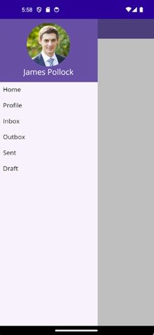

# Getting Started with .NET MAUI Navigation Drawer

This section guides you through setting up and configuring a [SfNavigationDrawer](https://help.syncfusion.com/cr/maui/Syncfusion.Maui.NavigationDrawer.SfNavigationDrawer.html) in your .NET MAUI application. Follow the steps below to add a basic Navigation Drawer to your project.

To quickly get started with the .NET MAUI Navigation Drawer, watch this video.






## Prerequisites

Before proceeding, ensure the following are set up:

1. Install [.NET 9 SDK](https://dotnet.microsoft.com/en-us/download/dotnet/9.0) or later.
2. Set up a .NET MAUI environment with Visual Studio 2022 v17.12 or later.

## Step 1: Create a new .NET MAUI project

1. Go to **File > New > Project** and choose the **.NET MAUI App** template.
2. Name the project and choose a location. Then, click **Next**.
3. Select the .NET framework version and click **Create**.

## Step 2: Install the Syncfusion® MAUI Navigation Drawer NuGet package

1. In **Solution Explorer**, right-click the project and choose **Manage NuGet Packages**.
2. Search for [Syncfusion.Maui.NavigationDrawer](https://www.nuget.org/packages/Syncfusion.Maui.NavigationDrawer) and install the latest version.
3. Ensure the necessary dependencies are installed correctly, and the project is restored.

## Step 3: Register the handler

The [Syncfusion.Maui.Core](https://www.nuget.org/packages/Syncfusion.Maui.Core/) NuGet is a dependent package for all Syncfusion® controls in .NET MAUI. In the `MauiProgram.cs` file, register the handler for Syncfusion® core.


using Microsoft.Extensions.Logging;
using Syncfusion.Maui.Core.Hosting;

namespace NavigationDrawerGettingStarted
{
    public static class MauiProgram
    {
    public static MauiApp CreateMauiApp()
    {
        var builder = MauiApp.CreateBuilder();
        builder
        .UseMauiApp<App>()
        .ConfigureSyncfusionCore()
        .ConfigureFonts(fonts =>
        {
            fonts.AddFont("OpenSans-Regular.ttf", "OpenSansRegular");
        });

        return builder.Build();
        }      
    }
}     



## Step 4: Add a basic Navigation Drawer

1. To initialize the control, import the Navigation Drawer namespace into your code.

2. Initialize [SfNavigationDrawer](https://help.syncfusion.com/cr/maui/Syncfusion.Maui.NavigationDrawer.SfNavigationDrawer.html).




<ContentPage 
            ...
            xmlns:navigationDrawer="clr-namespace:Syncfusion.Maui.NavigationDrawer;assembly=Syncfusion.Maui.NavigationDrawer">
    <navigationDrawer:SfNavigationDrawer x:Name="navigationDrawer">
    <navigationDrawer:SfNavigationDrawer.ContentView>
        <Grid/>
    </navigationDrawer:SfNavigationDrawer.ContentView>
    </navigationDrawer:SfNavigationDrawer>
</ContentPage>




    using Syncfusion.Maui.NavigationDrawer;
    namespace NavigationDrawerGettingStarted
    {
        public partial class MainPage : ContentPage
        {
            public MainPage()
            {
                InitializeComponent();           
                SfNavigationDrawer navigationDrawer = new SfNavigationDrawer();
                Grid grid = new Grid();
                navigationDrawer.ContentView = grid;
                this.Content = navigationDrawer; 
            }
        }   
    }







## Prerequisites

Before proceeding, ensure the following are set up:

1. Install [.NET 9 SDK](https://dotnet.microsoft.com/en-us/download/dotnet/9.0) or later.
2. Set up a .NET MAUI environment with Visual Studio Code.
3. Ensure that the .NET MAUI workloads are installed and configured as described [here](https://learn.microsoft.com/en-us/dotnet/maui/get-started/installation?view=net-maui-9.0&tabs=visual-studio-code).

## Step 1: Create a new .NET MAUI project

1. Open the command palette by pressing `Ctrl+Shift+P` and type **.NET:New Project** and enter.
2. Choose the **.NET MAUI App** template.
3. Select the project location, type the project name and press **Enter**.
4. Then choose **Create project**.

## Step 2: Install the Syncfusion® MAUI Navigation Drawer NuGet package

1. Press <kbd>Ctrl</kbd> + <kbd>`</kbd> (backtick) to open the integrated terminal in Visual Studio Code.
2. Ensure you're in the project root directory where your .csproj file is located.
3. Run the command `dotnet add package Syncfusion.Maui.NavigationDrawer` to install the Syncfusion® .NET MAUI Navigation Drawer package.
4. To ensure all dependencies are installed, run `dotnet restore`.

## Step 3: Register the handler

The [Syncfusion.Maui.Core](https://www.nuget.org/packages/Syncfusion.Maui.Core/) NuGet is a dependent package for all Syncfusion® controls of .NET MAUI. In the `MauiProgram.cs` file, register the handler for Syncfusion® core.


using Microsoft.Extensions.Logging;
using Syncfusion.Maui.Core.Hosting;

namespace NavigationDrawerGettingStarted
{
    public static class MauiProgram
    {
    public static MauiApp CreateMauiApp()
    {
        var builder = MauiApp.CreateBuilder();
        builder
        .UseMauiApp<App>()
        .ConfigureSyncfusionCore()
        .ConfigureFonts(fonts =>
        {
            fonts.AddFont("OpenSans-Regular.ttf", "OpenSansRegular");
        });

        return builder.Build();
        }      
    }
}     



## Step 4: Add a basic Navigation Drawer

1. To initialize the control, import the Navigation Drawer namespace into your code.

2. Initialize [SfNavigationDrawer](https://help.syncfusion.com/cr/maui/Syncfusion.Maui.NavigationDrawer.SfNavigationDrawer.html).




<ContentPage 
            ...
            xmlns:navigationDrawer="clr-namespace:Syncfusion.Maui.NavigationDrawer;assembly=Syncfusion.Maui.NavigationDrawer">
    <navigationDrawer:SfNavigationDrawer x:Name="navigationDrawer">
    <navigationDrawer:SfNavigationDrawer.ContentView>
        <Grid/>
    </navigationDrawer:SfNavigationDrawer.ContentView>
    </navigationDrawer:SfNavigationDrawer>
</ContentPage>




    using Syncfusion.Maui.NavigationDrawer;
    namespace NavigationDrawerGettingStarted
    {
        public partial class MainPage : ContentPage
        {
            public MainPage()
            {
                InitializeComponent();           
                SfNavigationDrawer navigationDrawer = new SfNavigationDrawer();
                Grid grid = new Grid();
                navigationDrawer.ContentView = grid;
                this.Content = navigationDrawer; 
            }
        }   
    }








## Prerequisites

Before proceeding, ensure the following are set up:

1. Install [.NET 9 SDK](https://dotnet.microsoft.com/en-us/download/dotnet/9.0) or later.
2. Set up a .NET MAUI environment with JetBrains Rider 2024.3 or later.
3. Make sure the MAUI workloads are installed and configured as described [here.](https://www.jetbrains.com/help/rider/MAUI.html#before-you-start)

## Step 1: Create a new .NET MAUI project

1. Go to **File > New Solution**, select .NET (C#) and choose the **.NET MAUI App** template.
2. Enter the Project Name, Solution Name, and Location.
3. Select the .NET framework version and click **Create**.

## Step 2: Install the Syncfusion® MAUI Navigation Drawer NuGet package

1. In **Solution Explorer**, right-click the project and choose **Manage NuGet Packages**.
2. Search for [Syncfusion.Maui.NavigationDrawer](https://www.nuget.org/packages/Syncfusion.Maui.Core/) and install the latest version.
3. Ensure the necessary dependencies are installed correctly, and the project is restored. If not, open the Terminal in Rider and manually run: `dotnet restore`.

## Step 3: Register the handler

The [Syncfusion.Maui.Core](https://www.nuget.org/packages/Syncfusion.Maui.Core/) NuGet is a dependent package for all Syncfusion® controls of .NET MAUI. In the `MauiProgram.cs` file, register the handler for Syncfusion® core.


using Microsoft.Extensions.Logging;
using Syncfusion.Maui.Core.Hosting;

namespace NavigationDrawerGettingStarted
{
    public static class MauiProgram
    {
    public static MauiApp CreateMauiApp()
    {
        var builder = MauiApp.CreateBuilder();
        builder
        .UseMauiApp<App>()
        .ConfigureSyncfusionCore()
        .ConfigureFonts(fonts =>
        {
            fonts.AddFont("OpenSans-Regular.ttf", "OpenSansRegular");
        });

        return builder.Build();
        }      
    }
}     



## Step 4: Add a basic Navigation Drawer

1. To initialize the control, import the Navigation Drawer namespace into your code.

2. Initialize [SfNavigationDrawer](https://help.syncfusion.com/cr/maui/Syncfusion.Maui.NavigationDrawer.SfNavigationDrawer.html).




<ContentPage 
            ...
            xmlns:navigationDrawer="clr-namespace:Syncfusion.Maui.NavigationDrawer;assembly=Syncfusion.Maui.NavigationDrawer">
    <navigationDrawer:SfNavigationDrawer x:Name="navigationDrawer">
    <navigationDrawer:SfNavigationDrawer.ContentView>
        <Grid/>
    </navigationDrawer:SfNavigationDrawer.ContentView>
    </navigationDrawer:SfNavigationDrawer>
</ContentPage>




    using Syncfusion.Maui.NavigationDrawer;
    namespace NavigationDrawerGettingStarted
    {
        public partial class MainPage : ContentPage
        {
            public MainPage()
            {
                InitializeComponent();           
                SfNavigationDrawer navigationDrawer = new SfNavigationDrawer();
                Grid grid = new Grid();
                navigationDrawer.ContentView = grid;
                this.Content = navigationDrawer; 
            }
        }   
    }







N> It is mandatory to set [ContentView](https://help.syncfusion.com/cr/maui/Syncfusion.Maui.NavigationDrawer.SfNavigationDrawer.html#Syncfusion_Maui_NavigationDrawer_SfNavigationDrawer_ContentView) for [SfNavigationDrawer](https://help.syncfusion.com/cr/maui/Syncfusion.Maui.NavigationDrawer.SfNavigationDrawer.html) upon initializing.

## Step 5: Add hamburger menu for toggling drawer

Create an ImageButton and set the required image to the `Source` property. Ensure the image is placed in the `Resources/Images` directory. Subscribe to the Clicked event of the button and invoke the [ToggleDrawer()](https://help.syncfusion.com/cr/maui/Syncfusion.Maui.NavigationDrawer.SfNavigationDrawer.html#Syncfusion_Maui_NavigationDrawer_SfNavigationDrawer_ToggleDrawer) method to toggle the drawer. Properly align the layout of [ContentView](https://help.syncfusion.com/cr/maui/Syncfusion.Maui.NavigationDrawer.SfNavigationDrawer.html#Syncfusion_Maui_NavigationDrawer_SfNavigationDrawer_ContentView) to position the hamburger icon at the top left, as demonstrated in the following code.




<navigationDrawer:SfNavigationDrawer x:Name="navigationDrawer">
    <navigationDrawer:SfNavigationDrawer.DrawerSettings>
        <navigationDrawer:DrawerSettings DrawerWidth="250"/>
    </navigationDrawer:SfNavigationDrawer.DrawerSettings>
    <navigationDrawer:SfNavigationDrawer.ContentView>
        <Grid x:Name="mainContentView" RowDefinitions="Auto,*">
            <HorizontalStackLayout>
                <ImageButton x:Name="hamburgerButton"
                             Source="hamburgericon.png"
                             Clicked="hamburgerButton_Clicked"/>
                <Label x:Name="headerLabel"  
                   Text="Home" FontSize="16" 
                   BackgroundColor="#6750A4"/>
            </HorizontalStackLayout>
            <Label Grid.Row="1" 
              x:Name="contentLabel" 
              Text="Content View" />
        </Grid>
    </navigationDrawer:SfNavigationDrawer.ContentView>
</navigationDrawer:SfNavigationDrawer>





namespace NavigationDrawerGettingStarted;

public partial class MainPage : ContentPage
{
    SfNavigationDrawer navigationDrawer;
    Label contentLabel;
	public MainPage()
	{
		InitializeComponent();
        navigationDrawer = new SfNavigationDrawer();
        Grid grid = new Grid()
        {
            RowDefinitions =
            {
                new RowDefinition {Height=new GridLength(1,GridUnitType.Auto)},
                new RowDefinition(),
            },
        };

        HorizontalStackLayout layout = new HorizontalStackLayout()
        { 
            Spacing = 10,
            Padding = new Thickness(5,0,0,0),
        };

        var hamburgerButton = new ImageButton
        {
            Source = "hamburgericon.png",
        };
        hamburgerButton.Clicked += hamburgerButton_Clicked;

        var label = new Label
        {
            Text = "Home",
            FontSize = 16,
            BackgroundColor = Color.FromArgb("#6750A4")
        };
        layout.Children.Add(hamburgerButton);
        layout.Children.Add(label);

        contentLabel = new Label
        {
            Text = "Content View",
        };

        grid.SetRow(layout, 0);
        grid.SetRow(contentLabel, 1);
        grid.Children.Add(layout);
        grid.Children.Add(contentLabel);
        navigationDrawer.ContentView = grid;

        navigationDrawer.DrawerSettings = new DrawerSettings()
        {
            DrawerWidth = 250,
        };
        this.Content = navigationDrawer;
    }
}







    private void hamburgerButton_Clicked(object sender, EventArgs e)
    {
        navigationDrawer.ToggleDrawer();
    }




## Set CollectionView as DrawerContentView

Create a CollectionView with items and set it as [DrawerContentView](https://help.syncfusion.com/cr/maui/Syncfusion.Maui.NavigationDrawer.DrawerSettings.html#Syncfusion_Maui_NavigationDrawer_DrawerSettings_DrawerContentView). 




<navigationDrawer:SfNavigationDrawer x:Name="navigationDrawer">
    <navigationDrawer:SfNavigationDrawer.DrawerSettings>
        <navigationDrawer:DrawerSettings DrawerWidth="250"
                                 DrawerHeaderHeight="160">
            <navigationDrawer:DrawerSettings.DrawerHeaderView>
                <Grid BackgroundColor="#6750A4" RowDefinitions="120,40">
                    <Image Source="user.png"/>
                    <Label Text="James Pollock" Grid.Row="1"/>
                </Grid>
            </navigationDrawer:DrawerSettings.DrawerHeaderView>
            <navigationDrawer:DrawerSettings.DrawerContentView>
                <CollectionView x:Name="collectionView" SelectionMode="Single"
                  SelectionChanged="collectionView_SelectionChanged">
                    <CollectionView.ItemsSource>
                        <x:Array Type="{x:Type x:String}">
                            <x:String>Home</x:String>
                            <x:String>Profile</x:String>
                            ...
                        </x:Array>
                    </CollectionView.ItemsSource>
                    <CollectionView.ItemTemplate>
                        <!--Load your Data Template -->
                    </CollectionView.ItemTemplate>
                </CollectionView>
            </navigationDrawer:DrawerSettings.DrawerContentView>
        </navigationDrawer:DrawerSettings>
    </navigationDrawer:SfNavigationDrawer.DrawerSettings>
    <navigationDrawer:SfNavigationDrawer.ContentView>
        <Grid x:Name="mainContentView" RowDefinitions="Auto,*">
            <HorizontalStackLayout BackgroundColor="#6750A4" Spacing="10" Padding="5,0,0,0">
                <ImageButton x:Name="hamburgerButton" Clicked="hamburgerButton_Clicked"/>
                <Label x:Name="headerLabel" />
            </HorizontalStackLayout>
            <Label Grid.Row="1" x:Name="contentLabel" />
        </Grid>
    </navigationDrawer:SfNavigationDrawer.ContentView>
</navigationDrawer:SfNavigationDrawer>




namespace NavigationDrawerGettingStarted;

public partial class MainPage : ContentPage
{
    SfNavigationDrawer navigationDrawer;
    CollectionView collectionView;
    Label headerLabel, contentLabel;

    public MainPage()
    {
        navigationDrawer = new SfNavigationDrawer();
        var drawerSettings = new DrawerSettings
        {
            DrawerWidth = 250,
            DrawerHeaderHeight = 160
        };

        var headerGrid = new Grid
        {
            BackgroundColor = Color.FromArgb("#6750A4"),
            RowDefinitions =
            {
                new RowDefinition { Height = 120 },
                new RowDefinition { Height = 40 }
            }
        };

        var userImage = new Image { Source = "user.png" };
        var userLabel = new Label { Text = "James Pollock" };
        Grid.SetRow(userLabel, 1);

        headerGrid.Children.Add(userImage);
        headerGrid.Children.Add(userLabel);

        drawerSettings.DrawerHeaderView = headerGrid;
        collectionView = new CollectionView
        {
            SelectionMode = SelectionMode.Single,
            ItemsSource = new List<string>
            {
                "Home",
                "Profile",
                "Settings",
                "About"
            }
        };
        collectionView.SelectionChanged += CollectionView_SelectionChanged;

        drawerSettings.DrawerContentView = collectionView;

        navigationDrawer.DrawerSettings = drawerSettings;
        var mainGrid = new Grid
        {
            RowDefinitions =
            {
                new RowDefinition { Height = GridLength.Auto },
                new RowDefinition { Height = GridLength.Star }
            }
        };

        var topBar = new HorizontalStackLayout
        {
            BackgroundColor = Color.FromArgb("#6750A4"),
            Spacing = 10,
            Padding = new Thickness(5, 0, 0, 0)
        };

        var hamburgerButton = new ImageButton();
        hamburgerButton.Clicked += HamburgerButton_Clicked;

        headerLabel = new Label();

        topBar.Children.Add(hamburgerButton);
        topBar.Children.Add(headerLabel);
        contentLabel = new Label();
        Grid.SetRow(contentLabel, 1);

        mainGrid.Children.Add(topBar);
        mainGrid.Children.Add(contentLabel);

        navigationDrawer.ContentView = mainGrid;

        Content = navigationDrawer;
    }
}







        private void hamburgerButton_Clicked(object sender, EventArgs e)
        {
            navigationDrawer.ToggleDrawer();
        }

        private void collectionView_SelectionChanged(object sender, SelectionChangedEventArgs e)
        {
            if (e.CurrentSelection.FirstOrDefault() is string selectedItem)
            {
                headerLabel.Text = selectedItem;
                contentLabel.Text = $"{selectedItem} Content";
                navigationDrawer.ToggleDrawer();
            }
        }




You can find the getting started sample from the [`GitHub`](https://github.com/SyncfusionExamples/Getting-started-sample-for-.NET-MAUI-NavigationDrawer) link.