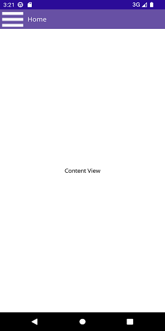

# Setting Main Content in .NET MAUI Navigation Drawer (SfNavigationDrawer)

## Prerequisites

Before using the [SfNavigationDrawer](https://help.syncfusion.com/cr/maui/Syncfusion.Maui.NavigationDrawer.SfNavigationDrawer.html), ensure the following NuGet package is installed in your .NET MAUI project:

- `Syncfusion.Maui.NavigationDrawer`

For step-by-step setup, refer to the [Getting Started](https://help.syncfusion.com/maui/navigationdrawer/getting-started) documentation.

## Main Content

The main content of the [SfNavigationDrawer](https://help.syncfusion.com/cr/maui/Syncfusion.Maui.NavigationDrawer.SfNavigationDrawer.html) is the area that stays visible behind the side pane. It is configured through the [ContentView](https://help.syncfusion.com/cr/maui/Syncfusion.Maui.NavigationDrawer.SfNavigationDrawer.html#Syncfusion_Maui_NavigationDrawer_SfNavigationDrawer_ContentView) property. When the user selects an item in the side pane (for example, a `ListView` item), update `ContentView` to switch the visible content within the same page.

## Properties

| Property | Type | Default Value | Description |
|----------|------|---------------|-------------|
| [ContentView](https://help.syncfusion.com/cr/maui/Syncfusion.Maui.NavigationDrawer.SfNavigationDrawer.html#Syncfusion_Maui_NavigationDrawer_SfNavigationDrawer_ContentView) | `View` | `null` | The view displayed in the main area behind the side pane. Must be set during initialization. |
| [DrawerWidth](https://help.syncfusion.com/cr/maui/Syncfusion.Maui.NavigationDrawer.DrawerSettings.html#Syncfusion_Maui_NavigationDrawer_DrawerSettings_DrawerWidth) | `double` | `250` | Width of the side pane. |
| [DrawerHeaderHeight](https://help.syncfusion.com/cr/maui/Syncfusion.Maui.NavigationDrawer.DrawerSettings.html#Syncfusion_Maui_NavigationDrawer_DrawerSettings_DrawerHeaderHeight) | `double` | `0` | Height of the side pane header area. |
| [IsOpen](https://help.syncfusion.com/cr/maui/Syncfusion.Maui.NavigationDrawer.SfNavigationDrawer.html#Syncfusion_Maui_NavigationDrawer_SfNavigationDrawer_IsOpen) | `bool` | `false` | Gets or sets whether the side pane is open. |
| [ToggleDrawer](https://help.syncfusion.com/cr/maui/Syncfusion.Maui.NavigationDrawer.SfNavigationDrawer.html#Syncfusion_Maui_NavigationDrawer_SfNavigationDrawer_ToggleDrawer) | `void` (method) | - | Toggles the side pane between open and closed. |

The following code examples illustrate how to set the main content of the [SfNavigationDrawer](https://help.syncfusion.com/cr/maui/Syncfusion.Maui.NavigationDrawer.SfNavigationDrawer.html), along with a hamburger button that toggles the side pane. Choose **one** of the two approaches below — the XAML approach uses the page's named element, while the C# approach builds the control entirely in code.




<navigationDrawer:SfNavigationDrawer x:Name="navigationDrawer">
    <navigationDrawer:SfNavigationDrawer.DrawerSettings>
        <navigationDrawer:DrawerSettings DrawerWidth="250"
                                            DrawerHeaderHeight="160" />
    </navigationDrawer:SfNavigationDrawer.DrawerSettings>
    <navigationDrawer:SfNavigationDrawer.ContentView>
        <Grid x:Name="mainContentView"
                BackgroundColor="White"
                RowDefinitions="Auto,*">
            <HorizontalStackLayout Grid.Row="0"
                                    BackgroundColor="#6750A4"
                                    Spacing="10"
                                    Padding="5,0,0,0">
                <ImageButton x:Name="hamburgerButton"
                                HeightRequest="50"
                                WidthRequest="50"
                                HorizontalOptions="Start"
                                Source="hamburger.png"
                                BackgroundColor="#6750A4"
                                Clicked="hamburgerButton_Clicked" />
                <Label x:Name="headerLabel"
                        HeightRequest="50"
                        HorizontalTextAlignment="Center"
                        VerticalTextAlignment="Center"
                        Text="Home"
                        FontSize="16"
                        TextColor="White"
                        BackgroundColor="#6750A4" />
            </HorizontalStackLayout>
            <Label Grid.Row="1"
                    x:Name="contentLabel"
                    VerticalOptions="Center"
                    HorizontalOptions="Center"
                    Text="Content View"
                    FontSize="14"
                    TextColor="Black" />
        </Grid>
    </navigationDrawer:SfNavigationDrawer.ContentView>
</navigationDrawer:SfNavigationDrawer>




SfNavigationDrawer navigationDrawer;
Label contentLabel;

navigationDrawer = new SfNavigationDrawer();
Grid grid = new Grid()
{
    RowDefinitions =
    {
        new RowDefinition {Height=new GridLength(1,GridUnitType.Auto)},
        new RowDefinition(),
    },
    BackgroundColor = Colors.White,
};

HorizontalStackLayout layout = new HorizontalStackLayout()
{ 
    BackgroundColor = Color.FromArgb("#6750A4"),
    Spacing = 10,
    Padding = new Thickness(5,0,0,0),
};

var hamburgerButton = new ImageButton
{
    HeightRequest = 50,
    WidthRequest = 50,
    HorizontalOptions = LayoutOptions.Start,
    BackgroundColor = Color.FromArgb("#6750A4"),
    Source = "hamburger.png",
};
hamburgerButton.Clicked += hamburgerButton_Clicked;

var label = new Label
{
    HeightRequest = 50,
    HorizontalTextAlignment = TextAlignment.Center,
    VerticalTextAlignment = TextAlignment.Center,
    Text = "Home",
    FontSize = 16,
    TextColor = Colors.White,
    BackgroundColor = Color.FromArgb("#6750A4")
};
layout.Children.Add(hamburgerButton);
layout.Children.Add(label);

contentLabel = new Label
{
    HorizontalOptions = LayoutOptions.Center,
    VerticalOptions = LayoutOptions.Center,
    Text = "Content View",
    FontSize = 14,
    TextColor = Colors.Black
};
grid.SetRow(layout, 0);
grid.SetRow(contentLabel, 1);
grid.Children.Add(layout);
grid.Children.Add(contentLabel);
navigationDrawer.ContentView = grid;

navigationDrawer.DrawerSettings = new DrawerSettings()
{
    DrawerWidth = 250,
};

private void hamburgerButton_Clicked(object sender, EventArgs e)
{
    navigationDrawer.ToggleDrawer();
}




N> It is mandatory to set the [ContentView](https://help.syncfusion.com/cr/maui/Syncfusion.Maui.NavigationDrawer.SfNavigationDrawer.html#Syncfusion_Maui_NavigationDrawer_SfNavigationDrawer_ContentView) for [SfNavigationDrawer](https://help.syncfusion.com/cr/maui/Syncfusion.Maui.NavigationDrawer.SfNavigationDrawer.html) when initializing.

The following image shows the main content rendered behind the side pane.

You can find the complete sample on [GitHub](https://github.com/SyncfusionExamples/.NET-MAUI-NavigationDrawer-MainContent).

## Common scenarios

### Updating content from a side pane selection

To switch the visible main content in response to a selection in the side pane (such as a `ListView.SelectionChanged` event described in [Side Pane Content](https://help.syncfusion.com/maui/navigationdrawer/side-pane-content)), update `ContentView` from the selection handler. The `headerLabel`, `contentLabel`, and `navigationDrawer` references below are the same instances declared in the `MainPage` class above.

## Behavior

The main content is always rendered behind the side pane; the side pane overlays the main content. Updating `ContentView` swaps the visible content without recreating the page or losing drawer state. When the side pane is open, the main content remains interactive only on the uncovered portion, and the side pane handles input within its bounds.

## See also

- [How to load content page to .NET MAUI Navigation Drawer content view?](https://support.syncfusion.com/kb/article/15674/how-to-load-content-page-to-net-maui-navigationdrawer-contentview)
- [Setting Toggle Animations in .NET MAUI Navigation Drawer](https://help.syncfusion.com/maui/navigationdrawer/toggle-animations)
- [Set Sliding Panel Content in .NET MAUI Navigation Drawer](https://help.syncfusion.com/maui/navigationdrawer/side-pane-content)
- [Setting Sliding Panel Size in .NET MAUI Navigation Drawer](https://help.syncfusion.com/maui/navigationdrawer/side-pane-sizing)