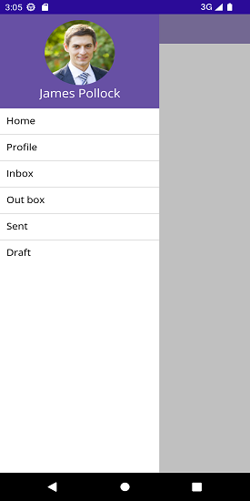
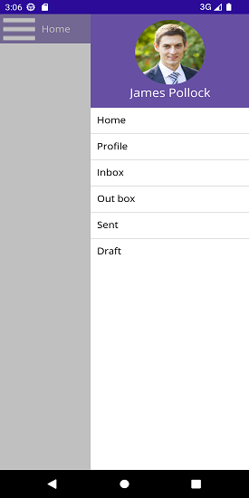

# Configuring The Drawer In Different Sides in .NET MAUI Navigation Drawer

The supplemental pane can be pulled in and out from all four sides. The `Position` property is used to change the side of the pane, and the options are:

*	`Left`

*	`Right`

*	`Top`

*	`Bottom`

N> The default position is `Left`.

## Left

The navigation pane pulled in and out from the `Left` side can be set as follows:

	



<navigationdrawer:SfNavigationDrawer x:Name="navigationDrawer">
    <navigationdrawer:SfNavigationDrawer.DrawerSettings>
        <navigationdrawer:DrawerSettings Position="Left">
        </navigationdrawer:DrawerSettings>
    </navigationdrawer:SfNavigationDrawer.DrawerSettings>
</navigationdrawer:SfNavigationDrawer>


	


 SfNavigationDrawer navigationDrawer = new SfNavigationDrawer();
 DrawerSettings drawerSettings = new DrawerSettings()
 {
     Position = Position.Left,
 };
 navigationDrawer.DrawerSettings = drawerSettings;
 this.Content = navigationDrawer;





## Right

The navigation pane pulled in and out from the `Right` side can be set as follows:

	



<navigationdrawer:SfNavigationDrawer x:Name="navigationDrawer">
    <navigationdrawer:SfNavigationDrawer.DrawerSettings>
        <navigationdrawer:DrawerSettings Position="Right">
        </navigationdrawer:DrawerSettings>
    </navigationdrawer:SfNavigationDrawer.DrawerSettings>
</navigationdrawer:SfNavigationDrawer>
	

	


 SfNavigationDrawer navigationDrawer = new SfNavigationDrawer();
 DrawerSettings drawerSettings = new DrawerSettings()
 {
     Position = Position.Right,
 };
 navigationDrawer.DrawerSettings = drawerSettings;
 this.Content = navigationDrawer;





	
## Top

The navigation pane pulled in and out from the `Top` side can be set as follows:





<navigationdrawer:SfNavigationDrawer x:Name="navigationDrawer">
    <navigationdrawer:SfNavigationDrawer.DrawerSettings>
        <navigationdrawer:DrawerSettings Position="Top">
        </navigationdrawer:DrawerSettings>
    </navigationdrawer:SfNavigationDrawer.DrawerSettings>
</navigationdrawer:SfNavigationDrawer>

	
	
	

	
 SfNavigationDrawer navigationDrawer = new SfNavigationDrawer();
 DrawerSettings drawerSettings = new DrawerSettings()
 {
     Position = Position.Top,
 };
 navigationDrawer.DrawerSettings = drawerSettings;
 this.Content = navigationDrawer;





## Bottom

The navigation pane pulled in and out from the `Bottom` side can be set as follows:

	



<navigationdrawer:SfNavigationDrawer x:Name="navigationDrawer">
    <navigationdrawer:SfNavigationDrawer.DrawerSettings>
        <navigationdrawer:DrawerSettings Position="Bottom">
        </navigationdrawer:DrawerSettings>
    </navigationdrawer:SfNavigationDrawer.DrawerSettings>
</navigationdrawer:SfNavigationDrawer>


	


SfNavigationDrawer navigationDrawer = new SfNavigationDrawer();
DrawerSettings drawerSettings = new DrawerSettings()
{
    Position = Position.Bottom,
};
navigationDrawer.DrawerSettings = drawerSettings;
this.Content = navigationDrawer;





