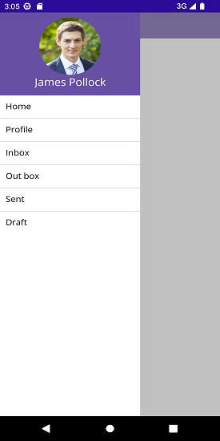
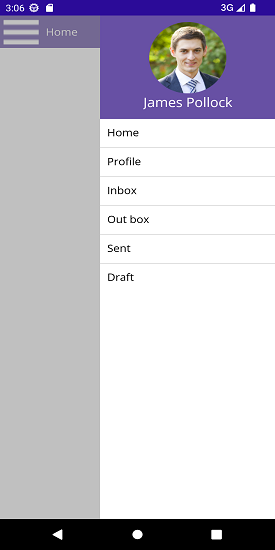
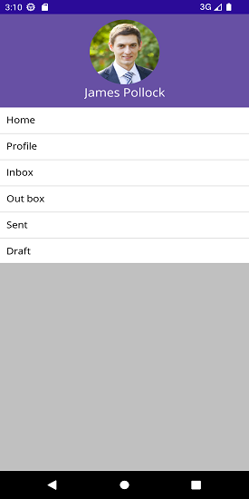

# Drawer Position in .NET MAUI Navigation Drawer (SfNavigationDrawer)

## Prerequisites

Before using the [SfNavigationDrawer](https://help.syncfusion.com/cr/maui/Syncfusion.Maui.NavigationDrawer.SfNavigationDrawer.html), ensure the following NuGet package is installed in your .NET MAUI project:

- `Syncfusion.Maui.NavigationDrawer`

For step-by-step setup, refer to the [Getting Started](https://help.syncfusion.com/maui/navigationdrawer/getting-started) documentation.

## Overview

The side pane of the [SfNavigationDrawer](https://help.syncfusion.com/cr/maui/Syncfusion.Maui.NavigationDrawer.SfNavigationDrawer.html) can be opened from any of the four sides of the screen. The side is controlled by the [Position](https://help.syncfusion.com/cr/maui/Syncfusion.Maui.NavigationDrawer.DrawerSettings.html#Syncfusion_Maui_NavigationDrawer_DrawerSettings_Position) property of `DrawerSettings`.

## Properties

| Property | Type | Default Value | Description |
|----------|------|---------------|-------------|
| [Position](https://help.syncfusion.com/cr/maui/Syncfusion.Maui.NavigationDrawer.DrawerSettings.html#Syncfusion_Maui_NavigationDrawer_DrawerSettings_Position) | `Position` enum | `Left` | Side from which the drawer opens. Values: `Left`, `Right`, `Top`, `Bottom`. |
| [DrawerWidth](https://help.syncfusion.com/cr/maui/Syncfusion.Maui.NavigationDrawer.DrawerSettings.html#Syncfusion_Maui_NavigationDrawer_DrawerSettings_DrawerWidth) | `double` | `250` | Width of the side pane. Used when `Position` is `Left` or `Right`. |
| [DrawerHeight](https://help.syncfusion.com/cr/maui/Syncfusion.Maui.NavigationDrawer.DrawerSettings.html#Syncfusion_Maui_NavigationDrawer_DrawerSettings_DrawerHeight) | `double` | `250` | Height of the side pane. Used when `Position` is `Top` or `Bottom`. |

## Position values

| Value | Description | Size property to use |
|-------|-------------|----------------------|
| [Left](https://help.syncfusion.com/cr/maui/Syncfusion.Maui.NavigationDrawer.Position.html#Syncfusion_Maui_NavigationDrawer_Position_Left) | Opens from the left edge. The most common position for primary navigation. | `DrawerWidth` |
| [Right](https://help.syncfusion.com/cr/maui/Syncfusion.Maui.NavigationDrawer.Position.html#Syncfusion_Maui_NavigationDrawer_Position_Right) | Opens from the right edge. Useful for secondary actions, filters, or details. | `DrawerWidth` |
| [Top](https://help.syncfusion.com/cr/maui/Syncfusion.Maui.NavigationDrawer.Position.html#Syncfusion_Maui_NavigationDrawer_Position_Top) | Opens from the top edge. Useful for notifications, banners, or search bars. | `DrawerHeight` |
| [Bottom](https://help.syncfusion.com/cr/maui/Syncfusion.Maui.NavigationDrawer.Position.html#Syncfusion_Maui_NavigationDrawer_Position_Bottom) | Opens from the bottom edge. Useful for sheets, action menus, or keyboards. | `DrawerHeight` |

## Example

The following code example illustrates how to set the drawer position of the [SfNavigationDrawer](https://help.syncfusion.com/cr/maui/Syncfusion.Maui.NavigationDrawer.SfNavigationDrawer.html). Replace `Position.Left` with the desired value to change the side.





<navigationDrawer:SfNavigationDrawer x:Name="navigationDrawer">
    <navigationDrawer:SfNavigationDrawer.DrawerSettings>
        <navigationDrawer:DrawerSettings Position="Left" />
    </navigationDrawer:SfNavigationDrawer.DrawerSettings>
</navigationDrawer:SfNavigationDrawer>





SfNavigationDrawer navigationDrawer = new SfNavigationDrawer()
{
    DrawerSettings = new DrawerSettings
    {
        Position = Position.Left
    },
};
        




## Output examples

The following images show the drawer opening from each of the four sides.

| Position | Image |
|----------|-------|
| Left |  |
| Right |  |
| Top |  |
| Bottom |  |

## Behavior

- The drawer slides in from the configured side and overlays the main content.
- The default position is `Left`. Changing the position at runtime triggers the appropriate open or close animation.
- When `Position` is `Top` or `Bottom`, use `DrawerHeight` instead of `DrawerWidth` to size the pane.
- The drawer's swipe gesture respects the configured position. For example, a `Left` drawer responds to right-to-left swipes. See [Swipe Gesture](https://help.syncfusion.com/maui/navigationdrawer/swipe-gesture) for details.
- A primary and secondary drawer can be configured independently on different sides. See [Multi Drawer](https://help.syncfusion.com/maui/navigationdrawer/multi-drawer) for details.

## Troubleshooting

| Issue | Possible cause | Resolution |
|-------|----------------|------------|
| Position change has no visible effect | The drawer is never opened after the property is set | Call `ToggleDrawer()` or set `IsOpen = true` to display the drawer |
| Vertical drawer (`Top`/`Bottom`) is too thin | `DrawerWidth` is set instead of `DrawerHeight` | Set `DrawerHeight` to the desired value |
| Drawer appears under the status bar | Safe area insets are not respected on iOS/Android | Apply `SafeArea` margins to the drawer content or use `Padding` on the `ContentView` |
| Swipe opens the drawer from the wrong side | The control is configured for a different position than expected | Verify `DrawerSettings.Position` and `SecondaryDrawerSettings.Position` (if used) match the desired side |

## See also

- [Getting Started with .NET MAUI Navigation Drawer](https://help.syncfusion.com/maui/navigationdrawer/getting-started)
- [Toggle Methods in .NET MAUI Navigation Drawer (SfNavigationDrawer)](https://help.syncfusion.com/maui/navigationdrawer/toggling-drawer)
- [Setting Toggle Animations in .NET MAUI Navigation Drawer](https://help.syncfusion.com/maui/navigationdrawer/toggle-animations)
- [Set Sliding Panel Content in .NET MAUI Navigation Drawer](https://help.syncfusion.com/maui/navigationdrawer/side-pane-content)
- [Setting Sliding Panel Size in .NET MAUI Navigation Drawer](https://help.syncfusion.com/maui/navigationdrawer/side-pane-size)