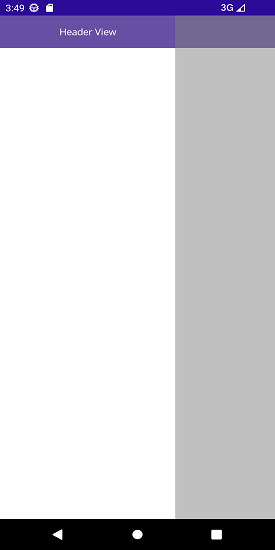
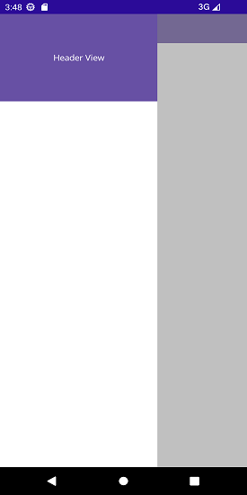
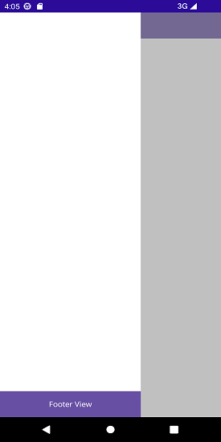
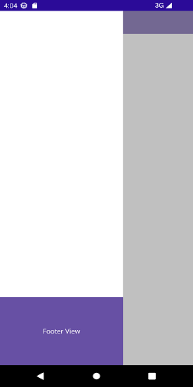
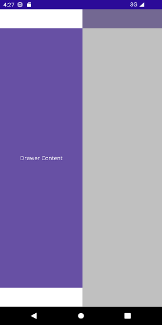

# Set Sliding Panel Content in .NET MAUI Navigation Drawer

The drawer pane content is only viewable when the drawer is in the open state. Its content can be set as:

*	Header Content

*	Drawer Content

*	Footer Content

N> Header and Footer content is optional, but the Drawer content is mandatory to allocate space for the drawer.
		
## Header Content

As the name suggests, it is displayed at the top of the drawer. The [DrawerHeaderView](https://help.syncfusion.com/cr/maui/Syncfusion.Maui.NavigationDrawer.DrawerSettings.html#Syncfusion_Maui_NavigationDrawer_DrawerSettings_DrawerHeaderView) property is used to set the header content of the drawer.





<navigationdrawer:SfNavigationDrawer x:Name="navigationDrawer">
    <navigationdrawer:SfNavigationDrawer.DrawerSettings>
        <navigationdrawer:DrawerSettings>
            <navigationdrawer:DrawerSettings.DrawerHeaderView>
                <Grid BackgroundColor="#6750A4">
                    <VerticalStackLayout VerticalOptions="Center"
                                         HorizontalOptions="Center">
                        <Label Text="Header View"/>
                    </VerticalStackLayout>
                </Grid>
            </navigationdrawer:DrawerSettings.DrawerHeaderView>
        </navigationdrawer:DrawerSettings>
    </navigationdrawer:SfNavigationDrawer.DrawerSettings>
</navigationdrawer:SfNavigationDrawer>





SfNavigationDrawer navigationDrawer = new SfNavigationDrawer();
DrawerSettings drawerSettings = new DrawerSettings()
{
    DrawerWidth = 250,
};
navigationDrawer.DrawerSettings = drawerSettings;
this.Content = navigationDrawer;
  




## Header Height

The height of the drawer header content can be adjusted using the [DrawerHeaderHeight](https://help.syncfusion.com/cr/maui/Syncfusion.Maui.NavigationDrawer.DrawerSettings.html#Syncfusion_Maui_NavigationDrawer_DrawerSettings_DrawerHeaderHeight) property.

N> The [DrawerHeaderView](https://help.syncfusion.com/cr/maui/Syncfusion.Maui.NavigationDrawer.DrawerSettings.html#Syncfusion_Maui_NavigationDrawer_DrawerSettings_DrawerHeaderView) can be removed by setting the [DrawerHeaderHeight](https://help.syncfusion.com/cr/maui/Syncfusion.Maui.NavigationDrawer.DrawerSettings.html#Syncfusion_Maui_NavigationDrawer_DrawerSettings_DrawerHeaderHeight) to zero.




    
<navigationdrawer:SfNavigationDrawer x:Name="navigationDrawer">
    <navigationdrawer:SfNavigationDrawer.DrawerSettings>
        <navigationdrawer:DrawerSettings DrawerHeaderHeight="150">
            <navigationdrawer:DrawerSettings.DrawerHeaderView>
                <Grid BackgroundColor="#6750A4">
                    <VerticalStackLayout VerticalOptions="Center"
                                         HorizontalOptions="Center">
                        <Label Text="Header View"/>
                    </VerticalStackLayout>
                </Grid>
            </navigationdrawer:DrawerSettings.DrawerHeaderView>
        </navigationdrawer:DrawerSettings>
    </navigationdrawer:SfNavigationDrawer.DrawerSettings>
</navigationdrawer:SfNavigationDrawer>





SfNavigationDrawer navigationDrawer = new SfNavigationDrawer();
DrawerSettings drawerSettings = new DrawerSettings()
{
    DrawerHeaderHeight = 150,
    DrawerWidth = 250,
};
navigationDrawer.DrawerSettings = drawerSettings;
this.Content = navigationDrawer;





## Footer Content

As the name suggests, it is displayed at the bottom of the drawer. The [DrawerFooterView](https://help.syncfusion.com/cr/maui/Syncfusion.Maui.NavigationDrawer.DrawerSettings.html#Syncfusion_Maui_NavigationDrawer_DrawerSettings_DrawerFooterView) property is used to set the footer content of the drawer.





<navigationdrawer:SfNavigationDrawer x:Name="navigationDrawer">
    <navigationdrawer:SfNavigationDrawer.DrawerSettings>
        <navigationdrawer:DrawerSettings>
            <navigationdrawer:DrawerSettings.DrawerFooterView>
                <Grid BackgroundColor="#6750A4">
                    <VerticalStackLayout VerticalOptions="Center"
                                         HorizontalOptions="Center">
                        <Label Text="Footer View"/>
                    </VerticalStackLayout>
                </Grid>
            </navigationdrawer:DrawerSettings.DrawerFooterView>
        </navigationdrawer:DrawerSettings>
    </navigationdrawer:SfNavigationDrawer.DrawerSettings>
</navigationdrawer:SfNavigationDrawer>





SfNavigationDrawer navigationDrawer = new SfNavigationDrawer();
DrawerSettings drawerSettings = new DrawerSettings()
{
    DrawerWidth = 250,
};
navigationDrawer.DrawerSettings = drawerSettings;
this.Content = navigationDrawer;





## Footer Height

The height of the drawer footer content can be adjusted using the [DrawerFooterHeight](https://help.syncfusion.com/cr/maui/Syncfusion.Maui.NavigationDrawer.DrawerSettings.html#Syncfusion_Maui_NavigationDrawer_DrawerSettings_DrawerFooterHeight) property.

N> The [DrawerFooterView](https://help.syncfusion.com/cr/maui/Syncfusion.Maui.NavigationDrawer.DrawerSettings.html#Syncfusion_Maui_NavigationDrawer_DrawerSettings_DrawerFooterView) can be removed by setting the [DrawerFooterHeight](https://help.syncfusion.com/cr/maui/Syncfusion.Maui.NavigationDrawer.DrawerSettings.html#Syncfusion_Maui_NavigationDrawer_DrawerSettings_DrawerFooterHeight) to zero.



 

<navigationdrawer:SfNavigationDrawer x:Name="navigationDrawer">
    <navigationdrawer:SfNavigationDrawer.DrawerSettings>
        <navigationdrawer:DrawerSettings DrawerFooterHeight="150">
            <navigationdrawer:DrawerSettings.DrawerFooterView>
                <Grid BackgroundColor="#6750A4">
                    <VerticalStackLayout VerticalOptions="Center"
                                         HorizontalOptions="Center">
                        <Label Text="Footer View"/>
                    </VerticalStackLayout>
                </Grid>
            </navigationdrawer:DrawerSettings.DrawerFooterView>
        </navigationdrawer:DrawerSettings>
    </navigationdrawer:SfNavigationDrawer.DrawerSettings>
</navigationdrawer:SfNavigationDrawer>
	



        
SfNavigationDrawer navigationDrawer = new SfNavigationDrawer();
DrawerSettings drawerSettings = new DrawerSettings()
{
    DrawerFooterHeight = 150,
    DrawerWidth = 250,
};  
navigationDrawer.DrawerSettings = drawerSettings;
this.Content = navigationDrawer;
  




## Drawer Content

The main content of the drawer is displayed between the header and footer content. It can be set using the [DrawerContentView](https://help.syncfusion.com/cr/maui/Syncfusion.Maui.NavigationDrawer.DrawerSettings.html#Syncfusion_Maui_NavigationDrawer_DrawerSettings_DrawerContentView) property. The content view occupies the remaining space left by the header and footer content.



 

<navigationdrawer:SfNavigationDrawer x:Name="navigationDrawer">
    <navigationdrawer:SfNavigationDrawer.DrawerSettings>
        <navigationdrawer:DrawerSettings>
            <navigationdrawer:DrawerSettings.DrawerContentView>
                <Grid BackgroundColor="#6750A4">
                    <VerticalStackLayout VerticalOptions="Center"
                     HorizontalOptions="Center">
                        <Label Text="Drawer Content"/>
                    </VerticalStackLayout>
                </Grid>
            </navigationdrawer:DrawerSettings.DrawerContentView>
        </navigationdrawer:DrawerSettings>
    </navigationdrawer:SfNavigationDrawer.DrawerSettings>
</navigationdrawer:SfNavigationDrawer>
	



        
SfNavigationDrawer navigationDrawer = new SfNavigationDrawer();
DrawerSettings drawerSettings = new DrawerSettings()
{
    DrawerWidth = 250,
};
navigationDrawer.DrawerSettings = drawerSettings;
this.Content = navigationDrawer;
  




