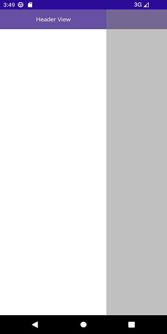
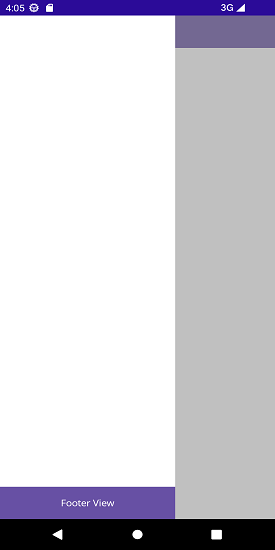
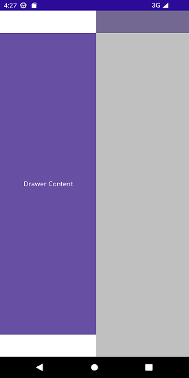

# Side Pane Content in .NET MAUI Navigation Drawer (SfNavigationDrawer)

## Prerequisites

Before using the [SfNavigationDrawer](https://help.syncfusion.com/cr/maui/Syncfusion.Maui.NavigationDrawer.SfNavigationDrawer.html), ensure the following NuGet package is installed in your .NET MAUI project:

- `Syncfusion.Maui.NavigationDrawer`

For step-by-step setup, refer to the [Getting Started](https://help.syncfusion.com/maui/navigationdrawer/getting-started) documentation.

## Overview

The side pane of the [SfNavigationDrawer](https://help.syncfusion.com/cr/maui/Syncfusion.Maui.NavigationDrawer.SfNavigationDrawer.html) is only visible when the drawer is open. The side pane is composed of three regions that stack vertically from top to bottom:

1. Header content - displayed at the top of the side pane.
2. Drawer content - displayed in the middle; occupies the space left by the header and footer.
3. Footer content - displayed at the bottom of the side pane.

The header and footer are optional; the drawer content is required to allocate space for the side pane.

## Properties

| Property | Type | Default Value | Description |
|----------|------|---------------|-------------|
| [DrawerHeaderView](https://help.syncfusion.com/cr/maui/Syncfusion.Maui.NavigationDrawer.DrawerSettings.html#Syncfusion_Maui_NavigationDrawer_DrawerSettings_DrawerHeaderView) | `View` | `null` | The view displayed at the top of the side pane. |
| [DrawerHeaderHeight](https://help.syncfusion.com/cr/maui/Syncfusion.Maui.NavigationDrawer.DrawerSettings.html#Syncfusion_Maui_NavigationDrawer_DrawerSettings_DrawerHeaderHeight) | `double` | `0` | Height of the header area. Set to `0` to hide the header. |
| [DrawerContentView](https://help.syncfusion.com/cr/maui/Syncfusion.Maui.NavigationDrawer.DrawerSettings.html#Syncfusion_Maui_NavigationDrawer_DrawerSettings_DrawerContentView) | `View` | `null` | The view displayed in the middle of the side pane. Required to allocate space for the drawer. |
| [DrawerFooterView](https://help.syncfusion.com/cr/maui/Syncfusion.Maui.NavigationDrawer.DrawerSettings.html#Syncfusion_Maui_NavigationDrawer_DrawerSettings_DrawerFooterView) | `View` | `null` | The view displayed at the bottom of the side pane. |
| [DrawerFooterHeight](https://help.syncfusion.com/cr/maui/Syncfusion.Maui.NavigationDrawer.DrawerSettings.html#Syncfusion_Maui_NavigationDrawer_DrawerSettings_DrawerFooterHeight) | `double` | `0` | Height of the footer area. Set to `0` to hide the footer. |
| [ContentBackground](https://help.syncfusion.com/cr/maui/Syncfusion.Maui.NavigationDrawer.DrawerSettings.html#Syncfusion_Maui_NavigationDrawer_DrawerSettings_ContentBackground) | `Color` | `null` | Background color of the side pane content area. |

## Layout

The side pane uses a vertical layout with the following stacking order:

1. `DrawerHeaderView` (top) - height controlled by `DrawerHeaderHeight`.
2. `DrawerContentView` (middle) - fills the remaining space.
3. `DrawerFooterView` (bottom) - height controlled by `DrawerFooterHeight`.

If any region is `null` or its height is `0`, that region is not rendered and the adjacent regions expand to fill the space.

## Header content

The header is displayed at the top of the side pane. Use the [DrawerHeaderView](https://help.syncfusion.com/cr/maui/Syncfusion.Maui.NavigationDrawer.DrawerSettings.html#Syncfusion_Maui_NavigationDrawer_DrawerSettings_DrawerHeaderView) property to set the header content and [DrawerHeaderHeight](https://help.syncfusion.com/cr/maui/Syncfusion.Maui.NavigationDrawer.DrawerSettings.html#Syncfusion_Maui_NavigationDrawer_DrawerSettings_DrawerHeaderHeight) to control its height.





<navigationDrawer:SfNavigationDrawer x:Name="navigationDrawer">
    <navigationDrawer:SfNavigationDrawer.DrawerSettings>
        <navigationDrawer:DrawerSettings DrawerHeaderHeight="150" DrawerWidth="250">
            <navigationDrawer:DrawerSettings.DrawerHeaderView>
                <Grid BackgroundColor="#6750A4">
                    <VerticalStackLayout VerticalOptions="Center"
                                       HorizontalOptions="Center">
                        <Label Text="Header View" TextColor="White" />
                    </VerticalStackLayout>
                </Grid>
            </navigationDrawer:DrawerSettings.DrawerHeaderView>
        </navigationDrawer:DrawerSettings>
    </navigationDrawer:SfNavigationDrawer.DrawerSettings>
</navigationDrawer:SfNavigationDrawer>





SfNavigationDrawer navigationDrawer = new SfNavigationDrawer()
{
    DrawerSettings = new DrawerSettings
    {
        DrawerWidth = 250,
        DrawerHeaderHeight = 150,
        DrawerHeaderView = new Grid
        {
            BackgroundColor = Color.FromArgb("#6750A4"),
            Children =
            {
                new VerticalStackLayout
                {
                    VerticalOptions = LayoutOptions.Center,
                    HorizontalOptions = LayoutOptions.Center,
                    Children =
                    {
                        new Label { Text = "Header View", TextColor = Colors.White }
                    }
                }
            }
        },
    },
};
        




> NOTE: The [DrawerHeaderView](https://help.syncfusion.com/cr/maui/Syncfusion.Maui.NavigationDrawer.DrawerSettings.html#Syncfusion_Maui_NavigationDrawer_DrawerSettings_DrawerHeaderView) is hidden when [DrawerHeaderHeight](https://help.syncfusion.com/cr/maui/Syncfusion.Maui.NavigationDrawer.DrawerSettings.html#Syncfusion_Maui_NavigationDrawer_DrawerSettings_DrawerHeaderHeight) is set to `0`.

## Footer content

The footer is displayed at the bottom of the side pane. Use the [DrawerFooterView](https://help.syncfusion.com/cr/maui/Syncfusion.Maui.NavigationDrawer.DrawerSettings.html#Syncfusion_Maui_NavigationDrawer_DrawerSettings_DrawerFooterView) property to set the footer content and [DrawerFooterHeight](https://help.syncfusion.com/cr/maui/Syncfusion.Maui.NavigationDrawer.DrawerSettings.html#Syncfusion_Maui_NavigationDrawer_DrawerSettings_DrawerFooterHeight) to control its height.





<navigationDrawer:SfNavigationDrawer x:Name="navigationDrawer">
    <navigationDrawer:SfNavigationDrawer.DrawerSettings>
        <navigationDrawer:DrawerSettings DrawerFooterHeight="150" DrawerWidth="250">
            <navigationDrawer:DrawerSettings.DrawerFooterView>
                <Grid BackgroundColor="#6750A4">
                    <VerticalStackLayout VerticalOptions="Center"
                                        HorizontalOptions="Center">
                        <Label Text="Footer View" TextColor="White" />
                    </VerticalStackLayout>
                </Grid>
            </navigationDrawer:DrawerSettings.DrawerFooterView>
        </navigationDrawer:DrawerSettings>
    </navigationDrawer:SfNavigationDrawer.DrawerSettings>
</navigationDrawer:SfNavigationDrawer>





SfNavigationDrawer navigationDrawer = new SfNavigationDrawer()
{
    DrawerSettings = new DrawerSettings
    {
        DrawerWidth = 250,
        DrawerFooterHeight = 150,
        DrawerFooterView = new Grid
        {
            BackgroundColor = Color.FromArgb("#6750A4"),
            Children =
            {
                new VerticalStackLayout
                {
                    VerticalOptions = LayoutOptions.Center,
                    HorizontalOptions = LayoutOptions.Center,
                    Children =
                    {
                        new Label { Text = "Footer View", TextColor = Colors.White }
                    }
                }
            }
        },
    },
};
        




> NOTE: The [DrawerFooterView](https://help.syncfusion.com/cr/maui/Syncfusion.Maui.NavigationDrawer.DrawerSettings.html#Syncfusion_Maui_NavigationDrawer_DrawerSettings_DrawerFooterView) is hidden when [DrawerFooterHeight](https://help.syncfusion.com/cr/maui/Syncfusion.Maui.NavigationDrawer.DrawerSettings.html#Syncfusion_Maui_NavigationDrawer_DrawerSettings_DrawerFooterHeight) is set to `0`.

## Drawer content

The drawer content is displayed between the header and footer. It is set using the [DrawerContentView](https://help.syncfusion.com/cr/maui/Syncfusion.Maui.NavigationDrawer.DrawerSettings.html#Syncfusion_Maui_NavigationDrawer_DrawerSettings_DrawerContentView) property and occupies the space left by the header and footer.





<navigationDrawer:SfNavigationDrawer x:Name="navigationDrawer">
    <navigationDrawer:SfNavigationDrawer.DrawerSettings>
        <navigationDrawer:DrawerSettings DrawerWidth="250">
            <navigationDrawer:DrawerSettings.DrawerContentView>
                <Grid BackgroundColor="#6750A4">
                    <VerticalStackLayout VerticalOptions="Center"
                                            HorizontalOptions="Center">
                        <Label Text="Drawer Content" TextColor="White" />
                    </VerticalStackLayout>
                </Grid>
            </navigationDrawer:DrawerSettings.DrawerContentView>
        </navigationDrawer:DrawerSettings>
    </navigationDrawer:SfNavigationDrawer.DrawerSettings>
</navigationDrawer:SfNavigationDrawer>




SfNavigationDrawer navigationDrawer = new SfNavigationDrawer()
{
    DrawerSettings = new DrawerSettings
    {
        DrawerWidth = 250,
        DrawerContentView = new Grid
        {
            BackgroundColor = Color.FromArgb("#6750A4"),
            Children =
            {
                new VerticalStackLayout
                {
                    VerticalOptions = LayoutOptions.Center,
                    HorizontalOptions = LayoutOptions.Center,
                    Children =
                    {
                        new Label { Text = "Drawer Content", TextColor = Colors.White }
                    }
                }
            }
        },
    },
};




## Drawer content background

Customize the background color of the side pane content area by setting the [ContentBackground](https://help.syncfusion.com/cr/maui/Syncfusion.Maui.NavigationDrawer.DrawerSettings.html#Syncfusion_Maui_NavigationDrawer_DrawerSettings_ContentBackground) property in `DrawerSettings`.





<navigationDrawer:SfNavigationDrawer x:Name="navigationDrawer">
    <navigationDrawer:SfNavigationDrawer.DrawerSettings>
        <navigationDrawer:DrawerSettings ContentBackground="Red" DrawerWidth="250">
            <navigationDrawer:DrawerSettings.DrawerContentView>
                <Grid BackgroundColor="#6750A4">
                    <VerticalStackLayout VerticalOptions="Center"
                                            HorizontalOptions="Center">
                        <Label Text="Drawer Content" TextColor="White" />
                    </VerticalStackLayout>
                </Grid>
            </navigationDrawer:DrawerSettings.DrawerContentView>
        </navigationDrawer:DrawerSettings>
    </navigationDrawer:SfNavigationDrawer.DrawerSettings>
</navigationDrawer:SfNavigationDrawer>





SfNavigationDrawer navigationDrawer = new SfNavigationDrawer()
{
    DrawerSettings = new DrawerSettings
    {
        DrawerWidth = 250,
        ContentBackground = Colors.Red,
        DrawerContentView = new Grid
        {
            BackgroundColor = Color.FromArgb("#6750A4"),
            Children =
            {
                new VerticalStackLayout
                {
                    VerticalOptions = LayoutOptions.Center,
                    HorizontalOptions = LayoutOptions.Center,
                    Children =
                    {
                        new Label { Text = "Drawer Content", TextColor = Colors.White }
                    }
                }
            }
        }
    }
};
            




## Combined example

The following example shows a side pane that includes a header, content area, and footer all at once.





<navigationDrawer:SfNavigationDrawer x:Name="navigationDrawer">
    <navigationDrawer:SfNavigationDrawer.DrawerSettings>
        <navigationDrawer:DrawerSettings DrawerHeaderHeight="120"
                                            DrawerFooterHeight="60"
                                            DrawerWidth="280"
                                            ContentBackground="White">
            <navigationDrawer:DrawerSettings.DrawerHeaderView>
                <Grid BackgroundColor="#6750A4">
                    <Label Text="Header"
                            TextColor="White"
                            HorizontalOptions="Center"
                            VerticalOptions="Center" />
                </Grid>
            </navigationDrawer:DrawerSettings.DrawerHeaderView>
            <navigationDrawer:DrawerSettings.DrawerContentView>
                <Label Text="Drawer Content"
                        HorizontalOptions="Center"
                        VerticalOptions="Center" />
            </navigationDrawer:DrawerSettings.DrawerContentView>
            <navigationDrawer:DrawerSettings.DrawerFooterView>
                <Grid BackgroundColor="#6750A4">
                    <Label Text="Footer"
                            TextColor="White"
                            HorizontalOptions="Center"
                            VerticalOptions="Center" />
                </Grid>
            </navigationDrawer:DrawerSettings.DrawerFooterView>
        </navigationDrawer:DrawerSettings>
    </navigationDrawer:SfNavigationDrawer.DrawerSettings>
</navigationDrawer:SfNavigationDrawer>





SfNavigationDrawer navigationDrawer = new SfNavigationDrawer
{
    DrawerSettings = new DrawerSettings
    {
        DrawerHeaderHeight = 120,
        DrawerFooterHeight = 60,
        DrawerWidth = 280,
        ContentBackground = Colors.White,
        DrawerHeaderView = new Grid
        {
            BackgroundColor = Color.FromArgb("#6750A4"),
            Children =
            {
                new Label
                {
                    Text = "Header",
                    TextColor = Colors.White,
                    HorizontalOptions = LayoutOptions.Center,
                    VerticalOptions = LayoutOptions.Center
                }
            }
        },
        DrawerContentView = new Label
        {
            Text = "Drawer Content",
            HorizontalOptions = LayoutOptions.Center,
            VerticalOptions = LayoutOptions.Center
        },
        DrawerFooterView = new Grid
        {
            BackgroundColor = Color.FromArgb("#6750A4"),
            Children =
            {
                new Label
                {
                    Text = "Footer",
                    TextColor = Colors.White,
                    HorizontalOptions = LayoutOptions.Center,
                    VerticalOptions = LayoutOptions.Center
                }
            }
        }
    }
};     





## Behavior

- The side pane is only visible when the drawer is open; it is hidden when the drawer is closed.
- The header, content, and footer stack vertically inside the side pane.
- Setting `DrawerHeaderHeight` or `DrawerFooterHeight` to `0` removes the corresponding region and lets the remaining regions expand to fill the space.
- `ContentBackground` paints the background of the entire content area; individual header, content, and footer views can override it with their own `BackgroundColor`.

## Troubleshooting

| Issue | Possible cause | Resolution |
|-------|----------------|------------|
| Header or footer is not visible | The corresponding height is `0` | Set `DrawerHeaderHeight` or `DrawerFooterHeight` to a positive value |
| Content area is empty | `DrawerContentView` is `null` | Assign a non-null `View` to `DrawerContentView` |
| `ContentBackground` has no effect | The inner view has an opaque `BackgroundColor` that covers it | Set the inner view's background to `Transparent` or remove it |
| Footer overlaps the content | `DrawerHeaderHeight` + `DrawerFooterHeight` exceeds the available height | Reduce one of the heights or set the other to `0` |
| Side pane does not open at all | The drawer was never triggered | Call `ToggleDrawer()` or set `IsOpen = true` to display the drawer |

## See also

- [Getting Started with .NET MAUI Navigation Drawer](https://help.syncfusion.com/maui/navigationdrawer/getting-started)
- [Toggle Methods in .NET MAUI Navigation Drawer (SfNavigationDrawer)](https://help.syncfusion.com/maui/navigationdrawer/toggling-drawer)
- [Setting Toggle Animations in .NET MAUI Navigation Drawer](https://help.syncfusion.com/maui/navigationdrawer/toggle-animations)
- [Setting Sliding Panel Size in .NET MAUI Navigation Drawer](https://help.syncfusion.com/maui/navigationdrawer/side-pane-size)
- [Configure the Drawer in Different Sides in .NET MAUI Navigation Drawer](https://help.syncfusion.com/maui/navigationdrawer/navigation-pane-sides)