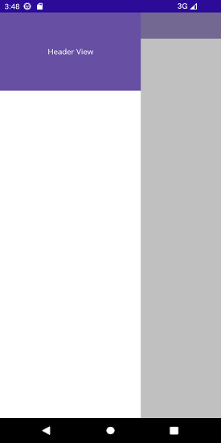
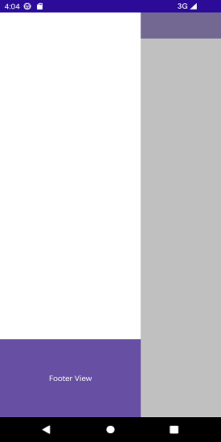

# Set Sliding Panel Content in .NET MAUI Navigation Drawer

The drawer pane content is only viewable when the drawer is in the open state. Content can be set as:

*	Header Content

*	Drawer Content

*	Footer Content

N> Header and Footer content is optional, but the Drawer content is mandatory to allocate space for the drawer.
		
## Header content

The header is displayed at the top of the drawer. Use the [DrawerHeaderView](https://help.syncfusion.com/cr/maui/Syncfusion.Maui.NavigationDrawer.DrawerSettings.html#Syncfusion_Maui_NavigationDrawer_DrawerSettings_DrawerHeaderView) property to set the header content:





<navigationdrawer:SfNavigationDrawer x:Name="navigationDrawer">
    <navigationdrawer:SfNavigationDrawer.DrawerSettings>
        <navigationdrawer:DrawerSettings>
            <navigationdrawer:DrawerSettings.DrawerHeaderView>
                <Grid BackgroundColor="#6750A4">
                    <VerticalStackLayout VerticalOptions="Center"
                                         HorizontalOptions="Center">
                        <Label Text="Header View"/>
                    </VerticalStackLayout>
                </Grid>
            </navigationdrawer:DrawerSettings.DrawerHeaderView>
        </navigationdrawer:DrawerSettings>
    </navigationdrawer:SfNavigationDrawer.DrawerSettings>
</navigationdrawer:SfNavigationDrawer>





SfNavigationDrawer navigationDrawer = new SfNavigationDrawer();
DrawerSettings drawerSettings = new DrawerSettings()
{
    DrawerWidth = 250,
};
navigationDrawer.DrawerSettings = drawerSettings;
this.Content = navigationDrawer;
  




## Header height

Adjust the height of the drawer header content using the [DrawerHeaderHeight](https://help.syncfusion.com/cr/maui/Syncfusion.Maui.NavigationDrawer.DrawerSettings.html#Syncfusion_Maui_NavigationDrawer_DrawerSettings_DrawerHeaderHeight) property.

N> The [DrawerHeaderView](https://help.syncfusion.com/cr/maui/Syncfusion.Maui.NavigationDrawer.DrawerSettings.html#Syncfusion_Maui_NavigationDrawer_DrawerSettings_DrawerHeaderView) can be removed by setting the [DrawerHeaderHeight](https://help.syncfusion.com/cr/maui/Syncfusion.Maui.NavigationDrawer.DrawerSettings.html#Syncfusion_Maui_NavigationDrawer_DrawerSettings_DrawerHeaderHeight) to zero.




    
<navigationdrawer:SfNavigationDrawer x:Name="navigationDrawer">
    <navigationdrawer:SfNavigationDrawer.DrawerSettings>
        <navigationdrawer:DrawerSettings DrawerHeaderHeight="150">
            <navigationdrawer:DrawerSettings.DrawerHeaderView>
                <Grid BackgroundColor="#6750A4">
                    <VerticalStackLayout VerticalOptions="Center"
                                         HorizontalOptions="Center">
                        <Label Text="Header View"/>
                    </VerticalStackLayout>
                </Grid>
            </navigationdrawer:DrawerSettings.DrawerHeaderView>
        </navigationdrawer:DrawerSettings>
    </navigationdrawer:SfNavigationDrawer.DrawerSettings>
</navigationdrawer:SfNavigationDrawer>





SfNavigationDrawer navigationDrawer = new SfNavigationDrawer();
DrawerSettings drawerSettings = new DrawerSettings()
{
    DrawerHeaderHeight = 150,
    DrawerWidth = 250,
};
navigationDrawer.DrawerSettings = drawerSettings;
this.Content = navigationDrawer;





## Footer content

The footer is displayed at the bottom of the drawer. Use the [DrawerFooterView](https://help.syncfusion.com/cr/maui/Syncfusion.Maui.NavigationDrawer.DrawerSettings.html#Syncfusion_Maui_NavigationDrawer_DrawerSettings_DrawerFooterView) property to set the footer content:





<navigationdrawer:SfNavigationDrawer x:Name="navigationDrawer">
    <navigationdrawer:SfNavigationDrawer.DrawerSettings>
        <navigationdrawer:DrawerSettings>
            <navigationdrawer:DrawerSettings.DrawerFooterView>
                <Grid BackgroundColor="#6750A4">
                    <VerticalStackLayout VerticalOptions="Center"
                                         HorizontalOptions="Center">
                        <Label Text="Footer View"/>
                    </VerticalStackLayout>
                </Grid>
            </navigationdrawer:DrawerSettings.DrawerFooterView>
        </navigationdrawer:DrawerSettings>
    </navigationdrawer:SfNavigationDrawer.DrawerSettings>
</navigationdrawer:SfNavigationDrawer>





SfNavigationDrawer navigationDrawer = new SfNavigationDrawer();
DrawerSettings drawerSettings = new DrawerSettings()
{
    DrawerWidth = 250,
};
navigationDrawer.DrawerSettings = drawerSettings;
this.Content = navigationDrawer;





## Footer height

Adjust the height of the drawer footer content using the [DrawerFooterHeight](https://help.syncfusion.com/cr/maui/Syncfusion.Maui.NavigationDrawer.DrawerSettings.html#Syncfusion_Maui_NavigationDrawer_DrawerSettings_DrawerFooterHeight) property.

N> The [DrawerFooterView](https://help.syncfusion.com/cr/maui/Syncfusion.Maui.NavigationDrawer.DrawerSettings.html#Syncfusion_Maui_NavigationDrawer_DrawerSettings_DrawerFooterView) can be removed by setting the [DrawerFooterHeight](https://help.syncfusion.com/cr/maui/Syncfusion.Maui.NavigationDrawer.DrawerSettings.html#Syncfusion_Maui_NavigationDrawer_DrawerSettings_DrawerFooterHeight) to zero.



 

<navigationdrawer:SfNavigationDrawer x:Name="navigationDrawer">
    <navigationdrawer:SfNavigationDrawer.DrawerSettings>
        <navigationdrawer:DrawerSettings DrawerFooterHeight="150">
            <navigationdrawer:DrawerSettings.DrawerFooterView>
                <Grid BackgroundColor="#6750A4">
                    <VerticalStackLayout VerticalOptions="Center"
                                         HorizontalOptions="Center">
                        <Label Text="Footer View"/>
                    </VerticalStackLayout>
                </Grid>
            </navigationdrawer:DrawerSettings.DrawerFooterView>
        </navigationdrawer:DrawerSettings>
    </navigationdrawer:SfNavigationDrawer.DrawerSettings>
</navigationdrawer:SfNavigationDrawer>
	



        
SfNavigationDrawer navigationDrawer = new SfNavigationDrawer();
DrawerSettings drawerSettings = new DrawerSettings()
{
    DrawerFooterHeight = 150,
    DrawerWidth = 250,
};  
navigationDrawer.DrawerSettings = drawerSettings;
this.Content = navigationDrawer;
  




## Drawer content

The main content of the drawer is displayed between the header and footer content. It can be set using the [DrawerContentView](https://help.syncfusion.com/cr/maui/Syncfusion.Maui.NavigationDrawer.DrawerSettings.html#Syncfusion_Maui_NavigationDrawer_DrawerSettings_DrawerContentView) property. The content view occupies the space left by the header and footer content.



 

<navigationdrawer:SfNavigationDrawer x:Name="navigationDrawer">
    <navigationdrawer:SfNavigationDrawer.DrawerSettings>
        <navigationdrawer:DrawerSettings>
            <navigationdrawer:DrawerSettings.DrawerContentView>
                <Grid BackgroundColor="#6750A4">
                    <VerticalStackLayout VerticalOptions="Center"
                     HorizontalOptions="Center">
                        <Label Text="Drawer Content"/>
                    </VerticalStackLayout>
                </Grid>
            </navigationdrawer:DrawerSettings.DrawerContentView>
        </navigationdrawer:DrawerSettings>
    </navigationdrawer:SfNavigationDrawer.DrawerSettings>
</navigationdrawer:SfNavigationDrawer>
	



        
SfNavigationDrawer navigationDrawer = new SfNavigationDrawer();
DrawerSettings drawerSettings = new DrawerSettings()
{
    DrawerWidth = 250,
};
navigationDrawer.DrawerSettings = drawerSettings;
this.Content = navigationDrawer;
  




## Drawer contentBackground

You can customize the background color of the drawer’s content area by setting the [ContentBackground](https://help.syncfusion.com/cr/maui/Syncfusion.Maui.NavigationDrawer.DrawerSettings.html#Syncfusion_Maui_NavigationDrawer_DrawerSettings_ContentBackground) property in `DrawerSettings`.



 

<navigationdrawer:SfNavigationDrawer x:Name="navigationDrawer">
    <navigationdrawer:SfNavigationDrawer.DrawerSettings>
        <navigationdrawer:DrawerSettings ContentBackground="Red">
            <navigationdrawer:DrawerSettings.DrawerContentView>
                <Grid BackgroundColor="#6750A4">
                    <VerticalStackLayout VerticalOptions="Center"
                     HorizontalOptions="Center">
                        <Label Text="Drawer Content"/>
                    </VerticalStackLayout>
                </Grid>
            </navigationdrawer:DrawerSettings.DrawerContentView>
        </navigationdrawer:DrawerSettings>
    </navigationdrawer:SfNavigationDrawer.DrawerSettings>
</navigationdrawer:SfNavigationDrawer>
	



        
SfNavigationDrawer navigationDrawer = new SfNavigationDrawer();
DrawerSettings drawerSettings = new DrawerSettings()
{
    DrawerWidth = 250,
};
navigationDrawer.DrawerSettings = drawerSettings;
this.Content = navigationDrawer;
  




## Add hamburger menu for toggling drawer

Create an ImageButton and set the required image to the `Source` property. Ensure the image is placed in the `Resources/Images` directory. Subscribe to the Clicked event of the button and invoke the [ToggleDrawer()](https://help.syncfusion.com/cr/maui/Syncfusion.Maui.NavigationDrawer.SfNavigationDrawer.html#Syncfusion_Maui_NavigationDrawer_SfNavigationDrawer_ToggleDrawer) method to toggle the drawer. Properly align the layout of [ContentView](https://help.syncfusion.com/cr/maui/Syncfusion.Maui.NavigationDrawer.SfNavigationDrawer.html#Syncfusion_Maui_NavigationDrawer_SfNavigationDrawer_ContentView) to position the hamburger icon at the top left, as demonstrated in the following code.




<navigationDrawer:SfNavigationDrawer x:Name="navigationDrawer">
    <navigationDrawer:SfNavigationDrawer.DrawerSettings>
        <navigationDrawer:DrawerSettings DrawerWidth="250"/>
    </navigationDrawer:SfNavigationDrawer.DrawerSettings>
    <navigationDrawer:SfNavigationDrawer.ContentView>
        <Grid x:Name="mainContentView" 
          BackgroundColor="White" RowDefinitions="Auto,*">
            <HorizontalStackLayout BackgroundColor="#6750A4" Spacing="10" Padding="5,0,0,0">
                <ImageButton x:Name="hamburgerButton"
                             HeightRequest="50"
                             WidthRequest="50"
                             HorizontalOptions="Start"
                             Source="hamburgericon.png"
                             BackgroundColor="#6750A4"
                             Clicked="hamburgerButton_Clicked"/>
                <Label x:Name="headerLabel" 
                   HeightRequest="50" 
                   HorizontalTextAlignment="Center" 
                   VerticalTextAlignment="Center" 
                   Text="Home" FontSize="16" 
                   TextColor="White" 
                   BackgroundColor="#6750A4"/>
            </HorizontalStackLayout>
            <Label Grid.Row="1" 
              x:Name="contentLabel" 
              VerticalOptions="Center" 
              HorizontalOptions="Center" 
              Text="Content View" 
              FontSize="14" 
              TextColor="Black"/>
        </Grid>
    </navigationDrawer:SfNavigationDrawer.ContentView>
</navigationDrawer:SfNavigationDrawer>





namespace NavigationDrawerGettingStarted;

public partial class MainPage : ContentPage
{
    SfNavigationDrawer navigationDrawer;
    Label contentLabel;
	public MainPage()
	{
		InitializeComponent();
        navigationDrawer = new SfNavigationDrawer();
        Grid grid = new Grid()
        {
            RowDefinitions =
            {
                new RowDefinition {Height=new GridLength(1,GridUnitType.Auto)},
                new RowDefinition(),
            },
            BackgroundColor = Colors.White,
        };

        HorizontalStackLayout layout = new HorizontalStackLayout()
        { 
            BackgroundColor = Color.FromArgb("#6750A4"),
            Spacing = 10,
            Padding = new Thickness(5,0,0,0),
        };

        var hamburgerButton = new ImageButton
        {
            HeightRequest = 50,
            WidthRequest = 50,
            HorizontalOptions = LayoutOptions.Start,
            BackgroundColor = Color.FromArgb("#6750A4"),
            Source = "hamburgericon.png",
        };
        hamburgerButton.Clicked += hamburgerButton_Clicked;

        var label = new Label
        {
            HeightRequest = 50,
            HorizontalTextAlignment = TextAlignment.Center,
            VerticalTextAlignment = TextAlignment.Center,
            Text = "Home",
            FontSize = 16,
            TextColor = Colors.White,
            BackgroundColor = Color.FromArgb("#6750A4")
        };
        layout.Children.Add(hamburgerButton);
        layout.Children.Add(label);

        contentLabel = new Label
        {
            HorizontalOptions = LayoutOptions.Center,
            VerticalOptions = LayoutOptions.Center,
            Text = "Content View",
            FontSize = 14,
            TextColor = Colors.Black
        };
        grid.SetRow(layout, 0);
        grid.SetRow(contentLabel, 1);
        grid.Children.Add(layout);
        grid.Children.Add(contentLabel);
        navigationDrawer.ContentView = grid;

        navigationDrawer.DrawerSettings = new DrawerSettings()
        {
            DrawerWidth = 250,
        };
        this.Content = navigationDrawer;
    }
}







    private void hamburgerButton_Clicked(object sender, EventArgs e)
    {
        navigationDrawer.ToggleDrawer();
    }




## Set CollectionView as DrawerContentView

Create a CollectionView with items and set it as [DrawerContentView](https://help.syncfusion.com/cr/maui/Syncfusion.Maui.NavigationDrawer.DrawerSettings.html#Syncfusion_Maui_NavigationDrawer_DrawerSettings_DrawerContentView). 




<navigationDrawer:SfNavigationDrawer x:Name="navigationDrawer">
    <navigationDrawer:SfNavigationDrawer.DrawerSettings>
        <navigationDrawer:DrawerSettings DrawerWidth="250"
                                 DrawerHeaderHeight="160">
            <navigationDrawer:DrawerSettings.DrawerHeaderView>
                <Grid BackgroundColor="#6750A4" RowDefinitions="120,40">
                    <Image Source="user.png"
                   HeightRequest="110"
                   Margin="0,10,0,0"
                   BackgroundColor="#6750A4"
                   VerticalOptions="Center"
                   HorizontalOptions="Center"/>
                    <Label Text="James Pollock"
                   Grid.Row="1"
                   HorizontalTextAlignment="Center"
                   HorizontalOptions="Center"
                   FontSize="20"
                   TextColor="White"/>
                </Grid>
            </navigationDrawer:DrawerSettings.DrawerHeaderView>
            <navigationDrawer:DrawerSettings.DrawerContentView>
                <CollectionView x:Name="collectionView" SelectionMode="Single"
                  SelectionChanged="collectionView_SelectionChanged">
                    <CollectionView.ItemsSource>
                        <x:Array Type="{x:Type x:String}">
                            <x:String>Home</x:String>
                            <x:String>Profile</x:String>
                            <x:String>Inbox</x:String>
                            <x:String>Outbox</x:String>
                            <x:String>Sent</x:String>
                            <x:String>Draft</x:String>
                        </x:Array>
                    </CollectionView.ItemsSource>
                    <CollectionView.ItemTemplate>
                        <DataTemplate>
                            <VerticalStackLayout HeightRequest="40">
                                <Label Margin="10,7,0,0"
                                   Text="{Binding}"
                                   FontSize="16"
                                   TextColor="Black"/>
                            </VerticalStackLayout>
                        </DataTemplate>
                    </CollectionView.ItemTemplate>
                </CollectionView>
            </navigationDrawer:DrawerSettings.DrawerContentView>
        </navigationDrawer:DrawerSettings>
    </navigationDrawer:SfNavigationDrawer.DrawerSettings>
    <navigationDrawer:SfNavigationDrawer.ContentView>
        <Grid x:Name="mainContentView" 
  BackgroundColor="White" RowDefinitions="Auto,*">
            <HorizontalStackLayout BackgroundColor="#6750A4" Spacing="10" Padding="5,0,0,0">
                <ImageButton x:Name="hamburgerButton"
                     HeightRequest="50"
                     WidthRequest="50"
                     HorizontalOptions="Start"
                     Source="hamburgericon.png"
                     BackgroundColor="#6750A4"
                     Clicked="hamburgerButton_Clicked"/>
                <Label x:Name="headerLabel" 
           HeightRequest="50" 
           HorizontalTextAlignment="Center" 
           VerticalTextAlignment="Center" 
           Text="Home" FontSize="16" 
           TextColor="White" 
           BackgroundColor="#6750A4"/>
            </HorizontalStackLayout>
            <Label Grid.Row="1" 
      x:Name="contentLabel" 
      VerticalOptions="Center" 
      HorizontalOptions="Center" 
      Text="Content View" 
      FontSize="14" 
      TextColor="Black"/>
        </Grid>
    </navigationDrawer:SfNavigationDrawer.ContentView>
</navigationDrawer:SfNavigationDrawer>




namespace NavigationDrawerGettingStarted;

    public partial class MainPage : ContentPage
    {

        SfNavigationDrawer navigationDrawer;
        Label headerLabel;
        Label contentLabel;
        CollectionView collectionView;

        public MainPage()
        {
            InitializeComponent();

            // Drawer Header View
            var drawerHeader = new Grid
            {
                BackgroundColor = Color.FromArgb("#6750A4"),
                RowDefinitions = new RowDefinitionCollection
                {
                    new RowDefinition { Height = 120 },
                    new RowDefinition { Height = 40 }
                }
            };

            drawerHeader.Add(new Image
            {
                Source = "user.png",
                HeightRequest = 110,
                Margin = new Thickness(0, 10, 0, 0),
                BackgroundColor = Color.FromArgb("#6750A4"),
                VerticalOptions = LayoutOptions.Center,
                HorizontalOptions = LayoutOptions.Center
            });

            drawerHeader.Add(new Label
            {
                Text = "James Pollock",
                FontSize = 20,
                TextColor = Colors.White,
                HorizontalTextAlignment = TextAlignment.Center,
                HorizontalOptions = LayoutOptions.Center
            }, 0, 1);

            // Drawer Content View
            collectionView = new CollectionView
            {
                SelectionMode = SelectionMode.Single,
                ItemsSource = new string[] { "Home", "Profile", "Inbox", "Outbox", "Sent", "Draft" },
                ItemTemplate = new DataTemplate(() =>
                {

                    var label = new Label
                    {
                        Margin = new Thickness(10, 7, 0, 0),
                        FontSize = 16,
                        TextColor = Colors.Black
                    };
                    label.SetBinding(Label.TextProperty, ".");

                    return new VerticalStackLayout
                    {
                        HeightRequest = 40,
                        Children = { label }
                    };

                })
            };

            collectionView.SelectionChanged += collectionView_SelectionChanged;

            var drawerSettings = new DrawerSettings
            {
                DrawerWidth = 250,
                DrawerHeaderHeight = 160,
                DrawerHeaderView = drawerHeader,
                DrawerContentView = collectionView
            };

            // Main Content View
            headerLabel = new Label
            {
                Text = "Home",
                FontSize = 16,
                TextColor = Colors.White,
                BackgroundColor = Color.FromArgb("#6750A4"),
                HeightRequest = 50,
                HorizontalTextAlignment = TextAlignment.Center,
                VerticalTextAlignment = TextAlignment.Center
            };

            contentLabel = new Label
            {
                Text = "Content View",
                FontSize = 14,
                TextColor = Colors.Black,
                VerticalOptions = LayoutOptions.Center,
                HorizontalOptions = LayoutOptions.Center
            };

            var hamburgerButton = new ImageButton
            {
                Source = "hamburgericon.png",
                HeightRequest = 50,
                WidthRequest = 50,
                BackgroundColor = Color.FromArgb("#6750A4"),
                HorizontalOptions = LayoutOptions.Start
            };
            hamburgerButton.Clicked += hamburgerButton_Clicked;

            var topBar = new HorizontalStackLayout
            {
                BackgroundColor = Color.FromArgb("#6750A4"),
                Spacing = 10,
                Padding = new Thickness(5, 0, 0, 0),
                Children = { hamburgerButton, headerLabel }
            };

            var mainContent = new Grid
            {
                BackgroundColor = Colors.White,
                RowDefinitions = new RowDefinitionCollection
                {
                    new RowDefinition { Height = GridLength.Auto },
                    new RowDefinition { Height = GridLength.Star }
                }
            };
            mainContent.Add(topBar);
            mainContent.Add(contentLabel, 0, 1);

            // Navigation Drawer
            navigationDrawer = new SfNavigationDrawer
            {
                DrawerSettings = drawerSettings,
                ContentView = mainContent
            };

            Content = navigationDrawer;
        }
    }







        private void hamburgerButton_Clicked(object sender, EventArgs e)
        {
            navigationDrawer.ToggleDrawer();
        }

        private void collectionView_SelectionChanged(object sender, SelectionChangedEventArgs e)
        {
            if (e.CurrentSelection.FirstOrDefault() is string selectedItem)
            {
                headerLabel.Text = selectedItem;
                contentLabel.Text = $"{selectedItem} Content";
                navigationDrawer.ToggleDrawer();
            }
        }




You can find the getting started sample from the [`GitHub`](https://github.com/SyncfusionExamples/Getting-started-sample-for-.NET-MAUI-NavigationDrawer) link.