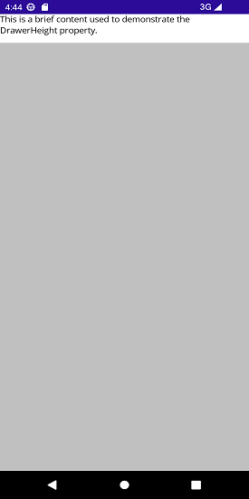

# Setting Sliding Panel Size in .NET MAUI Navigation Drawer

The size of the side pane can be adjusted using the [DrawerHeight](https://help.syncfusion.com/cr/maui/Syncfusion.Maui.NavigationDrawer.DrawerSettings.html#Syncfusion_Maui_NavigationDrawer_DrawerSettings_DrawerHeight) and [DrawerWidth](https://help.syncfusion.com/cr/maui/Syncfusion.Maui.NavigationDrawer.DrawerSettings.html#Syncfusion_Maui_NavigationDrawer_DrawerSettings_DrawerWidth) properties.

## Drawer Height

The [DrawerHeight](https://help.syncfusion.com/cr/maui/Syncfusion.Maui.NavigationDrawer.DrawerSettings.html#Syncfusion_Maui_NavigationDrawer_DrawerSettings_DrawerHeight) property changes the height of the side pane when the [Position](https://help.syncfusion.com/cr/maui/Syncfusion.Maui.NavigationDrawer.DrawerSettings.html#Syncfusion_Maui_NavigationDrawer_DrawerSettings_Position) is set to [Top](https://help.syncfusion.com/cr/maui/Syncfusion.Maui.NavigationDrawer.Position.html#Syncfusion_Maui_NavigationDrawer_Position_Top) or [Bottom](https://help.syncfusion.com/cr/maui/Syncfusion.Maui.NavigationDrawer.Position.html#Syncfusion_Maui_NavigationDrawer_Position_Bottom).





<navigationdrawer:SfNavigationDrawer x:Name="navigationDrawer">
    <navigationdrawer:SfNavigationDrawer.DrawerSettings>
        <navigationdrawer:DrawerSettings Position="Top"
                                         DrawerHeight="50">
            <navigationdrawer:DrawerSettings.DrawerHeaderView>
                <Label Text="This is a brief content used to demonstrate the DrawerHeight property."/>
            </navigationdrawer:DrawerSettings.DrawerHeaderView>
        </navigationdrawer:DrawerSettings>
    </navigationdrawer:SfNavigationDrawer.DrawerSettings>
</navigationdrawer:SfNavigationDrawer>
	
	
	
 

 SfNavigationDrawer navigationDrawer = new SfNavigationDrawer();
 DrawerSettings drawerSettings = new DrawerSettings()
 {
     Position = Position.Top,
     DrawerHeight = 50,
 };
 navigationDrawer.DrawerSettings = drawerSettings;
 this.Content = navigationDrawer;





## Drawer Width

The [DrawerWidth](https://help.syncfusion.com/cr/maui/Syncfusion.Maui.NavigationDrawer.DrawerSettings.html#Syncfusion_Maui_NavigationDrawer_DrawerSettings_DrawerWidth) property changes the width of the side pane when the [Position](https://help.syncfusion.com/cr/maui/Syncfusion.Maui.NavigationDrawer.DrawerSettings.html#Syncfusion_Maui_NavigationDrawer_DrawerSettings_Position) is set to [Left](https://help.syncfusion.com/cr/maui/Syncfusion.Maui.NavigationDrawer.Position.html#Syncfusion_Maui_NavigationDrawer_Position_Left) or [Right](https://help.syncfusion.com/cr/maui/Syncfusion.Maui.NavigationDrawer.Position.html#Syncfusion_Maui_NavigationDrawer_Position_Right).





 <navigationdrawer:SfNavigationDrawer x:Name="navigationDrawer">
     <navigationdrawer:SfNavigationDrawer.DrawerSettings>
         <navigationdrawer:DrawerSettings Position="Left"
                                          DrawerWidth="250"
                                          DrawerHeaderHeight="75">
             <navigationdrawer:DrawerSettings.DrawerHeaderView>
                 <Label Text="This is a brief content used to demonstrate the DrawerWidth property."/>
             </navigationdrawer:DrawerSettings.DrawerHeaderView>
         </navigationdrawer:DrawerSettings>
     </navigationdrawer:SfNavigationDrawer.DrawerSettings>
 </navigationdrawer:SfNavigationDrawer>
	
	
	
 

SfNavigationDrawer navigationDrawer = new SfNavigationDrawer();
DrawerSettings drawerSettings = new DrawerSettings()
{
    Position = Position.Left,
    DrawerWidth = 250,
    DrawerHeaderHeight = 75,
};
navigationDrawer.DrawerSettings = drawerSettings;
this.Content = navigationDrawer;





