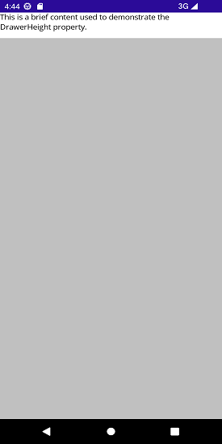
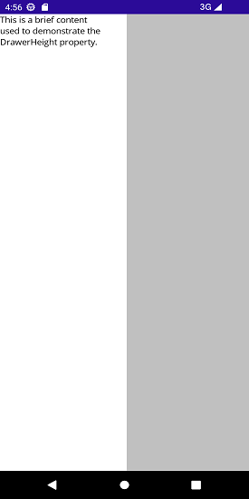

# Setting Sliding Panel Size in .NET MAUI Navigation Drawer

The size of the side pane can be adjusted using the [DrawerHeight](https://help.syncfusion.com/cr/maui/Syncfusion.Maui.NavigationDrawer.DrawerSettings.html#Syncfusion_Maui_NavigationDrawer_DrawerSettings_DrawerHeight) and [DrawerWidth](https://help.syncfusion.com/cr/maui/Syncfusion.Maui.NavigationDrawer.DrawerSettings.html#Syncfusion_Maui_NavigationDrawer_DrawerSettings_DrawerWidth) properties.

## DrawerHeight

The [DrawerHeight](https://help.syncfusion.com/cr/maui/Syncfusion.Maui.NavigationDrawer.DrawerSettings.html#Syncfusion_Maui_NavigationDrawer_DrawerSettings_DrawerHeight) property changes the height of the side pane when the [Position](https://help.syncfusion.com/cr/maui/Syncfusion.Maui.NavigationDrawer.DrawerSettings.html#Syncfusion_Maui_NavigationDrawer_DrawerSettings_Position) is set to [Top](https://help.syncfusion.com/cr/maui/Syncfusion.Maui.NavigationDrawer.Position.html#Syncfusion_Maui_NavigationDrawer_Position_Top) or [Bottom](https://help.syncfusion.com/cr/maui/Syncfusion.Maui.NavigationDrawer.Position.html#Syncfusion_Maui_NavigationDrawer_Position_Bottom).





<navigationdrawer:SfNavigationDrawer x:Name="navigationDrawer">
    <navigationdrawer:SfNavigationDrawer.DrawerSettings>
        <navigationdrawer:DrawerSettings Position="Top"
                                         DrawerHeight="50">
            <navigationdrawer:DrawerSettings.DrawerHeaderView>
                <Label Text="This is a brief content used to demonstrate the DrawerHeight property."/>
            </navigationdrawer:DrawerSettings.DrawerHeaderView>
        </navigationdrawer:DrawerSettings>
    </navigationdrawer:SfNavigationDrawer.DrawerSettings>
</navigationdrawer:SfNavigationDrawer>
	
	
	
 

 SfNavigationDrawer navigationDrawer = new SfNavigationDrawer();
 DrawerSettings drawerSettings = new DrawerSettings()
 {
     Position = Position.Top,
     DrawerHeight = 50,
 };
 navigationDrawer.DrawerSettings = drawerSettings;
 this.Content = navigationDrawer;





## DrawerWidth

The [DrawerWidth](https://help.syncfusion.com/cr/maui/Syncfusion.Maui.NavigationDrawer.DrawerSettings.html#Syncfusion_Maui_NavigationDrawer_DrawerSettings_DrawerWidth) property changes the width of the side pane when the [Position](https://help.syncfusion.com/cr/maui/Syncfusion.Maui.NavigationDrawer.DrawerSettings.html#Syncfusion_Maui_NavigationDrawer_DrawerSettings_Position) is set to [Left](https://help.syncfusion.com/cr/maui/Syncfusion.Maui.NavigationDrawer.Position.html#Syncfusion_Maui_NavigationDrawer_Position_Left) or [Right](https://help.syncfusion.com/cr/maui/Syncfusion.Maui.NavigationDrawer.Position.html#Syncfusion_Maui_NavigationDrawer_Position_Right).





 <navigationdrawer:SfNavigationDrawer x:Name="navigationDrawer">
     <navigationdrawer:SfNavigationDrawer.DrawerSettings>
         <navigationdrawer:DrawerSettings Position="Left"
                                          DrawerWidth="250"
                                          DrawerHeaderHeight="75">
             <navigationdrawer:DrawerSettings.DrawerHeaderView>
                 <Label Text="This is a brief content used to demonstrate the DrawerWidth property."/>
             </navigationdrawer:DrawerSettings.DrawerHeaderView>
         </navigationdrawer:DrawerSettings>
     </navigationdrawer:SfNavigationDrawer.DrawerSettings>
 </navigationdrawer:SfNavigationDrawer>
	
	
	
 

SfNavigationDrawer navigationDrawer = new SfNavigationDrawer();
DrawerSettings drawerSettings = new DrawerSettings()
{
    Position = Position.Left,
    DrawerWidth = 250,
    DrawerHeaderHeight = 75,
};
navigationDrawer.DrawerSettings = drawerSettings;
this.Content = navigationDrawer;





## Adjust drawer size

The default position of the navigation pane is on the left. Change the drawer width to 250 using the [DrawerWidth](https://help.syncfusion.com/cr/maui/Syncfusion.Maui.NavigationDrawer.DrawerSettings.html#Syncfusion_Maui_NavigationDrawer_DrawerSettings_DrawerWidth) property.




<navigationDrawer:SfNavigationDrawer x:Name="navigationDrawer">
    <navigationDrawer:SfNavigationDrawer.DrawerSettings>
        <navigationDrawer:DrawerSettings DrawerWidth="250"/>
    </navigationDrawer:SfNavigationDrawer.DrawerSettings>
    <navigationDrawer:SfNavigationDrawer.ContentView>
        <Grid/>
    </navigationDrawer:SfNavigationDrawer.ContentView>
</navigationDrawer:SfNavigationDrawer>





using Syncfusion.Maui.NavigationDrawer;

namespace NavigationDrawerGettingStarted;

public partial class MainPage : ContentPage
{
	public MainPage()
	{
		InitializeComponent();
        SfNavigationDrawer navigationDrawer = new SfNavigationDrawer();
        Grid grid = new Grid();
        navigationDrawer.ContentView = grid;
        navigationDrawer.DrawerSettings = new DrawerSettings()
        {
            DrawerWidth = 250,
        };
        this.Content = navigationDrawer;
    }
}




N> To change the side of the navigation pane, utilize the [Position](https://help.syncfusion.com/cr/maui/Syncfusion.Maui.NavigationDrawer.DrawerSettings.html#Syncfusion_Maui_NavigationDrawer_DrawerSettings_Position) property. Adjust the drawer height in the Top and Bottom positions using the [DrawerHeight](https://help.syncfusion.com/cr/maui/Syncfusion.Maui.NavigationDrawer.DrawerSettings.html#Syncfusion_Maui_NavigationDrawer_DrawerSettings_DrawerHeight) property.
