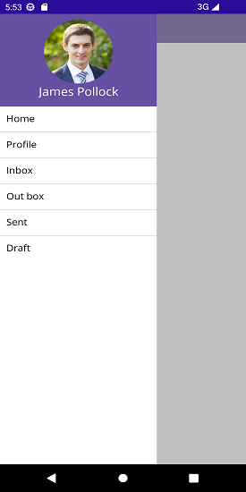
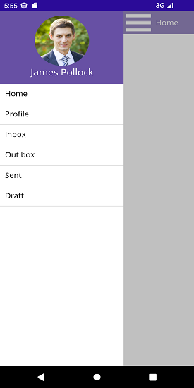

# Setting Toggle Animations in .NET MAUI Navigation Drawer

The drawer toggling animation can be changed using the [Transition](https://help.syncfusion.com/cr/maui/Syncfusion.Maui.NavigationDrawer.DrawerSettings.html#Syncfusion_Maui_NavigationDrawer_DrawerSettings_Transition) property, and it can be set to three different values. Which are:

* [SlideOnTop](https://help.syncfusion.com/cr/maui/Syncfusion.Maui.NavigationDrawer.Transition.html#Syncfusion_Maui_NavigationDrawer_Transition_SlideOnTop)

* [Push](https://help.syncfusion.com/cr/maui/Syncfusion.Maui.NavigationDrawer.Transition.html#Syncfusion_Maui_NavigationDrawer_Transition_Push)

* [Reveal](https://help.syncfusion.com/cr/maui/Syncfusion.Maui.NavigationDrawer.Transition.html#Syncfusion_Maui_NavigationDrawer_Transition_Reveal)

N> The default animation is [SlideOnTop](https://help.syncfusion.com/cr/maui/Syncfusion.Maui.NavigationDrawer.Transition.html#Syncfusion_Maui_NavigationDrawer_Transition_SlideOnTop).

## SlideOnTop

The navigation pane overlays the main content area when it is opened. It can be set as follows:





<navigationdrawer:SfNavigationDrawer x:Name="navigationDrawer">
    <navigationdrawer:SfNavigationDrawer.DrawerSettings>
        <navigationdrawer:DrawerSettings Transition="SlideOnTop">
        </navigationdrawer:DrawerSettings>
    </navigationdrawer:SfNavigationDrawer.DrawerSettings>
</navigationdrawer:SfNavigationDrawer>
	
	
	
 

SfNavigationDrawer navigationDrawer = new SfNavigationDrawer();
DrawerSettings drawerSettings = new DrawerSettings()
{
    Transition = Transition.SlideOnTop,
};
navigationDrawer.DrawerSettings = drawerSettings;
this.Content = navigationDrawer;





## Push

The navigation pane is hidden. When opened, it will push the main content area on the opposite side up to the width of the drawer. It can be set as follows:

	



<navigationdrawer:SfNavigationDrawer x:Name="navigationDrawer">
    <navigationdrawer:SfNavigationDrawer.DrawerSettings>
        <navigationdrawer:DrawerSettings Transition="Push">
        </navigationdrawer:DrawerSettings>
    </navigationdrawer:SfNavigationDrawer.DrawerSettings>
</navigationdrawer:SfNavigationDrawer>


	
 

SfNavigationDrawer navigationDrawer = new SfNavigationDrawer();
DrawerSettings drawerSettings = new DrawerSettings()
{
    Transition = Transition.Push,
};
navigationDrawer.DrawerSettings = drawerSettings;
this.Content = navigationDrawer;





## Reveal

The navigation pane is hidden behind the main content. The main content moves away on the opposite side up to the drawer width to show the drawer content. It can be set as follows:





<navigationdrawer:SfNavigationDrawer x:Name="navigationDrawer">
    <navigationdrawer:SfNavigationDrawer.DrawerSettings>
        <navigationdrawer:DrawerSettings Transition="Reveal">
        </navigationdrawer:DrawerSettings>
    </navigationdrawer:SfNavigationDrawer.DrawerSettings>
</navigationdrawer:SfNavigationDrawer>
	
	
	
 

SfNavigationDrawer navigationDrawer = new SfNavigationDrawer();
DrawerSettings drawerSettings = new DrawerSettings()
{
    Transition = Transition.Reveal,
};
navigationDrawer.DrawerSettings = drawerSettings;
this.Content = navigationDrawer;





