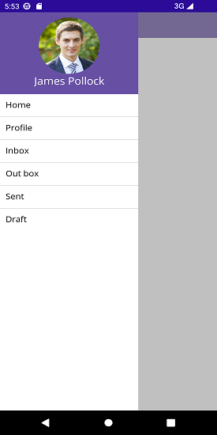
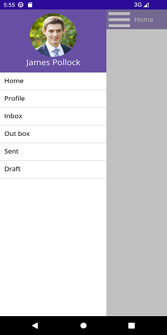

# Setting Toggle Animations in .NET MAUI Navigation Drawer

## Prerequisites

Before using the [SfNavigationDrawer](https://help.syncfusion.com/cr/maui/Syncfusion.Maui.NavigationDrawer.SfNavigationDrawer.html), ensure the following NuGet package is installed in your .NET MAUI project:

- `Syncfusion.Maui.NavigationDrawer`

For step-by-step setup, refer to the [Getting Started](https://help.syncfusion.com/maui/navigationdrawer/getting-started) documentation.

## Overview

The drawer open and close animation can be customized using the [Transition](https://help.syncfusion.com/cr/maui/Syncfusion.Maui.NavigationDrawer.DrawerSettings.html#Syncfusion_Maui_NavigationDrawer_DrawerSettings_Transition) property of [DrawerSettings](https://help.syncfusion.com/cr/maui/Syncfusion.Maui.NavigationDrawer.DrawerSettings.html). The property supports the following values:

* [SlideOnTop](https://help.syncfusion.com/cr/maui/Syncfusion.Maui.NavigationDrawer.Transition.html#Syncfusion_Maui_NavigationDrawer_Transition_SlideOnTop)
* [Push](https://help.syncfusion.com/cr/maui/Syncfusion.Maui.NavigationDrawer.Transition.html#Syncfusion_Maui_NavigationDrawer_Transition_Push)
* [Reveal](https://help.syncfusion.com/cr/maui/Syncfusion.Maui.NavigationDrawer.Transition.html#Syncfusion_Maui_NavigationDrawer_Transition_Reveal)

N> The default value is [SlideOnTop](https://help.syncfusion.com/cr/maui/Syncfusion.Maui.NavigationDrawer.Transition.html#Syncfusion_Maui_NavigationDrawer_Transition_SlideOnTop).

The following table summarizes each transition style:

| Transition | Behavior |
|------------|----------|
| SlideOnTop | Drawer overlays the main content area when opened. |
| Push | Main content slides aside to make room for the drawer. |
| Reveal | Drawer sits behind the main content, which slides aside to expose it. |

## SlideOnTop

The drawer overlays the main content area when opened.





<navigationDrawer:SfNavigationDrawer x:Name="navigationDrawer">
    <navigationDrawer:SfNavigationDrawer.DrawerSettings>
        <navigationDrawer:DrawerSettings Transition="SlideOnTop">
        </navigationDrawer:DrawerSettings>
    </navigationDrawer:SfNavigationDrawer.DrawerSettings>
</navigationDrawer:SfNavigationDrawer>





using Syncfusion.Maui.NavigationDrawer;

SfNavigationDrawer navigationDrawer = new SfNavigationDrawer()
{
    DrawerSettings = new DrawerSettings()
    {
        Transition = Transition.SlideOnTop,
    },
};





## Push

The drawer pushes the main content aside when opened.





<navigationDrawer:SfNavigationDrawer x:Name="navigationDrawer">
    <navigationDrawer:SfNavigationDrawer.DrawerSettings>
        <navigationDrawer:DrawerSettings Transition="Push">
        </navigationDrawer:DrawerSettings>
    </navigationDrawer:SfNavigationDrawer.DrawerSettings>
</navigationDrawer:SfNavigationDrawer>





SfNavigationDrawer navigationDrawer = new SfNavigationDrawer()
{
    DrawerSettings = new DrawerSettings()
    {
        Transition = Transition.Push,
    },
};





## Reveal

The drawer sits behind the main content, which slides aside to expose it.





<navigationDrawer:SfNavigationDrawer x:Name="navigationDrawer">
    <navigationDrawer:SfNavigationDrawer.DrawerSettings>
        <navigationDrawer:DrawerSettings Transition="Reveal">
        </navigationDrawer:DrawerSettings>
    </navigationDrawer:SfNavigationDrawer.DrawerSettings>
</navigationDrawer:SfNavigationDrawer>





SfNavigationDrawer navigationDrawer = new SfNavigationDrawer()
{
    DrawerSettings = new DrawerSettings()
    {
        Transition = Transition.Reveal,
    },
};





## AnimationEasing

You can customize the acceleration curve of the drawer open and close animations using the [AnimationEasing](https://help.syncfusion.com/cr/maui/Syncfusion.Maui.NavigationDrawer.DrawerSettings.html#Syncfusion_Maui_NavigationDrawer_DrawerSettings_AnimationEasing) property. The default value is `Easing.Linear`.





<navigationDrawer:SfNavigationDrawer x:Name="navigationDrawer">
    <navigationDrawer:SfNavigationDrawer.DrawerSettings>
        <navigationDrawer:DrawerSettings AnimationEasing="SpringIn">
        </navigationDrawer:DrawerSettings>
    </navigationDrawer:SfNavigationDrawer.DrawerSettings>
</navigationDrawer:SfNavigationDrawer>





using Microsoft.Maui;
using Syncfusion.Maui.NavigationDrawer;

SfNavigationDrawer navigationDrawer = new SfNavigationDrawer()
{
    DrawerSettings = new DrawerSettings()
    {
        AnimationEasing = Easing.SpringIn
    }
};





> NOTE: The `AnimationEasing` property accepts any value from the `Microsoft.Maui.Easing` type, including built-in presets such as `Linear`, `SpringIn`, `SpringOut`, `CubicIn`, `CubicOut`, `CubicInOut`, `SinIn`, `SinOut`, and `SinInOut`, as well as custom `Easing` instances created with `Easing.FromCb` or `Easing.FromAnimation`.

## See also

- [Animation Duration](https://help.syncfusion.com/maui/navigationdrawer/duration)
- [Getting Started with .NET MAUI Navigation Drawer](https://help.syncfusion.com/maui/navigationdrawer/getting-started)
- [Toggle Methods in .NET MAUI Navigation Drawer (SfNavigationDrawer)](https://help.syncfusion.com/maui/navigationdrawer/toggling-drawer)
- [Set Sliding Panel Content in .NET MAUI Navigation Drawer](https://help.syncfusion.com/maui/navigationdrawer/side-pane-content)
- [Configure the Drawer in Different Sides in .NET MAUI Navigation Drawer](https://help.syncfusion.com/maui/navigationdrawer/navigation-pane-sides)
