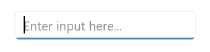
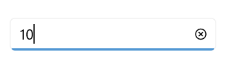
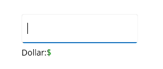
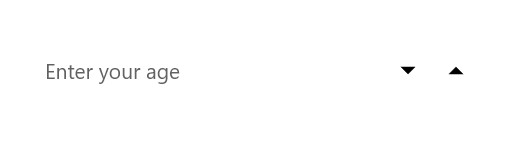
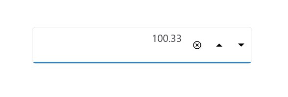
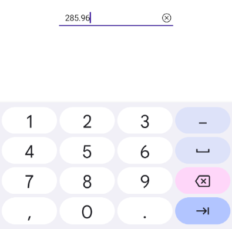
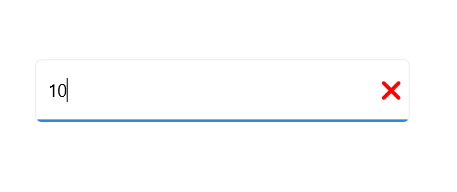
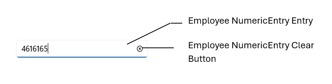

# Basic Features in .NET MAUI Numeric Entry (SfNumericEntry)

## Setting Placeholder Text

You can prompt the user with any information using the [Placeholder](https://help.syncfusion.com/cr/maui/Syncfusion.Maui.Inputs.SfNumericEntry.html#Syncfusion_Maui_Inputs_SfNumericEntry_Placeholder) property. Placeholder text will be displayed only when the value of the [AllowNull](https://help.syncfusion.com/cr/maui/Syncfusion.Maui.Inputs.SfNumericEntry.html#Syncfusion_Maui_Inputs_SfNumericEntry_AllowNull) property is **true** and the value of the `NumericEntry` control is **null**. The default value of the `Placeholder` property is **string.Empty** (No string will be displayed).




<editors:SfNumericEntry WidthRequest="200"
                        HorizontalOptions="Center" 
                        VerticalOptions="Center" 
                        Placeholder="Enter input here..." />




SfNumericEntry sfNumericEntry= new SfNumericEntry();
sfNumericEntry.WidthRequest=200;
sfNumericEntry.Placeholder = "Enter input here...";
sfNumericEntry.HorizontalOptions = LayoutOptions.Center;
sfNumericEntry.VerticalOptions = LayoutOptions.Center;




## Clear button visibility 

The [ShowClearButton](https://help.syncfusion.com/cr/maui/Syncfusion.Maui.Inputs.SfNumericEntry.html#Syncfusion_Maui_Inputs_SfNumericEntry_ShowClearButton) property is used to show or hide the clear button in the `NumericEntry`. By default, visibility of the clear button is enabled.

N> The clear button appears only when the text box is focused and the `IsEditable` property value is set to **true**.



<editors:SfNumericEntry WidthRequest="200"
                        ShowClearButton="True" 
                        IsEditable="True" 
                        Value="10"/>




SfNumericEntry sfNumericEntry= new SfNumericEntry();
sfNumericEntry.WidthRequest=200;
sfNumericEntry.Value=10;
sfNumericEntry.ShowClearButton = true;
sfNumericEntry.IsEditable = true; 




If IsEditable is true

If IsEditable is false

## Value changed notification

The [ValueChanged](https://help.syncfusion.com/cr/maui/Syncfusion.Maui.Inputs.SfNumericEntry.html#Syncfusion_Maui_Inputs_SfNumericEntry_ValueChanged) event is triggered when the [Value](https://help.syncfusion.com/cr/maui/Syncfusion.Maui.Inputs.SfNumericEntry.html#Syncfusion_Maui_Inputs_SfNumericEntry_Value) property of the `NumericEntry` control is changed. The value will not be changed when the user enters the input. The value of the `NumericEntry` control will be changed after validation is performed on the `Enter` keypress or when the focus is lost in the control. The `ValueChanged` contains the following properties.

 * `NewValue`- Contains the new input value.
 * `OldValue`- Contains the previous input value.




<editors:SfNumericEntry WidthRequest="200"
                        HorizontalOptions="Center"
                        VerticalOptions="Center"
                        ValueChanged="sfNumericEntry_ValueChanged" />




SfNumericEntry sfNumericEntry = new SfNumericEntry();
sfNumericEntry.WidthRequest=200;
sfNumericEntry.HorizontalOptions = LayoutOptions.Center;
sfNumericEntry.VerticalOptions = LayoutOptions.Center;
sfNumericEntry.ValueChanged += sfNumericEntry_ValueChanged;




You can handle the event as follows.




private void sfNumericEntry_ValueChanged(object sender, NumericEntryValueChangedEventArgs e)
{
    var oldValue = e.OldValue;
    var newValue = e.NewValue;
}




## Value Change Mode

The [ValueChangeMode](https://help.syncfusion.com/cr/maui/Syncfusion.Maui.Inputs.SfNumericEntry.html#Syncfusion_Maui_Inputs_SfNumericEntry_ValueChangeMode) property determine when the values are updated.

The supported value change modes are as follows:
    * [OnLostFocus](https://help.syncfusion.com/cr/maui/Syncfusion.Maui.Inputs.ValueChangeMode.html#Syncfusion_Maui_Inputs_ValueChangeMode_OnLostFocus) - The value will be updated when the editor loses its focus or the focus moved to the next control. By default, the [ValueChangeMode](https://help.syncfusion.com/cr/maui/Syncfusion.Maui.Inputs.SfNumericEntry.html#Syncfusion_Maui_Inputs_SfNumericEntry_ValueChangeMode) is `OnLostFocus`.
    * [OnKeyFocus](https://help.syncfusion.com/cr/maui/Syncfusion.Maui.Inputs.ValueChangeMode.html#Syncfusion_Maui_Inputs_ValueChangeMode_OnKeyFocus) - The value will be updated with each key press.




<VerticalStackLayout Spacing="10" VerticalOptions="Center">
    <editors:SfNumericEntry x:Name="numericEntry"
                            WidthRequest="200"
                            HeightRequest="40" 
                            VerticalOptions="Center"
                            ValueChangeMode="OnKeyFocus"
                            Value="50">
    </editors:SfNumericEntry>
    <HorizontalStackLayout Spacing="2" HeightRequest="40" WidthRequest="200">
        <Label Text="Dollar:"  />
        <Label x:Name="valueDisplay" 
               TextColor="Green" 
               Text="{Binding Path=Value, Source={x:Reference numericEntry}, StringFormat='${0:F2}'}" 
               HeightRequest="40" />
    </HorizontalStackLayout>
</VerticalStackLayout>




public partial class MainPage : ContentPage
{
    public Label valueDisplay;
    public MainPage()
    {
        InitializeComponent();
        var verticalStackLayout = new StackLayout
        {
            Spacing = 10,
            VerticalOptions = LayoutOptions.Center
        };
        var numericEntry = new SfNumericEntry
        {
            WidthRequest = 200,
            HeightRequest = 40,
            VerticalOptions = LayoutOptions.Center,
            ValueChangeMode = ValueChangeMode.OnKeyFocus,
            Value = 50
        };
        var horizontalStackLayout = new StackLayout
        {
            Spacing = 2,
            HeightRequest = 40,
            WidthRequest = 200
        };
        var labelDollar = new Label
        {
            Text = "Dollar:"
        };
        valueDisplay = new Label
        {
            Text="$50",
            TextColor = Colors.Green
        };
        numericEntry.ValueChanged += NumericEntry_ValueChanged;
        horizontalStackLayout.Children.Add(labelDollar);
        horizontalStackLayout.Children.Add(valueDisplay);
        verticalStackLayout.Children.Add(numericEntry);
        verticalStackLayout.Children.Add(horizontalStackLayout);
        Content = verticalStackLayout;
    }

    private void NumericEntry_ValueChanged(object sender, NumericEntryValueChangedEventArgs e)
    {
        valueDisplay.Text="$"+e.NewValue.ToString();
    }
}




## Stroke

The NumericEntry border color can be changed by using the [Stroke](https://help.syncfusion.com/cr/maui/Syncfusion.Maui.Inputs.SfNumericEntry.html#Syncfusion_Maui_Inputs_SfNumericEntry_Stroke) property. The default `Stroke` color is **Black**.




<editors:SfNumericEntry WidthRequest="200"
                        HorizontalOptions="Center"
                        VerticalOptions="Center"
                        Stroke="Red" />




SfNumericEntry sfNumericEntry = new SfNumericEntry();
sfNumericEntry.WidthRequest=200;
sfNumericEntry.HorizontalOptions = LayoutOptions.Center;
sfNumericEntry.VerticalOptions = LayoutOptions.Center;
sfNumericEntry.Stroke = Colors.Red;




You can find the complete getting started sample of .NET MAUI from this [link.](https://github.com/SyncfusionExamples/maui-numericentry-samples)

## Border visibility

The [ShowBorder](https://help.syncfusion.com/cr/maui/Syncfusion.Maui.Inputs.SfNumericEntry.html#Syncfusion_Maui_Inputs_SfNumericEntry_ShowBorder) property of [SfNumericEntry](https://help.syncfusion.com/cr/maui/Syncfusion.Maui.Inputs.SfNumericEntry.html) is used to modify the visibility of the border and its default value is **true**. The following code example demonstrates how to change the border visibility,




<editors:SfNumericEntry WidthRequest="200"
                        HeightRequest="40"
                        ShowBorder="False"/>




SfNumericEntry sfNumericEntry= new SfNumericEntry();
sfNumericEntry.WidthRequest = 200;
sfNumericEntry.HeightRequest = 40;
sfNumericEntry.ShowBorder = false;




The following image illustrates the result of the above code:

## TextAlignment

The [SfNumericEntry](https://help.syncfusion.com/cr/maui/Syncfusion.Maui.Inputs.SfNumericEntry.html) provides support to customize the text alignment by using the [HorizontalTextAlignment](https://help.syncfusion.com/cr/maui/Syncfusion.Maui.Inputs.SfNumericEntry.html#Syncfusion_Maui_Inputs_SfNumericEntry_HorizontalTextAlignment) and [VerticalTextAlignment](https://help.syncfusion.com/cr/maui/Syncfusion.Maui.Inputs.SfNumericEntry.html#Syncfusion_Maui_Inputs_SfNumericEntry_VerticalTextAlignment) properties.

N> Dynamic changes to the `HorizontalTextAlignment` property may not be functioning as expected on Android platform.




<editors:SfNumericEntry WidthRequest="200"
                        HeightRequest="50"
                        HorizontalTextAlignment="Center" 
                        VerticalTextAlignment="Start"/>




SfNumericEntry sfNumericEntry= new SfNumericEntry();
sfNumericEntry.WidthRequest = 200;
sfNumericEntry.HeightRequest = 50;
sfNumericEntry.HorizontalTextAlignment = TextAlignment.Center;
sfNumericEntry.VerticalTextAlignment = TextAlignment.Start;




The following image illustrates the result of the above code:

## Select text on focus

The [`SelectAllOnFocus`]() property allows you to automatically select all the text in the numeric entry when the control gains focus. This can improve user efficiency by making it easy to replace the entire content. The default value of this property is `true`.




<editors:SfNumericEntry WidthRequest="200"
                        Value="123456"
                        SelectAllOnFocus="False" />




SfNumericEntry numericEntry = new SfNumericEntry();
numericEntry.WidthRequest = 200;
numericEntry.Value = 123456;
numericEntry.SelectAllOnFocus = false;




## ReturnType

The `ReturnType` property specifies the return button (e.g., Next, Done, Go) of the keyboard. It helps manage the flow between multiple input fields by defining what happens when the action button is pressed.

You can define the return key type of [SfNumericEntry](https://help.syncfusion.com/cr/maui/Syncfusion.Maui.Inputs.SfNumericEntry.html) by using the ReturnType property.

N> Default value of ReturnType is `Default`.




<editors:SfNumericEntry x:Name="numericEntry" 
                        WidthRequest="200"
                        ReturnType="Next"/>




SfNumericEntry sfNumericEntry = new SfNumericEntry();
sfNumericEntry.WidthRequest=200;
sfNumericEntry.ReturnType = ReturnType.Next;




## Clear button customization

The `ClearButtonPath` property allows users to set the path for customizing the appearance of the [SfNumericEntry](https://help.syncfusion.com/cr/maui/Syncfusion.Maui.Inputs.SfNumericEntry.html) clear button.




<editors:SfNumericEntry x:Name="numericEntry"
                        WidthRequest="200"
                        ShowClearButton="True" 
                        IsEditable="True" 
                        Value="10">
            <editors:SfNumericEntry.ClearButtonPath>
                <Path Data="M1.70711 0.292893C1.31658 -0.097631 0.683417 -0.097631 0.292893 0.292893C-0.097631 0.683417 -0.097631 1.31658 0.292893 1.70711L5.58579 7L0.292893 12.2929C-0.097631 12.6834 -0.097631 13.3166 0.292893 13.7071C0.683417 14.0976 1.31658 14.0976 1.70711 13.7071L7 8.41421L12.2929 13.7071C12.6834 14.0976 13.3166 14.0976 13.7071 13.7071C14.0976 13.3166 14.0976 12.6834 13.7071 12.2929L8.41421 7L13.7071 1.70711C14.0976 1.31658 14.0976 0.683417 13.7071 0.292893C13.3166 -0.097631 12.6834 -0.097631 12.2929 0.292893L7 5.58579L1.70711 0.292893Z" 
                Fill="Red" 
                Stroke="Red"/>
            </editors:SfNumericEntry.ClearButtonPath>
</editors:SfNumericEntry>




private string _customPath = "M1.70711 0.292893C1.31658 -0.097631 0.683417 -0.097631 0.292893 0.292893C-0.097631 0.683417 -0.097631 1.31658 0.292893 1.70711L5.58579 7L0.292893 12.2929C-0.097631 12.6834 -0.097631 13.3166 0.292893 13.7071C0.683417 14.0976 1.31658 14.0976 1.70711 13.7071L7 8.41421L12.2929 13.7071C12.6834 14.0976 13.3166 14.0976 13.7071 13.7071C14.0976 13.3166 14.0976 12.6834 13.7071 12.2929L8.41421 7L13.7071 1.70711C14.0976 1.31658 14.0976 0.683417 13.7071 0.292893C13.3166 -0.097631 12.6834 -0.097631 12.2929 0.292893L7 5.58579L1.70711 0.292893Z";

var converter = new PathGeometryConverter();
var path = new Path() 
{ 
    Data = (PathGeometry)converter.ConvertFromInvariantString(_customPath),
    Fill = Colors.Red,
    Stroke = Colors.Red
};

SfNumericEntry numericEntry = new SfNumericEntry();
numricEntry.Value=10;
numericEntry.WidthRequest=200;
numericEntry.ShowClearButton = true;
numericEntry.IsEditable = true; 
numericEntry.ClearButtonPath = path;




The following image illustrates the result of the above code:

## Return Command and Return Command Parameter

- `ReturnCommand`, of type ICommand, defines the command to be executed when the return key is pressed.
- `ReturnCommandParameter`, of type object, specifies the parameter for the `ReturnCommand`.




<ContentPage.BindingContext>
    <local:CommandDemoViewModel/>
</ContentPage.BindingContext>

<editors:SfNumericEntry x:Name="numericEntry"
            WidthRequest="200"
            ReturnCommand="{Binding AlertCommand}"
            ReturnCommandParameter="Return key is pressed">
</editors:SfNumericEntry>




var viewModel = new CommandDemoViewModel();
SfNumericEntry numericEntry = new SfNumericEntry();
numericEntry.WidthRequest=200;
numericEntry.ReturnCommand = viewModel.AlertCommand;
numericEntry.ReturnCommandParameter = "Return key is pressed";







//ViewModel.cs

public class CommandDemoViewModel
{
    public ICommand AlertCommand => new Command<string>(OnAlertCommandExecuted);

    private async void OnAlertCommandExecuted(string parameter)
    {
        await Application.Current.MainPage.DisplayAlert("Alert", parameter, "OK");
    }
}




## Automation ID

The [SfNumericEntry](https://help.syncfusion.com/cr/maui/Syncfusion.Maui.Inputs.SfNumericEntry.html) control provides `AutomationId` support specifically for the` editable entry` and the `clear button`, enabling UI automation frameworks to reliably target these two elements. Each element’s AutomationId is derived from the control’s AutomationId to ensure uniqueness. 

For example, if the SfNumericEntry’s `AutomationId` is set to “Employee Numeric Entry,” the editable entry can be targeted as “Employee Numeric Entry" and the clear button as “Employee Numeric Entry Clear Button.” This focused support improves accessibility and automated UI testing by providing stable, predictable identifiers for the primary interactive elements. 

The following screenshot illustrates the AutomationIds of inner elements.

