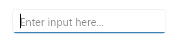
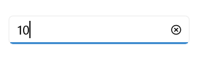
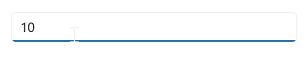
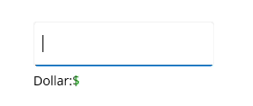
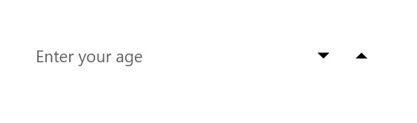
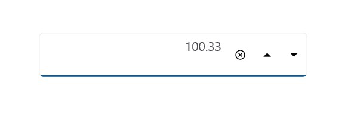
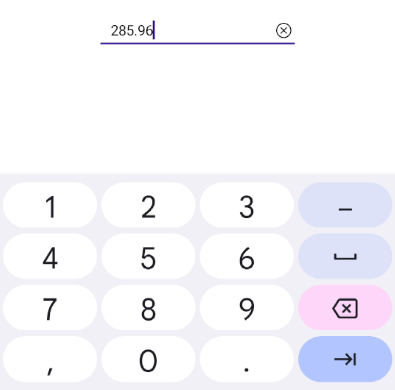
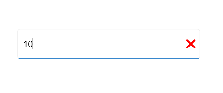
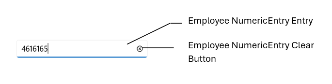

# Basic Features in .NET MAUI NumericEntry (SfNumericEntry)

## Prerequisites

Before using the [SfNumericEntry](https://help.syncfusion.com/cr/maui/Syncfusion.Maui.Inputs.SfNumericEntry.html), ensure the following NuGet package is installed in your .NET MAUI project:

- `Syncfusion.Maui.Inputs`

For a step-by-step setup, refer to the [Getting Started](Getting-Started.md) documentation.

## Setting Placeholder Text

Use the [Placeholder](https://help.syncfusion.com/cr/maui/Syncfusion.Maui.Inputs.SfNumericEntry.html#Syncfusion_Maui_Inputs_SfNumericEntry_Placeholder) property to display a hint when the control has no value. The placeholder text is shown only when the value of the [AllowNull](https://help.syncfusion.com/cr/maui/Syncfusion.Maui.Inputs.SfNumericEntry.html#Syncfusion_Maui_Inputs_SfNumericEntry_AllowNull) property is **true** and the `Value` is **null**. The default value of the `Placeholder` property is `string.Empty` — no placeholder is displayed.




<editors:SfNumericEntry WidthRequest="200"
                        HorizontalOptions="Center"
                        VerticalOptions="Center"
                        Placeholder="Enter input here..." />




SfNumericEntry sfNumericEntry = new SfNumericEntry();
sfNumericEntry.WidthRequest = 200;
sfNumericEntry.Placeholder = "Enter input here...";
sfNumericEntry.HorizontalOptions = LayoutOptions.Center;
sfNumericEntry.VerticalOptions = LayoutOptions.Center;




## Clear button visibility

The [ShowClearButton](https://help.syncfusion.com/cr/maui/Syncfusion.Maui.Inputs.SfNumericEntry.html#Syncfusion_Maui_Inputs_SfNumericEntry_ShowClearButton) property controls whether the clear button is displayed in the `NumericEntry`. By default, the clear button is visible.

N> The clear button appears only when the text box is focused and the `IsEditable` property is set to **true**.




<editors:SfNumericEntry WidthRequest="200"
                        ShowClearButton="True"
                        IsEditable="True"
                        Value="10" />




SfNumericEntry sfNumericEntry = new SfNumericEntry();
sfNumericEntry.WidthRequest = 200;
sfNumericEntry.Value = 10;
sfNumericEntry.ShowClearButton = true;
sfNumericEntry.IsEditable = true;




If `IsEditable` is **true**:

If `IsEditable` is **false**:

## Value changed notification

The [ValueChanged](https://help.syncfusion.com/cr/maui/Syncfusion.Maui.Inputs.SfNumericEntry.html#Syncfusion_Maui_Inputs_SfNumericEntry_ValueChanged) event is raised when the [Value](https://help.syncfusion.com/cr/maui/Syncfusion.Maui.Inputs.SfNumericEntry.html#Syncfusion_Maui_Inputs_SfNumericEntry_Value) property of the `NumericEntry` control changes. The value is not updated while the user is typing. The value is updated after validation is performed on the Enter keypress or when the control loses focus. The `NumericEntryValueChangedEventArgs` passed to the handler exposes the following members:

| Member | Type | Description |
| --- | --- | --- |
| `NewValue` | `double?` | The new value of the control. |
| `OldValue` | `double?` | The previous value of the control. |




<editors:SfNumericEntry WidthRequest="200"
                        HorizontalOptions="Center"
                        VerticalOptions="Center"
                        ValueChanged="sfNumericEntry_ValueChanged" />




SfNumericEntry sfNumericEntry = new SfNumericEntry();
sfNumericEntry.WidthRequest = 200;
sfNumericEntry.HorizontalOptions = LayoutOptions.Center;
sfNumericEntry.VerticalOptions = LayoutOptions.Center;
sfNumericEntry.ValueChanged += sfNumericEntry_ValueChanged;




You can handle the event as follows.




private void sfNumericEntry_ValueChanged(object sender, NumericEntryValueChangedEventArgs e)
{
    var oldValue = e.OldValue;
    var newValue = e.NewValue;
}




## Value Change Mode

The [ValueChangeMode](https://help.syncfusion.com/cr/maui/Syncfusion.Maui.Inputs.SfNumericEntry.html#Syncfusion_Maui_Inputs_SfNumericEntry_ValueChangeMode) property determines when the value is updated. The supported modes are:

* [OnLostFocus](https://help.syncfusion.com/cr/maui/Syncfusion.Maui.Inputs.ValueChangeMode.html#Syncfusion_Maui_Inputs_ValueChangeMode_OnLostFocus) — The value is updated when the editor loses focus or focus moves to the next control. This is the default mode.
* [OnKeyFocus](https://help.syncfusion.com/cr/maui/Syncfusion.Maui.Inputs.ValueChangeMode.html#Syncfusion_Maui_Inputs_ValueChangeMode_OnKeyFocus) — The value is updated with each keypress.




<VerticalStackLayout Spacing="10" VerticalOptions="Center">
    <editors:SfNumericEntry x:Name="numericEntry"
                            WidthRequest="200"
                            HeightRequest="40" 
                            VerticalOptions="Center"
                            ValueChangeMode="OnKeyFocus"
                            Value="50">
    </editors:SfNumericEntry>
    <HorizontalStackLayout Spacing="2" HeightRequest="40" WidthRequest="200">
        <Label Text="Dollar:"  />
        <Label x:Name="valueDisplay" 
               TextColor="Green" 
               Text="{Binding Path=Value, Source={x:Reference numericEntry}, StringFormat='${0:F2}'}" 
               HeightRequest="40" />
    </HorizontalStackLayout>
</VerticalStackLayout>




public partial class MainPage : ContentPage
{
    public Label valueDisplay;
    public MainPage()
    {
        InitializeComponent();
        var verticalStackLayout = new StackLayout
        {
            Spacing = 10,
            VerticalOptions = LayoutOptions.Center
        };
        var numericEntry = new SfNumericEntry
        {
            WidthRequest = 200,
            HeightRequest = 40,
            VerticalOptions = LayoutOptions.Center,
            ValueChangeMode = ValueChangeMode.OnKeyFocus,
            Value = 50
        };
        var horizontalStackLayout = new StackLayout
        {
            Spacing = 2,
            HeightRequest = 40,
            WidthRequest = 200
        };
        var labelDollar = new Label
        {
            Text = "Dollar:"
        };
        valueDisplay = new Label
        {
            Text="$50",
            TextColor = Colors.Green
        };
        numericEntry.ValueChanged += NumericEntry_ValueChanged;
        horizontalStackLayout.Children.Add(labelDollar);
        horizontalStackLayout.Children.Add(valueDisplay);
        verticalStackLayout.Children.Add(numericEntry);
        verticalStackLayout.Children.Add(horizontalStackLayout);
        Content = verticalStackLayout;
    }

    private void NumericEntry_ValueChanged(object sender, NumericEntryValueChangedEventArgs e)
    {
        valueDisplay.Text = "$"+e.NewValue.ToString();;
    }
}




## Completed Event

The [Completed](https://help.syncfusion.com/cr/maui/Syncfusion.Maui.Inputs.SfNumericEntry.html#Syncfusion_Maui_Inputs_SfNumericEntry_Completed) event is raised when the user finalizes the text in the [SfNumericEntry](https://help.syncfusion.com/cr/maui/Syncfusion.Maui.Inputs.SfNumericEntry.html) in editable mode by pressing the Return key on the keyboard. The handler is a generic event handler that takes the `sender` and `EventArgs`.




<editors:SfNumericEntry x:Name="numericEntry"
                        WidthRequest="200"
                        Value="153"
                        Completed="numericEntry_Completed" />




SfNumericEntry numericEntry = new SfNumericEntry()
{
    WidthRequest = 200,
    Value = 153,
};
numericEntry.Completed += numericEntry_Completed;
this.Content = numericEntry;




The `Completed` event can be handled in C# as follows:




private async void numericEntry_Completed(object sender, EventArgs e)
{
    await DisplayAlert("Message", "Text entering Completed", "OK");
}




## ClearButtonClicked Event

The [ClearButtonClicked](https://help.syncfusion.com/cr/maui/Syncfusion.Maui.Inputs.SfNumericEntry.html#Syncfusion_Maui_Inputs_SfNumericEntry_ClearButtonClicked) event is raised when the user activates the clear button in the `SfNumericEntry` by tapping it. The handler is a generic event handler that takes the `sender` and `EventArgs`.




<editors:SfNumericEntry x:Name="numericEntry"
                        WidthRequest="200"
                        Value="153"
                        ClearButtonClicked="numericEntry_ClearButtonClicked" />




SfNumericEntry numericEntry = new SfNumericEntry()
{
    WidthRequest = 200,
    Value = 153,
};
numericEntry.ClearButtonClicked += numericEntry_ClearButtonClicked;
this.Content = numericEntry;




The `ClearButtonClicked` event can be handled in C# as follows:




private async void numericEntry_ClearButtonClicked(object sender, EventArgs e)
{
    await DisplayAlert("Message", "Clear Button Clicked", "OK");
}




## Stroke

Use the [Stroke](https://help.syncfusion.com/cr/maui/Syncfusion.Maui.Inputs.SfNumericEntry.html#Syncfusion_Maui_Inputs_SfNumericEntry_Stroke) property to change the border color of the NumericEntry. The default value is `LightGray`.




<editors:SfNumericEntry WidthRequest="200"
                        HorizontalOptions="Center"
                        VerticalOptions="Center"
                        Stroke="Red" />




SfNumericEntry sfNumericEntry = new SfNumericEntry();
sfNumericEntry.WidthRequest = 200;
sfNumericEntry.HorizontalOptions = LayoutOptions.Center;
sfNumericEntry.VerticalOptions = LayoutOptions.Center;
sfNumericEntry.Stroke = Colors.Red;




## Border visibility

Use the [ShowBorder](https://help.syncfusion.com/cr/maui/Syncfusion.Maui.Inputs.SfNumericEntry.html#Syncfusion_Maui_Inputs_SfNumericEntry_ShowBorder) property of [SfNumericEntry](https://help.syncfusion.com/cr/maui/Syncfusion.Maui.Inputs.SfNumericEntry.html) to control the visibility of the border. The default value is `true`. The following example shows how to change the border visibility:




<editors:SfNumericEntry WidthRequest="200"
                        HeightRequest="40"
                        ShowBorder="False" />




SfNumericEntry sfNumericEntry = new SfNumericEntry();
sfNumericEntry.WidthRequest = 200;
sfNumericEntry.HeightRequest = 40;
sfNumericEntry.ShowBorder = false;




The following image illustrates the result of the above code:

## TextAlignment

The [SfNumericEntry](https://help.syncfusion.com/cr/maui/Syncfusion.Maui.Inputs.SfNumericEntry.html) supports text-alignment customization through the [HorizontalTextAlignment](https://help.syncfusion.com/cr/maui/Syncfusion.Maui.Inputs.SfNumericEntry.html#Syncfusion_Maui_Inputs_SfNumericEntry_HorizontalTextAlignment) and [VerticalTextAlignment](https://help.syncfusion.com/cr/maui/Syncfusion.Maui.Inputs.SfNumericEntry.html#Syncfusion_Maui_Inputs_SfNumericEntry_VerticalTextAlignment) properties.

N> Dynamic changes to the `HorizontalTextAlignment` property may not behave as expected on the Android platform.




<editors:SfNumericEntry WidthRequest="200"
                        HeightRequest="50"
                        HorizontalTextAlignment="Center"
                        VerticalTextAlignment="Start" />




SfNumericEntry sfNumericEntry = new SfNumericEntry();
sfNumericEntry.WidthRequest = 200;
sfNumericEntry.HeightRequest = 50;
sfNumericEntry.HorizontalTextAlignment = TextAlignment.Center;
sfNumericEntry.VerticalTextAlignment = TextAlignment.Start;




The following image illustrates the result of the above code:

## Select text on focus

The [`SelectAllOnFocus`](https://help.syncfusion.com/cr/maui/Syncfusion.Maui.Inputs.SfNumericEntry.html#Syncfusion_Maui_Inputs_SfNumericEntry_SelectAllOnFocus) property automatically selects all the text in the NumericEntry when the control gains focus. This makes it easy to replace the entire content. The default value is `true`.




<editors:SfNumericEntry WidthRequest="200"
                        Value="123456"
                        SelectAllOnFocus="False" />




SfNumericEntry numericEntry = new SfNumericEntry();
numericEntry.WidthRequest = 200;
numericEntry.Value = 123456;
numericEntry.SelectAllOnFocus = false;




## ReturnType

The `ReturnType` property specifies the return button of the on-screen keyboard (for example, `Next`, `Done`, or `Go`). Use it to manage the flow between multiple input fields by defining what action the Return key performs.

You can define the return key type of [SfNumericEntry](https://help.syncfusion.com/cr/maui/Syncfusion.Maui.Inputs.SfNumericEntry.html) by using the ReturnType property.

N> The default value of `ReturnType` is `Default`.




<editors:SfNumericEntry x:Name="numericEntry"
                        WidthRequest="200"
                        ReturnType="Next" />




SfNumericEntry sfNumericEntry = new SfNumericEntry();
sfNumericEntry.WidthRequest = 200;
sfNumericEntry.ReturnType = ReturnType.Next;




## Clear button customization

The `ClearButtonPath` property specifies the `Path` that is rendered as the clear-button icon, allowing the appearance of the clear button to be customized.




<editors:SfNumericEntry x:Name="numericEntry"
                        WidthRequest="200"
                        ShowClearButton="True"
                        IsEditable="True"
                        Value="10">
    <editors:SfNumericEntry.ClearButtonPath>
        <Path Data="M1.70711 0.292893C1.31658 -0.097631 0.683417 -0.097631 0.292893 0.292893C-0.097631 0.683417 -0.097631 1.31658 0.292893 1.70711L5.58579 7L0.292893 12.2929C-0.097631 12.6834 -0.097631 13.3166 0.292893 13.7071C0.683417 14.0976 1.31658 14.0976 1.70711 13.7071L7 8.41421L12.2929 13.7071C12.6834 14.0976 13.3166 14.0976 13.7071 13.7071C14.0976 13.3166 14.0976 12.6834 13.7071 12.2929L8.41421 7L13.7071 1.70711C14.0976 1.31658 14.0976 0.683417 13.7071 0.292893C13.3166 -0.097631 12.6834 -0.097631 12.2929 0.292893L7 5.58579L1.70711 0.292893Z"
              Fill="Red"
              Stroke="Red" />
    </editors:SfNumericEntry.ClearButtonPath>
</editors:SfNumericEntry>




private string _customPath = "M1.70711 0.292893C1.31658 -0.097631 0.683417 -0.097631 0.292893 0.292893C-0.097631 0.683417 -0.097631 1.31658 0.292893 1.70711L5.58579 7L0.292893 12.2929C-0.097631 12.6834 -0.097631 13.3166 0.292893 13.7071C0.683417 14.0976 1.31658 14.0976 1.70711 13.7071L7 8.41421L12.2929 13.7071C12.6834 14.0976 13.3166 14.0976 13.7071 13.7071C14.0976 13.3166 14.0976 12.6834 13.7071 12.2929L8.41421 7L13.7071 1.70711C14.0976 1.31658 14.0976 0.683417 13.7071 0.292893C13.3166 -0.097631 12.6834 -0.097631 12.2929 0.292893L7 5.58579L1.70711 0.292893Z";

var converter = new PathGeometryConverter();

var path = new Path()
{
    Data = (PathGeometry)converter.ConvertFromInvariantString(_customPath),
    Stroke = Colors.Red
};

SfNumericEntry numericEntry = new SfNumericEntry();
numericEntry.Value = 10;
numericEntry.WidthRequest = 200;
numericEntry.ShowClearButton = true;
numericEntry.IsEditable = true;
numericEntry.ClearButtonPath = path;
this.Content = numericEntry;




The following image illustrates the result of the above code:

## Return Command and Return Command Parameter

- `ReturnCommand`, of type `ICommand`, defines the command that is executed when the Return key is pressed.
- `ReturnCommandParameter`, of type `object`, specifies the parameter passed to the `ReturnCommand`.




<editors:SfNumericEntry x:Name="numericEntry"
                        WidthRequest="200"
                        ReturnCommand="{Binding AlertCommand}"
                        ReturnCommandParameter="Return key is pressed" />
    <editors:SfNumericEntry.BindingContext>
        <local:CommandDemoViewModel />
    </editors:SfNumericEntry.BindingContext>                    
</editors:SfNumericEntry>




var viewModel = new CommandDemoViewModel();
SfNumericEntry numericEntry = new SfNumericEntry
{
    WidthRequest = 200,
    ReturnCommand = viewModel.AlertCommand,
    ReturnCommandParameter = "Return key is pressed",
};
this.Content = numericEntry;







// ViewModel.cs

public class CommandDemoViewModel
{
    public ICommand AlertCommand => new Command<string>(OnAlertCommandExecuted);

    private async void OnAlertCommandExecuted(string parameter)
    {
        await Shell.Current.DisplayAlert("Alert", parameter, "OK");
    }
}




## Automation ID

The [SfNumericEntry](https://help.syncfusion.com/cr/maui/Syncfusion.Maui.Inputs.SfNumericEntry.html) control provides `AutomationId` support specifically for the `editable entry` and the `clear button`, enabling UI automation frameworks to reliably target these two elements. Each element’s `AutomationId` is derived from the control’s `AutomationId` to ensure uniqueness.

For example, if the `SfNumericEntry`’s `AutomationId` is set to `EmployeeNumericEntry`, the editable entry can be targeted as `EmployeeNumericEntry Entry` and the clear button as `EmployeeNumericEntry Clear Button`. This focused support improves accessibility and automated UI testing by providing stable, predictable identifiers for the primary interactive elements.

The following screenshot illustrates the `AutomationId`s of the inner elements:

## See Also

* [Formatting](formatting.md)
* [Restriction](restriction.md)
* [UpDown-Button](UpDown-Button.md)

## Related resources

* [Getting started sample for .NET MAUI NumericEntry on GitHub](https://github.com/SyncfusionExamples/maui-numericentry-samples)