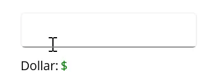

# Basic Features in .NET MAUI Numeric Entry (SfNumericEntry)

## Setting Placeholder Text

The [Placeholder](https://help.syncfusion.com/cr/maui/Syncfusion.Maui.Inputs.SfNumericEntry.html#Syncfusion_Maui_Inputs_SfNumericEntry_Placeholder) property is used to display prompt text to guide users on input. The placeholder text appears only when the [AllowNull](https://help.syncfusion.com/cr/maui/Syncfusion.Maui.Inputs.SfNumericEntry.html#Syncfusion_Maui_Inputs_SfNumericEntry_AllowNull) property is `true` and the `NumericEntry` control value is `null`. By default, the `Placeholder` property is `string.Empty`, meaning no text is shown.




<editors:SfNumericEntry WidthRequest="200"
                        HorizontalOptions="Center" 
                        VerticalOptions="Center" 
                        Placeholder="Enter input here..." />




SfNumericEntry sfNumericEntry= new SfNumericEntry();
sfNumericEntry.WidthRequest=200;
sfNumericEntry.Placeholder = "Enter input here...";
sfNumericEntry.HorizontalOptions = LayoutOptions.Center;
sfNumericEntry.VerticalOptions = LayoutOptions.Center;




## Clear Button Visibility

The [ShowClearButton](https://help.syncfusion.com/cr/maui/Syncfusion.Maui.Inputs.SfNumericEntry.html#Syncfusion_Maui_Inputs_SfNumericEntry_ShowClearButton) property determines the visibility of the clear button in the `NumericEntry`. By default, the clear button is visible.

N> The clear button appears only when the text box is focused, and the `IsEditable` property is set to `true`.




<editors:SfNumericEntry WidthRequest="200"
                        ShowClearButton="True" 
                        IsEditable="True" 
                        Value="10"/>




SfNumericEntry sfNumericEntry= new SfNumericEntry();
sfNumericEntry.WidthRequest=200;
sfNumericEntry.Value=10;
sfNumericEntry.ShowClearButton = true;
sfNumericEntry.IsEditable = true; 




If `IsEditable` is true:

If `IsEditable` is false:

## Value Changed Notification

The [ValueChanged](https://help.syncfusion.com/cr/maui/Syncfusion.Maui.Inputs.SfNumericEntry.html#Syncfusion_Maui_Inputs_SfNumericEntry_ValueChanged) event is triggered when the [Value](https://help.syncfusion.com/cr/maui/Syncfusion.Maui.Inputs.SfNumericEntry.html#Syncfusion_Maui_Inputs_SfNumericEntry_Value) property of the `NumericEntry` control changes. The value changes after validation is performed on the `Enter` keypress or when the control loses focus. The `ValueChanged` event provides the following properties:

* `NewValue`: Contains the new input value.
* `OldValue`: Contains the previous input value.




<editors:SfNumericEntry WidthRequest="200"
                        HorizontalOptions="Center"
                        VerticalOptions="Center"
                        ValueChanged="sfNumericEntry_ValueChanged" />




SfNumericEntry sfNumericEntry = new SfNumericEntry();
sfNumericEntry.WidthRequest=200;
sfNumericEntry.HorizontalOptions = LayoutOptions.Center;
sfNumericEntry.VerticalOptions = LayoutOptions.Center;
sfNumericEntry.ValueChanged += sfNumericEntry_ValueChanged;




Event handling example:



private void sfNumericEntry_ValueChanged(object sender, NumericEntryValueChangedEventArgs e)
{
    var oldValue = e.OldValue;
    var newValue = e.NewValue;
}




## Value Change Mode

The [ValueChangeMode](https://help.syncfusion.com/cr/maui/Syncfusion.Maui.Inputs.SfNumericEntry.html#Syncfusion_Maui_Inputs_SfNumericEntry_ValueChangeMode) property determines when values are updated. The supported modes are:

* [OnLostFocus](https://help.syncfusion.com/cr/maui/Syncfusion.Maui.Inputs.ValueChangeMode.html#Syncfusion_Maui_Inputs_ValueChangeMode_OnLostFocus): Updates the value when the editor loses focus. This is the default mode.
* [OnKeyFocus](https://help.syncfusion.com/cr/maui/Syncfusion.Maui.Inputs.ValueChangeMode.html#Syncfusion_Maui_Inputs_ValueChangeMode_OnKeyFocus): Updates the value with each keypress.




<VerticalStackLayout Spacing="10" VerticalOptions="Center">
    <editors:SfNumericEntry x:Name="numericEntry"
                            WidthRequest="200"
                            HeightRequest="40" 
                            VerticalOptions="Center"
                            ValueChangeMode="OnKeyFocus"
                            Value="50">
    </editors:SfNumericEntry>
    <HorizontalStackLayout Spacing="2" HeightRequest="40" WidthRequest="200">
        <Label Text="Dollar:"  />
        <Label x:Name="valueDisplay" 
               TextColor="Green" 
               Text="{Binding Path=Value, Source={x:Reference numericEntry}, StringFormat='${0:F2}'}" 
               HeightRequest="40" />
    </HorizontalStackLayout>
</VerticalStackLayout>




public partial class MainPage : ContentPage
{
    public Label valueDisplay;
    public MainPage()
    {
        InitializeComponent();
        var verticalStackLayout = new StackLayout
        {
            Spacing = 10,
            VerticalOptions = LayoutOptions.Center
        };
        var numericEntry = new SfNumericEntry
        {
            WidthRequest = 200,
            HeightRequest = 40,
            VerticalOptions = LayoutOptions.Center,
            ValueChangeMode = ValueChangeMode.OnKeyFocus,
            Value = 50
        };
        var horizontalStackLayout = new StackLayout
        {
            Spacing = 2,
            HeightRequest = 40,
            WidthRequest = 200
        };
        var labelDollar = new Label
        {
            Text = "Dollar:"
        };
        valueDisplay = new Label
        {
            Text="$50",
            TextColor = Colors.Green
        };
        numericEntry.ValueChanged += NumericEntry_ValueChanged;
        horizontalStackLayout.Children.Add(labelDollar);
        horizontalStackLayout.Children.Add(valueDisplay);
        verticalStackLayout.Children.Add(numericEntry);
        verticalStackLayout.Children.Add(horizontalStackLayout);
        Content = verticalStackLayout;
    }

    private void NumericEntry_ValueChanged(object sender, NumericEntryValueChangedEventArgs e)
    {
        valueDisplay.Text="$"+e.NewValue.ToString();
    }
}




## Stroke

The border color of the NumericEntry can be changed using the [Stroke](https://help.syncfusion.com/cr/maui/Syncfusion.Maui.Inputs.SfNumericEntry.html#Syncfusion_Maui_Inputs_SfNumericEntry_Stroke) property. The default `Stroke` color is **Black**.




<editors:SfNumericEntry WidthRequest="200"
                        HorizontalOptions="Center"
                        VerticalOptions="Center"
                        Stroke="Red" />




SfNumericEntry sfNumericEntry = new SfNumericEntry();
sfNumericEntry.WidthRequest=200;
sfNumericEntry.HorizontalOptions = LayoutOptions.Center;
sfNumericEntry.VerticalOptions = LayoutOptions.Center;
sfNumericEntry.Stroke = Colors.Red;




Check the complete getting started sample for .NET MAUI [here](https://github.com/SyncfusionExamples/maui-numericentry-samples).

## Border Visibility

The [ShowBorder](https://help.syncfusion.com/cr/maui/Syncfusion.Maui.Inputs.SfNumericEntry.html#Syncfusion_Maui_Inputs_SfNumericEntry_ShowBorder) property modifies the visibility of the `SfNumericEntry` border. The default value is `true`. The code example below demonstrates how to change the border visibility.




<editors:SfNumericEntry WidthRequest="200"
                        HeightRequest="40"
                        ShowBorder="False"/>




SfNumericEntry sfNumericEntry= new SfNumericEntry();
sfNumericEntry.WidthRequest = 200;
sfNumericEntry.HeightRequest = 40;
sfNumericEntry.ShowBorder = false;




The following image illustrates the result of the above code:

## Text Alignment

The [SfNumericEntry](https://help.syncfusion.com/cr/maui/Syncfusion.Maui.Inputs.SfNumericEntry.html) allows customization of text alignment using the [HorizontalTextAlignment](https://help.syncfusion.com/cr/maui/Syncfusion.Maui.Inputs.SfNumericEntry.html#Syncfusion_Maui_Inputs_SfNumericEntry_HorizontalTextAlignment) and [VerticalTextAlignment](https://help.syncfusion.com/cr/maui/Syncfusion.Maui.Inputs.SfNumericEntry.html#Syncfusion_Maui_Inputs_SfNumericEntry_VerticalTextAlignment) properties.

N> Dynamic changes to the `HorizontalTextAlignment` property may not work as expected on the Android platform.




<editors:SfNumericEntry WidthRequest="200"
                        HeightRequest="50"
                        HorizontalTextAlignment="Center" 
                        VerticalTextAlignment="Start"/>




SfNumericEntry sfNumericEntry= new SfNumericEntry();
sfNumericEntry.WidthRequest = 200;
sfNumericEntry.HeightRequest = 50;
sfNumericEntry.HorizontalTextAlignment = TextAlignment.Center;
sfNumericEntry.VerticalTextAlignment = TextAlignment.Start;




The following image illustrates the result of the above code:

## ReturnType

The `ReturnType` property specifies the return button type (e.g., Next, Done, Go) on the keyboard. It helps manage the flow between multiple input fields by defining what happens when the action button is pressed.

You can define the return key type for [SfNumericEntry](https://help.syncfusion.com/cr/maui/Syncfusion.Maui.Inputs.SfNumericEntry.html) using the `ReturnType` property.

N> The default value of ReturnType is `Default`.




<editors:SfNumericEntry x:Name="numericEntry" 
                        WidthRequest="200"
                        ReturnType="Next"/>




SfNumericEntry sfNumericEntry = new SfNumericEntry();
sfNumericEntry.WidthRequest=200;
sfNumericEntry.ReturnType = ReturnType.Next;




## Clear Button Customization

The `ClearButtonPath` property allows customization of the appearance of the `SfNumericEntry` clear button.



<editors:SfNumericEntry x:Name="numericEntry"
                        WidthRequest="200"
                        ShowClearButton="True" 
                        IsEditable="True" 
                        Value="10">
            <editors:SfNumericEntry.ClearButtonPath>
                <Path Data="M1.70711 0.292893C1.31658 -0.097631 0.683417 -0.097631 0.292893 0.292893C-0.097631 0.683417 -0.097631 1.31658 0.292893 1.70711L5.58579 7L0.292893 12.2929C-0.097631 12.6834 -0.097631 13.3166 0.292893 13.7071C0.683417 14.0976 1.31658 14.0976 1.70711 13.7071L7 8.41421L12.2929 13.7071C12.6834 14.0976 13.3166 14.0976 13.7071 13.7071C14.0976 13.3166 14.0976 12.6834 13.7071 12.2929L8.41421 7L13.7071 1.70711C14.0976 1.31658 14.0976 0.683417 13.7071 0.292893C13.3166 -0.097631 12.6834 -0.097631 12.2929 0.292893L7 5.58579L1.70711 0.292893Z" 
                Fill="Red" 
                Stroke="Red"/>
            </editors:SfNumericEntry.ClearButtonPath>
</editors:SfNumericEntry>




private string _customPath = "M1.70711 0.292893C1.31658 -0.097631 0.683417 -0.097631 0.292893 0.292893C-0.097631 0.683417 -0.097631 1.31658 0.292893 1.70711L5.58579 7L0.292893 12.2929C-0.097631 12.6834 -0.097631 13.3166 0.292893 13.7071C0.683417 14.0976 1.31658 14.0976 1.70711 13.7071L7 8.41421L12.2929 13.7071C12.6834 14.0976 13.3166 14.0976 13.7071 13.7071C14.0976 13.3166 14.0976 12.6834 13.7071 12.2929L8.41421 7L13.7071 1.70711C14.0976 1.31658 14.0976 0.683417 13.7071 0.292893C13.3166 -0.097631 12.6834 -0.097631 12.2929 0.292893L7 5.58579L1.70711 0.292893Z";

var converter = new PathGeometryConverter();
var path = new Path() 
{ 
    Data = (PathGeometry)converter.ConvertFromInvariantString(_customPath),
    Fill = Colors.Red,
    Stroke = Colors.Red
};

SfNumericEntry numericEntry = new SfNumericEntry();
numricEntry.Value=10;
numericEntry.WidthRequest=200;
numericEntry.ShowClearButton = true;
numericEntry.IsEditable = true; 
numericEntry.ClearButtonPath = path;




The following image illustrates the result of the above code:

## Return Command and Return Command Parameter

- `ReturnCommand`, of type ICommand, defines the command to execute when the return key is pressed.
- `ReturnCommandParameter`, of type object, specifies the parameter for the `ReturnCommand`.




<ContentPage.BindingContext>
    <local:CommandDemoViewModel/>
</ContentPage.BindingContext>

<editors:SfNumericEntry x:Name="numericEntry"
            WidthRequest="200"
            ReturnCommand="{Binding AlertCommand}"
            ReturnCommandParameter="Return key is pressed">
</editors:SfNumericEntry>




var viewModel = new CommandDemoViewModel();
SfNumericEntry numericEntry = new SfNumericEntry();
numericEntry.WidthRequest=200;
numericEntry.ReturnCommand = viewModel.AlertCommand;
numericEntry.ReturnCommandParameter = "Return key is pressed";







//ViewModel.cs

public class CommandDemoViewModel
{
    public ICommand AlertCommand => new Command<string>(OnAlertCommandExecuted);

    private async void OnAlertCommandExecuted(string parameter)
    {
        await Application.Current.MainPage.DisplayAlert("Alert", parameter, "OK");
    }
}


