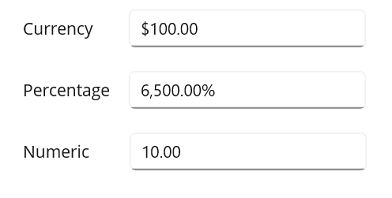
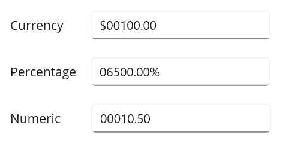
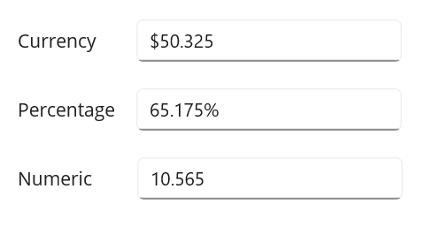
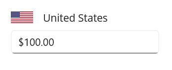

# Value formatting with .NET MAUI NumericEntry

This section explains how to change the value format of the `NumericEntry` control using `CustomFormat` properties.

## Currency, percentage and decimal format

You can format the value of a `NumericEntry` control using the `CustomFormat` property. By default, the value is formatted based on the current culture's decimal format. The default value of `CustomFormat` properties are **null**.

The following example shows how to set `CurrencyFormatter`, `DecimalFormatter` and `PercentFormatter` for `NumberFormatter` property. 

Using **N**, **C**, and **P** format values, we can apply numeric, currency, and percent custom formats in `CustomFormat` property. 

N> You can apply various custom formats available in `this page` which are supported for `double` type.




// Format stock price in currency
stockPrice.CustomFormat = "C2";

// Format product discount in percent
productDiscount.CustomFormat = "P2";

// Format worked hours in decimal
hoursWorked.CustomFormat = "N2";




## Format the integer digits

You can change the decimal digits of the value in the `NumericEntry` control using `CustomFormat` properties. 

For `CustomFormat` property, use the **0** format specifier to set the minimum number of decimal digits.  

N> **0** (Zero placeholder) replaces the zero with the corresponding digit present in the value; otherwise, zero appends with the leftmost position of the value. 




// Format stock price in currency
stockPrice.CustomFormat = "$00000.00";

// Format product discount in percent
productDiscount.CustomFormat = "00000.00%";

// Format worked hours in decimal
hoursWorked.CustomFormat = "00000.00";




## Format the fractional digits

You can change the fractional digits of the value in `NumericEntry` control using `CustomFormat` Properties.

For `CustomFormat` property, use the **0** format specifier to set the minimum number of fractional digits.  

N> **0** (Zero placeholder) replaces the zero with the corresponding digit present in the value.




stockPrice.CustomFormat = "$000.000";
productDiscount.CustomFormat = "00.000%";
hoursWorked.CustomFormat = "00.000";




## Apply custom format

You can apply custom formats to the `NumericEntry` control using the **0** and **#** format specifiers. Using these format specifiers you can set the minimum and the maximum number of fractional digits in the `CustomFormat` property. 

   * **0** (Zero placeholder) replaces the zero with the corresponding digit present in the value; otherwise, zero appends with the leftmost position of the value. 

   * **#** (Digit placeholder) replaces the number sign symbol with the corresponding digit present in the value; otherwise, no digit will append with the value. 

In the below example, the value of the `CustomFormat` property is **#.00##**, hence it will allow a maximum of `4` fractional digits and a minimum of `2` fractional digits.




stockPrice.CustomFormat = "$00.00##";
productDiscount.CustomFormat = "00.00##%";
hoursWorked.CustomFormat = "00.00##";




## Culture support

The culture support allows the control to be configured for a specific language. To configure this, use the `culture` property.




CultureInfo ci = new CultureInfo("en-US");
NumericEntry.Culture = ci;
         




