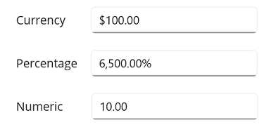
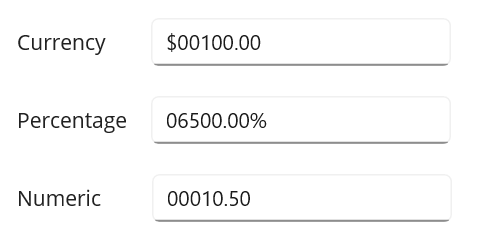
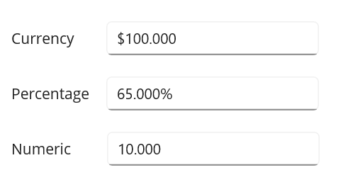
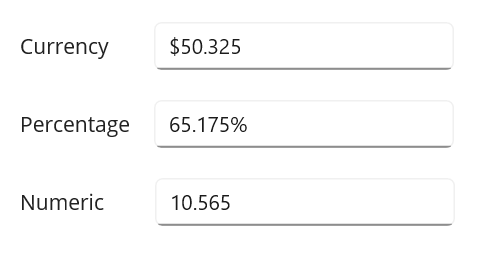
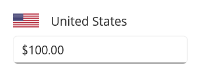
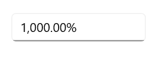
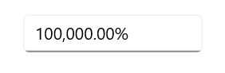
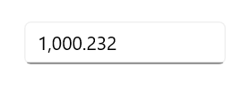

# Value Formatting with .NET MAUI NumericEntry

This section explains how to change the value format of the [SfNumericEntry](https://help.syncfusion.com/cr/maui/Syncfusion.Maui.Inputs.SfNumericEntry.html) control using the `CustomFormat` property and the related formatting options (`Culture`, `PercentDisplayMode`, `MaximumNumberDecimalDigits`).

## Prerequisites

Before using the [SfNumericEntry](https://help.syncfusion.com/cr/maui/Syncfusion.Maui.Inputs.SfNumericEntry.html),  Install the [Syncfusion.Maui.Inputs](https://www.nuget.org/packages/Syncfusion.Maui.Inputs) NuGet package in your .NET MAUI project.

For a step-by-step setup, refer to the [Getting Started](Getting-Started.md) documentation.

## Currency, percentage, and decimal formats

Format the value of the `NumericEntry` control by using the [CustomFormat](https://help.syncfusion.com/cr/maui/Syncfusion.Maui.Inputs.SfNumericEntry.html#Syncfusion_Maui_Inputs_SfNumericEntry_CustomFormat) property. By default, the value is formatted using the current culture's decimal format, and the default value of `CustomFormat` is `null`.

The following table lists the most common standard format specifiers that are supported for the `double` type:

| Specifier | Description | Example output (en-US) |
| --- | --- | --- |
| `C` | Currency | `$1,234.50` |
| `P` | Percent | `12.50 %` |
| `N` | Number (integer and decimal digits) | `1,234.50` |

N> For the full list of supported standard format strings, see the [.NET documentation on standard numeric format strings](https://learn.microsoft.com/dotnet/standard/base-types/standard-numeric-format-strings).

The following example shows how to apply the `C`, `P`, and `N` format strings to the `CustomFormat` property.




<!-- Format stock price in currency. -->
<editors:SfNumericEntry CustomFormat="C2" WidthRequest="200" />

<!-- Format product discount in percent. -->
<editors:SfNumericEntry CustomFormat="P2" WidthRequest="200" />

<!-- Format worked hours in decimal. -->
<editors:SfNumericEntry CustomFormat="N2" WidthRequest="200" />




// Format stock price in currency.
var stockPrice = new SfNumericEntry
{
    CustomFormat = "C2",
    WidthRequest = 200
};

// Format product discount in percent.
var productDiscount = new SfNumericEntry
{
    CustomFormat = "P2",
    WidthRequest = 200
};

// Format worked hours in decimal.
var hoursWorked = new SfNumericEntry
{
    CustomFormat = "N2",
    WidthRequest = 200
};




## Format the integer digits

Pad the integer portion of the value to a fixed width by using the **0** (zero-placeholder) specifier in the [CustomFormat](https://help.syncfusion.com/cr/maui/Syncfusion.Maui.Inputs.SfNumericEntry.html#Syncfusion_Maui_Inputs_SfNumericEntry_CustomFormat) property. For example, the format string `00000.00` always renders a 5-digit integer followed by a 2-digit fractional portion, padding the left with zeros when the value has fewer digits.

N> **0** (zero placeholder) replaces the zero with the corresponding digit present in the value; otherwise, a zero is appended at the leftmost position of the value.




<!-- Format stock price in currency. -->
<editors:SfNumericEntry CustomFormat="$00000.00" WidthRequest="200" />

<!-- Format product discount in percentage. -->
<editors:SfNumericEntry CustomFormat="00000.00%" WidthRequest="200" />

<!-- Format worked hours in decimal. -->
<editors:SfNumericEntry CustomFormat="00000.00" WidthRequest="200" />




// Format stock price in currency.
var stockPrice = new SfNumericEntry
{
    CustomFormat = "$00000.00",
    WidthRequest = 200,
};

// Format product discount in percentage.
var productDiscount = new SfNumericEntry
{
    CustomFormat = "00000.00%",
    WidthRequest = 200,
};

// Format worked hours in decimal.
var hoursWorked = new SfNumericEntry
{
    CustomFormat = "00000.00",
    WidthRequest = 200,
};




## Format the fractional digits

Set the number of fractional digits displayed by the value by using the **0** (zero-placeholder) specifier in the [CustomFormat](https://help.syncfusion.com/cr/maui/Syncfusion.Maui.Inputs.SfNumericEntry.html#Syncfusion_Maui_Inputs_SfNumericEntry_CustomFormat) property. The following example renders a 3-digit fractional portion:

N> **0** (zero placeholder) replaces the zero with the corresponding digit in the value. If the value has fewer fractional digits, a zero is appended at the rightmost position.




<editors:SfNumericEntry CustomFormat="$000.000" WidthRequest="200"/>
<editors:SfNumericEntry CustomFormat="00.000%" WidthRequest="200"/>
<editors:SfNumericEntry CustomFormat="00.000" WidthRequest="200"/>




var stockPrice = new SfNumericEntry
{
    CustomFormat = "$000.000",
    WidthRequest = 200
};

var productDiscount = new SfNumericEntry
{
    CustomFormat = "00.000%",
    WidthRequest = 200
};

var hoursWorked = new SfNumericEntry
{
    CustomFormat = "00.000",
    WidthRequest = 200
};




## Apply custom format

You can apply custom formats to the `NumericEntry` control by combining the **0** and **#** format specifiers in the [CustomFormat](https://help.syncfusion.com/cr/maui/Syncfusion.Maui.Inputs.SfNumericEntry.html#Syncfusion_Maui_Inputs_SfNumericEntry_CustomFormat) property. Use these specifiers to set the minimum and maximum number of fractional digits.

| Specifier | Description |
| --- | --- |
| **0** (zero placeholder) | Replaces the zero with the corresponding digit present in the value. If no digit is present, a zero is appended at the leftmost (integer) or rightmost (fractional) position. |
| **#** (digit placeholder) | Replaces the placeholder with the corresponding digit present in the value. If no digit is present, no digit is rendered. |

In the following example, the value of the `CustomFormat` property is `$00.00##`. The two `0` specifiers before the decimal point force a minimum 2-digit integer, the two `0` specifiers after the decimal point force a minimum 2 fractional digits, and the two `#` specifiers allow up to 4 fractional digits in total.




<editors:SfNumericEntry x:Name="stockPrice" CustomFormat="$00.00##" WidthRequest="200"/>
<editors:SfNumericEntry x:Name="productDiscount" CustomFormat="00.00##%" WidthRequest="200"/>
<editors:SfNumericEntry x:Name="hoursWorked" CustomFormat="00.00##" WidthRequest="200"/>




var stockPrice = new SfNumericEntry
{
    CustomFormat = "$00.00##",
    WidthRequest = 200
};

var productDiscount = new SfNumericEntry
{
    CustomFormat = "00.00##%",
    WidthRequest = 200
};

var hoursWorked = new SfNumericEntry
{
    CustomFormat = "00.00##",
    WidthRequest = 200
};




## Culture support

The `Culture` property configures the [SfNumericEntry](https://help.syncfusion.com/cr/maui/Syncfusion.Maui.Inputs.SfNumericEntry.html) for a specific language. Set it to a `System.Globalization.CultureInfo` instance; the value is then formatted using that culture's decimal separator, currency symbol, and so on.




<editors:SfNumericEntry x:Name="numericEntry"
                        WidthRequest="200"
                        CustomFormat="C2"
                        Value="1234.5" />




using System.Globalization;
using Syncfusion.Maui.Inputs;

var numericEntry = new SfNumericEntry
{
    WidthRequest = 200,
    CustomFormat = "C2",
    Value = 1234.5,
    Culture = new CultureInfo("en-US"),
};
this.Content = numericEntry;




## Customize percentage display

When the [SfNumericEntry](https://help.syncfusion.com/cr/maui/Syncfusion.Maui.Inputs.SfNumericEntry.html) uses a percentage format (`CustomFormat` starts with `P` or `p`), the `PercentDisplayMode` property controls how the value is displayed:

* `Value` - Displays the actual value with percentage symbol.
* `Compute` - Displays the value multiplied by 100, followed by the percentage symbol.

### Value mode




<editors:SfNumericEntry x:Name="numericEntry"
                        WidthRequest="200"
                        CustomFormat="p"
                        Value="1000"
                        PercentDisplayMode="Value" />




SfNumericEntry sfNumericEntry = new SfNumericEntry
{
    WidthRequest = 200,
    CustomFormat = "p",
    Value = 1000,
    PercentDisplayMode = PercentDisplayMode.Value,
};




### Compute mode




<editors:SfNumericEntry x:Name="numericEntry"
                        WidthRequest="200"
                        CustomFormat="p"
                        Value="1000"
                        PercentDisplayMode="Compute" />




SfNumericEntry sfNumericEntry = new SfNumericEntry
{
    WidthRequest = 200,
    CustomFormat = "p",
    Value = 1000,
    PercentDisplayMode = PercentDisplayMode.Compute,
};




N> The default value of `PercentDisplayMode` is `Compute`.

## Manage maximum decimal digits

Specify the maximum number of digits to display after the decimal point by setting the `MaximumNumberDecimalDigits` property.

> The `MaximumNumberDecimalDigits` property must be a positive integer and is ignored when a `CustomFormat` is provided. The default value of `MaximumNumberDecimalDigits` is `2`.




<editors:SfNumericEntry x:Name="numericEntry"
                        WidthRequest="200"
                        Value="1000.23232"
                        MaximumNumberDecimalDigits="3" />




SfNumericEntry sfNumericEntry = new SfNumericEntry
{
    WidthRequest = 200,
    Value = 1000.23232,
    MaximumNumberDecimalDigits = 3,
};




## See Also

* [Basic Features](Basic-Features.md)
* [Restriction](Restriction.md)
* [UpDown-Button](UpDown-Button.md)
