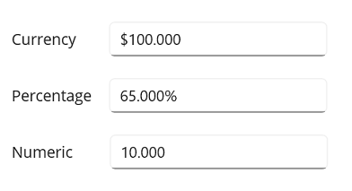
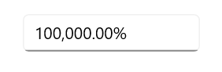

# Value Formatting with .NET MAUI NumericEntry

This section explains how to change the value format of the [NumericEntry](https://help.syncfusion.com/cr/maui/Syncfusion.Maui.Inputs.SfNumericEntry.html) control using the `CustomFormat` properties.

## Currency, percentage and decimal format

The value of the `NumericEntry` control can be formatted using the [CustomFormat](https://help.syncfusion.com/cr/maui/Syncfusion.Maui.Inputs.SfNumericEntry.html#Syncfusion_Maui_Inputs_SfNumericEntry_CustomFormat) property. By default, the value is formatted based on the current culture's decimal format. The default value of the `CustomFormat` properties is **null**.

The following example shows how to set the `CurrencyFormatter`, `DecimalFormatter`, and `PercentFormatter` for the `NumberFormatter` property. 

Using the **N**, **C**, and **P** format values, we can apply numeric, currency, and percent custom formats in the `CustomFormat` property. 

N> You can apply various custom formats available in  [this page](https://docs.microsoft.com/en-us/dotnet/standard/base-types/standard-numeric-format-strings), which are supported for the `double` type.




// Format stock price in currency.
<editors:SfNumericEntry CustomFormat="C2" WidthRequest="200" />

// Format product discount in percent.
<editors:SfNumericEntry CustomFormat="P2" WidthRequest="200" />

// Format worked hours in decimal.
<editors:SfNumericEntry CustomFormat="N2" WidthRequest="200" />




// Format stock price in currency.
var stockPrice = new SfNumericEntry
{
    CustomFormat = "C2",
    WidthRequest = 200
};

// Format product discount in percent.
var productDiscount = new SfNumericEntry
{
    CustomFormat = "P2",
    WidthRequest = 200
};

// Format worked hours in decimal.
var hoursWorked = new SfNumericEntry
{
    CustomFormat = "N2",
    WidthRequest = 200
};




## Format the integer digits

You can change the decimal digits of the value in the `NumericEntry` control using the [CustomFormat](https://help.syncfusion.com/cr/maui/Syncfusion.Maui.Inputs.SfNumericEntry.html#Syncfusion_Maui_Inputs_SfNumericEntry_CustomFormat) properties. 

For the `CustomFormat` property, use the **0** format specifier to set the minimum number of decimal digits.  

N> **0** (Zero placeholder) replaces the zero with the corresponding digit present in the value; otherwise, zero appends with the leftmost position of the value. 




// Format stock price in currency.
<editors:SfNumericEntry CustomFormat="$00000.00" WidthRequest="200"/>

// Format product discount in percentage.
<editors:SfNumericEntry CustomFormat="00000.00%" WidthRequest="200"/>

// Format worked hours in decimal.
<editors:SfNumericEntry CustomFormat="00000.00" WidthRequest="200"/>




// Format stock price in currency.
var stockPrice = new SfNumericEntry
{
    CustomFormat = "$00000.00",
    WidthRequest = 200
};

// Format product discount in percentage.
var productDiscount = new SfNumericEntry
{
    CustomFormat = "00000.00%",
    WidthRequest = 200
};

// Format worked hours in decimal.
var hoursWorked = new SfNumericEntry
{
    CustomFormat = "00000.00",
    WidthRequest = 200
};




## Format the fractional digits

You can change the fractional digits of the value in the `NumericEntry` control using the [CustomFormat](https://help.syncfusion.com/cr/maui/Syncfusion.Maui.Inputs.SfNumericEntry.html#Syncfusion_Maui_Inputs_SfNumericEntry_CustomFormat) Properties.

For the `CustomFormat` property, use the **0** format specifier to set the minimum number of fractional digits.  

N> **0** (Zero placeholder) replaces the zero with the corresponding digit in the value.




<editors:SfNumericEntry CustomFormat="$000.000" WidthRequest="200"/>
<editors:SfNumericEntry CustomFormat="00.000%" WidthRequest="200"/>
<editors:SfNumericEntry CustomFormat="00.000" WidthRequest="200"/>




var stockPrice = new SfNumericEntry
{
    CustomFormat = "$000.000",
    WidthRequest = 200
};

var productDiscount = new SfNumericEntry
{
    CustomFormat = "00.000%",
    WidthRequest = 200
};

var hoursWorked = new SfNumericEntry
{
    CustomFormat = "00.000",
    WidthRequest = 200
};




## Apply custom format

You can apply custom formats to the `NumericEntry` control using the **0** and **#** format specifiers. Using these format specifiers, you can set the minimum and the maximum number of fractional digits in the [CustomFormat](https://help.syncfusion.com/cr/maui/Syncfusion.Maui.Inputs.SfNumericEntry.html#Syncfusion_Maui_Inputs_SfNumericEntry_CustomFormat) property.

   * **0** (Zero placeholder) replaces the zero with the corresponding digit present in the value; otherwise, zero appends with the leftmost position of the value. 

   * **#** (Digit placeholder) replaces the number sign symbol with the corresponding digit present in the value; otherwise, no digit will append to the value.

In the following example, the value of the `CustomFormat` property is **#.00##**, hence it will allow a maximum of `4` fractional digits and a minimum of `2` fractional digits.




<editors:SfNumericEntry x:Name="stockPrice" CustomFormat="$00.00##" WidthRequest="200"/>
<editors:SfNumericEntry x:Name="productDiscount" CustomFormat="00.00##%" WidthRequest="200"/>
<editors:SfNumericEntry x:Name="hoursWorked" CustomFormat="00.00##" WidthRequest="200"/>




var stockPrice = new SfNumericEntry
{
    CustomFormat = "$00.00##",
    WidthRequest = 200
};

var productDiscount = new SfNumericEntry
{
    CustomFormat = "00.00##%",
    WidthRequest = 200
};

var hoursWorked = new SfNumericEntry
{
    CustomFormat = "00.00##",
    WidthRequest = 200
};




## Culture support

The culture support allows the control to be configured for a specific language. To configure this, use the `culture` property.




CultureInfo culture = new CultureInfo("en-US");
NumericEntry.Culture = culture;
         



## Customize percentage display

When the [SfNumericEntry](https://help.syncfusion.com/cr/maui/Syncfusion.Maui.Inputs.SfNumericEntry.html) is in percentage format, the value can be displayed in two ways as follows:

`Value`: Displays the actual value with percentage symbol.




<editors:SfNumericEntry x:Name="numericEntry" WidthRequest="200"
                        CustomFormat="p" 
                        Value="1000"  
                        PercentDisplayMode="Value">
</editors:SfNumericEntry>




SfNumericEntry sfNumericEntry= new SfNumericEntry();
sfNumericEntry.CustomFormat = "p";
sfNumericEntry.Value = 1000;
sfNumericEntry.PercentDisplayMode = PercentDisplayMode.Value;
sfNumericEntry.WidthRequest = 200;




`Compute`: Displays the computed value with percentage symbol.




<editors:SfNumericEntry x:Name="numericEntry" WidthRequest="200"
                        CustomFormat="p" 
                        Value="1000"  
                        PercentDisplayMode="Value">
</editors:SfNumericEntry>




SfNumericEntry sfNumericEntry= new SfNumericEntry();
sfNumericEntry.Value = 1000;
sfNumericEntry.CustomFormat = "p";
sfNumericEntry.PercentDisplayMode = PercentDisplayMode.Value;
sfNumericEntry.WidthRequest = 200;




N> Default value of PercentDisplayMode is `Compute`.

## Manage maximum decimal digits

The maximum number of digits to be displayed after the decimal point can be specified by using the `MaximumNumberDecimalDigits` property.

N> The `MaximumNumberDecimalDigits` property can only be set to a positive value and does not work when a CustomFormat is provided. The default value of MaximumNumberDecimalDigits is 2.




<editors:SfNumericEntry x:Name="numericEntry" WidthRequest="200"
                        Value="1000.23232"  
                        MaximumNumberDecimalDigits="3">
</editors:SfNumericEntry>




SfNumericEntry sfNumericEntry= new SfNumericEntry();
sfNumericEntry.WidthRequest = 200;
sfNumericEntry.Value = 1000.23232;
sfNumericEntry.MaximumNumberDecimalDigits = 3;




