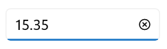
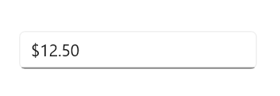
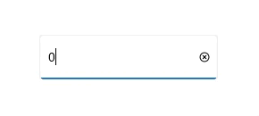

# Getting Started with .NET MAUI NumericEntry

This section explains the steps required to add the `.NET MAUI NumericEntry` control in the MAUI application and utilize the various functions provided.

## Structure of NumericEntry control

## Creating an application with .NET MAUI NumericEntry

In this walkthrough, you will create a .NET MAUI application that contains the `NumericEntry` control.

## Adding control manually in XAML

To add `NumericEntry` control manually in XAML, follow the below steps.

1. Create a `.NET MAUI 3 desktop app for C# and .NET 5`.
2.  Download and refer the following NuGet package in the project.

    * `Syncfusion.Maui.Inputs`
3. Import the control namespace `Syncfusion.Maui.Inputs` in XAML page.
4. Initialize the `NumericEntry` control.





<Page
    x:Class="GettingStarted.MainPage"
    xmlns="http://schemas.microsoft.com/winfx/2006/xaml/presentation"
    xmlns:x="http://schemas.microsoft.com/winfx/2006/xaml"
    xmlns:local="using:GettingStarted"
    xmlns:d="http://schemas.microsoft.com/expression/blend/2008"
    xmlns:mc="http://schemas.openxmlformats.org/markup-compatibility/2006"
    xmlns:editors="using:Syncfusion.UI.Xaml.Editors"
    mc:Ignorable="d"
    Background="{ThemeResource ApplicationPageBackgroundThemeBrush}">
    <Grid Name="grid">
        <!--Adding NumericEntry control -->
        <editors:SfNumericEntry HorizontalOptions="Center"
                             VerticalOptions="Center" 
                             Value="15.35" />
    </Grid>
</Page>




{{ codesnippet1 | OrderList_Indent_Level_1 }}

## Adding control manually in C#

To add `NumericEntry` control manually in C# , follow the below steps.

1. Create a `.NET MAUI 3 desktop app for C# and .NET 5`.
2.  Download and refer the following NuGet in the project.

    * `Syncfusion.Maui.Inputs`

3. Import the control namespace `Syncfusion.Maui.Inputs` in C# page.
4. Initialize the `NumericEntry` control.





namespace GettingStarted
{
    public sealed partial class MainPage : Page
    {
        public MainPage()
        {
            this.InitializeComponent();
            // Creating an instance of the NumericEntry control
            SfNumericEntry sfNumericEntry = new SfNumericEntry();
            sfNumericEntry.HorizontalOptions = LayoutOptions.Center;
            sfNumericEntry.VerticalOptions = LayoutOptions.Center;
            sfNumericEntry.Value = 15.35;

            grid.Children.Add(sfNumericEntry);
        }
    }
}




{{ codesnippet2 | OrderList_Indent_Level_1 }}

## Editing the value

By default, the `NumericEntry` control allows you to enter numeric input and restricts the alphabetic input. Once `Enter` key is pressed or control focus is lost, the value of the `NumericEntry` control is validated and updated based on the format applied.




<editors:SfNumericEntry HorizontalOptions="Center" 
                     VerticalOptions="Center" 
                     CustomFormat="0.000" />




SfNumericEntry sfNumericEntry = new SfNumericEntry();
sfNumericEntry.HorizontalOptions = LayoutOptions.Center;
sfNumericEntry.VerticalOptions = LayoutOptions.Center;
sfNumericEntry.CustomFormat = "0.000";




## Change number format

You can change the format in which the value should be displayed using the `CustomFormat` property . By default, value of the `CustomFormat` property is **null**. 




<editors:SfNumericEntry HorizontalOptions="Center"
                     VerticalOptions="Center"
                     Value="12.5" 
                     CustomFormat="C2" />




SfNumberBox sfNumberBox = new SfNumberBox();
sfNumberBox.HorizontalOptions = LayoutOptions.Center;
sfNumberBox.VerticalOptions = LayoutOptions.Center;
sfNumberBox.Value = 12.5;
sfNumberBox.CustomFormat = "C2";




## Accept null value

By default, `NumericEntry` control allows **null** value. A null value is assigned when the user clicks the clear button or clears the input. You can disable this by setting the value of `AllowNull` property as **false**. When value of the `AllowNull` property is set to **false** and the input is cleared, the `NumericEntry` control returns it to **0**. 




<editors:SfNumericEntry HorizontalOptions="Center"
                     VerticalOptions="Center"
                     Value="12315"
                     AllowNull="False" />




SfNumericEntry sfNumericEntry = new SfNumericEntry();
sfNumericEntry.HorizontalOptions = LayoutOptions.Center;
sfNumericEntry.VerticalOptions = LayoutOptions.Center;
sfNumericEntry.AllowNull = false;




## Setting Placeholder Text

You can prompt the user with any information by using the `PlaceholderText` property. Watermark text will be displayed only when the value of the `AllowNull` property is **true** and the value of `NumericEntry` control is **null**. The default value of `Placeholder` property is **string.Empty** (No string will be displayed).




<editors:SfNumberBox HorizontalOptions="Center" 
                     VerticalOptions="Center" 
                     Placeholder="Enter input here..." />




SfNumberBox SfNumberBox= new SfNumberBox();
SfNumberBox.PlaceholderText = "Enter input here...";
sfNumberBox.HorizontalOptions = LayoutOptions.Center;
sfNumberBox.VerticalOptions = LayoutOptions.Center;




## Clear button visibility 

The `ShowClearButton` property is used to show or hide the clear button in `NumericEntry`. By default, visibility of the clear button is enabled.

N> The clear button appears only when the text box is focused and the `IsEditable` property value is set to **true**.



<editors:SfNumericEntry x:Name="numericEntry"  
            WidthRequest="300"                   
            ShowClearButton="True" 
            IsEditable="True" 
            Value="10"/>




SfNumericEntry SfNumericEntry = new SfNumericEntry();
SfNumericEntry.ShowClearButton = true;
SfNumericEntry.IsEditable = true; 




If IsEditable is true

If IsEditable is false

## Value changed notification

The `ValueChanged` event is triggered, when the `Value` property of `NumericEntry` control is changed. The value will not be changed when the user enters the input. The value of the `NumericEntry` control will be changed after validation is performed on the `Enter` keypress or when the focus is lost in the control. The `ValueChanged` contains the following properties.

 * `NewValue` - Contains the new input value.
 * `OldValue` - Contains the previous input value.




<editors:SfNumericEntry HorizontalOptions="Center"
                     VerticalOptions="Center" 
                     x:Name="sfNumericEntry"
                     ValueChanged="sfNumberBox_ValueChanged" />




SfNumericEntry sfNumericEntry = new SfNumericEntry();
sfNumericEntry.HorizontalOptions = LayoutOptions.Center;
sfNumericEntry.VerticalOptions = LayoutOptions.Center;
sfNumericEntry.ValueChanged += sfNumericEntry_ValueChanged;




You can handle the event as follows.




private void sfNumericEntry_ValueChanged(object sender, ValueChangedEventArgs e)
{
    var oldValue = e.OldValue;
    var newValue = e.NewValue;
}


