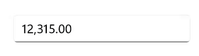

> **Notice**: After **Volume 1 2025 (Mid March 2025)**, updates, bug fixes, and feature enhancements for this control will no longer be available in the Syncfusion® package. Please switch to the **Syncfusion® Toolkit for .NET MAUI** for continued support. For a seamless transition, refer to this [migration document](https://help.syncfusion.com/maui-toolkit/migration).

# Getting Started with .NET MAUI Numeric Entry

This section guides you through setting up and configuring a [Numeric Entry](https://help.syncfusion.com/cr/maui/Syncfusion.Maui.Inputs.SfNumericEntry.html) in your .NET MAUI application. Follow the steps below to add a basic Numeric Entry to your project.

To quickly get started with the .NET MAUI Numeric Entry, watch this video.

{% youtube "https://www.youtube.com/watch?v=BHw8UpoUmoM&ab_channel=Syncfusion%2CInc" %}




## Prerequisites

Before proceeding, ensure the following are in place:

1. Install [.NET 8 SDK](https://dotnet.microsoft.com/en-us/download/dotnet/8.0) or later.
2. Set up a .NET MAUI environment with Visual Studio 2022 (v17.8 or later).

## Step 1: Create a New .NET MAUI Project

1. Navigate to **File > New > Project** and select the **.NET MAUI App** template.
2. Name the project, choose a location, and click **Next**.
3. Select the .NET framework version and click **Create**.

## Step 2: Install the Syncfusion® MAUI Inputs NuGet Package

1. In **Solution Explorer**, right-click the project and select **Manage NuGet Packages**.
2. Search for [Syncfusion.Maui.Inputs](https://www.nuget.org/packages/Syncfusion.Maui.Inputs) and install the latest version.
3. Ensure all necessary dependencies are correctly installed and the project is restored.

## Step 3: Register the Handler

The [Syncfusion.Maui.Core](https://www.nuget.org/packages/Syncfusion.Maui.Core) NuGet package is a dependency for all Syncfusion® controls in .NET MAUI. Register the handler for Syncfusion® core in the `MauiProgram.cs` file.


using Microsoft.Maui;
using Microsoft.Maui.Hosting;
using Microsoft.Maui.Controls.Compatibility;
using Microsoft.Maui.Controls.Hosting;
using Microsoft.Maui.Controls.Xaml;
using Syncfusion.Maui.Core.Hosting;

namespace MaskedEntrySample
{
    public static class MauiProgram
    {
        public static MauiApp CreateMauiApp()
        {
            var builder = MauiApp.CreateBuilder();
            builder
            .UseMauiApp<App>()
            .ConfigureSyncfusionCore()
            .ConfigureFonts(fonts =>
            {
                fonts.AddFont("OpenSans-Regular.ttf", "OpenSansRegular");
            });

            return builder.Build();
        }      
    }
}   

 

## Step 4: Add a Basic Numeric Entry

**Step 1**: Add the namespace as shown in the following code sample.




	<xmlns:editors="clr-namespace:Syncfusion.Maui.Inputs;assembly=Syncfusion.Maui.Inputs"/>




	using Syncfusion.Maui.Inputs;




**Step 2**: Add the [SfNumericEntry](https://help.syncfusion.com/cr/maui/Syncfusion.Maui.Inputs.SfNumericEntry.html) control with a desired name using the included namespace.




	<editors:SfNumericEntry x:Name="numericEntry" />
	



    SfNumericEntry sfNumericEntry = new SfNumericEntry();   







## Prerequisites

Before proceeding, ensure the following are set up:

1. Install [.NET 8 SDK](https://dotnet.microsoft.com/en-us/download/dotnet/8.0) or later.
2. Set up a .NET MAUI environment with Visual Studio Code.
3. Ensure the .NET MAUI extension is installed and configured as described [here](https://learn.microsoft.com/en-us/dotnet/maui/get-started/installation?view=net-maui-8.0&tabs=visual-studio-code).

## Step 1: Create a New .NET MAUI Project

1. Open the Command Palette by pressing **Ctrl+Shift+P**, type **.NET:New Project**, and press Enter.
2. Select the **.NET MAUI App** template.
3. Set the project location, type the project name, and press Enter.
4. Finally, select **Create project**.

## Step 2: Install the Syncfusion® MAUI Inputs NuGet Package

1. Press <kbd>Ctrl</kbd> + <kbd>`</kbd> (backtick) to open the integrated terminal in Visual Studio Code.
2. Navigate to the project root directory where your `.csproj` file is located.
3. Run the command `dotnet add package Syncfusion.Maui.Inputs` to install the Syncfusion® .NET MAUI Inputs package.
4. Ensure all dependencies are installed by running `dotnet restore`.

## Step 3: Register the Handler

The [Syncfusion.Maui.Core](https://www.nuget.org/packages/Syncfusion.Maui.Core) NuGet package is essential for all Syncfusion® controls in .NET MAUI. Register the handler for Syncfusion® core in the `MauiProgram.cs` file.


using Microsoft.Maui;
using Microsoft.Maui.Hosting;
using Microsoft.Maui.Controls.Compatibility;
using Microsoft.Maui.Controls.Hosting;
using Microsoft.Maui.Controls.Xaml;
using Syncfusion.Maui.Core.Hosting;

namespace MaskedEntrySample
{
    public static class MauiProgram
    {
        public static MauiApp CreateMauiApp()
        {
            var builder = MauiApp.CreateBuilder();
            builder
            .UseMauiApp<App>()
            .ConfigureSyncfusionCore()
            .ConfigureFonts(fonts =>
            {
                fonts.AddFont("OpenSans-Regular.ttf", "OpenSansRegular");
            });

            return builder.Build();
        }      
    }
}   

 

## Step 4: Add a Basic Numeric Entry

**Step 1**: Add the NuGet package to the project as discussed in the reference section above.

**Step 2**: Add the namespace as shown in the following code sample.




	<xmlns:editors="clr-namespace:Syncfusion.Maui.Inputs;assembly=Syncfusion.Maui.Inputs"/>




	using Syncfusion.Maui.Inputs;




**Step 3**: Add the [SfNumericEntry](https://help.syncfusion.com/cr/maui/Syncfusion.Maui.Inputs.SfNumericEntry.html) control using the included namespace.




	<editors:SfNumericEntry x:Name="numericEntry" />
	



    SfNumericEntry sfNumericEntry = new SfNumericEntry();   







## Editing the Value

By default, the [NumericEntry](https://help.syncfusion.com/cr/maui/Syncfusion.Maui.Inputs.SfNumericEntry.html) control accepts numeric input only, rejecting alphabetic input. The value is validated and formatted upon pressing the `Enter` key or when the control loses focus.




<editors:SfNumericEntry WidthRequest="200"
                        HorizontalOptions="Center" 
                        VerticalOptions="Center" 
                        CustomFormat="0.000" />




SfNumericEntry numericEntry = new SfNumericEntry();
numericEntry.WidthRequest=200;
numericEntry.HorizontalOptions = LayoutOptions.Center;
numericEntry.VerticalOptions = LayoutOptions.Center;
numericEntry.CustomFormat = "0.000";




## Change Number Format

You can adjust the displayed format of values using the [CustomFormat](https://help.syncfusion.com/cr/maui/Syncfusion.Maui.Inputs.SfNumericEntry.html#Syncfusion_Maui_Inputs_SfNumericEntry_CustomFormat) property. By default, the `CustomFormat` property is `null`.




<editors:SfNumericEntry WidthRequest="200"
                        HorizontalOptions="Center"
                        VerticalOptions="Center"
                        Value="12.5" 
                        CustomFormat="C2" />




SfNumericEntry numericEntry = new SfNumericEntry();
numericEntry.WidthRequest=200;
numericEntry.HorizontalOptions = LayoutOptions.Center;
numericEntry.VerticalOptions = LayoutOptions.Center;
numericEntry.Value = 12.5;
numericEntry.CustomFormat = "C2";




## Accept Null Value

By default, the [NumericEntry](https://help.syncfusion.com/cr/maui/Syncfusion.Maui.Inputs.SfNumericEntry.html) control accepts a **null** value, assigned when cleared by the user. To prevent null assignment and revert to **0** upon clearing, set the [AllowNull](https://help.syncfusion.com/cr/maui/Syncfusion.Maui.Inputs.SfNumericEntry.html#Syncfusion_Maui_Inputs_SfNumericEntry_AllowNull) property to **false**.




<editors:SfNumericEntry WidthRequest="200"
                        HorizontalOptions="Center"
                        VerticalOptions="Center"
                        Value="12315"
                        AllowNull="False" />




SfNumericEntry sfNumericEntry = new SfNumericEntry();
sfNumericEntry.WidthRequest=200;
sfNumericEntry.Value=12315;
sfNumericEntry.HorizontalOptions = LayoutOptions.Center;
sfNumericEntry.VerticalOptions = LayoutOptions.Center;
sfNumericEntry.AllowNull = false;




