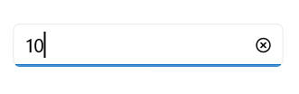
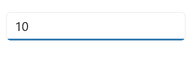

# Getting Started with .NET MAUI NumericEntry

This section explains the steps required to add the `.NET MAUI NumericEntry` control in the MAUI application and utilize the various functions provided.

## Structure of NumericEntry control

## Creating an application with .NET MAUI NumericEntry

In this walkthrough, you will create a .NET MAUI application that contains the `NumericEntry` control.

## Handler registration 

 In the MauiProgram.cs file, register the handler for Syncfusion core.


using Microsoft.Maui;
using Microsoft.Maui.Hosting;
using Microsoft.Maui.Controls.Compatibility;
using Microsoft.Maui.Controls.Hosting;
using Microsoft.Maui.Controls.Xaml;
using Syncfusion.Maui.Core.Hosting;

namespace MaskedEntrySample
{
    public static class MauiProgram
    {
        public static MauiApp CreateMauiApp()
        {
            var builder = MauiApp.CreateBuilder();
            builder
            .UseMauiApp<App>()
            .ConfigureSyncfusionCore()
            .ConfigureFonts(fonts =>
            {
                fonts.AddFont("OpenSans-Regular.ttf", "OpenSansRegular");
            });

            return builder.Build();
        }      
    }
}   

 

## Adding the .NET MAUI Numeric Entry control

Step 1: Add the NuGet to the project as discussed in the above reference section. 

Step 2: Add the namespace as shown in the following code sample.




	<xmlns:syncfusion="clr-namespace:Syncfusion.Maui.Inputs;assembly=Syncfusion.Maui.Inputs"/>




	using Syncfusion.Maui.Inputs;




## Initialize Numeric Entry

Now, add the `SfNumericEntry` control with a required optimal name using the included namespace.




	<syncfusion:SfNumericEntry x:Name="numericEntry" />
	



        numericEntry = new SfNumericEntry();




## Editing the value

By default, the `NumericEntry` control allows you to enter numeric input and restricts the alphabetic input. Once `Enter` key is pressed or control focus is lost, the value of the `NumericEntry` control is validated and updated based on the format applied.




<editors:SfNumericEntry HorizontalOptions="Center" 
                     VerticalOptions="Center" 
                     CustomFormat="0.000" />




SfNumericEntry sfNumericEntry = new SfNumericEntry();
sfNumericEntry.HorizontalOptions = LayoutOptions.Center;
sfNumericEntry.VerticalOptions = LayoutOptions.Center;
sfNumericEntry.CustomFormat = "0.000";




## Change number format

You can change the format in which the value should be displayed using the `CustomFormat` property . By default, value of the `CustomFormat` property is **null**. 




<editors:SfNumericEntry HorizontalOptions="Center"
                     VerticalOptions="Center"
                     Value="12.5" 
                     CustomFormat="C2" />




SfNumberBox sfNumberBox = new SfNumberBox();
sfNumberBox.HorizontalOptions = LayoutOptions.Center;
sfNumberBox.VerticalOptions = LayoutOptions.Center;
sfNumberBox.Value = 12.5;
sfNumberBox.CustomFormat = "C2";




## Accept null value

By default, `NumericEntry` control allows **null** value. A null value is assigned when the user clicks the clear button or clears the input. You can disable this by setting the value of `AllowNull` property as **false**. When value of the `AllowNull` property is set to **false** and the input is cleared, the `NumericEntry` control returns it to **0**. 




<editors:SfNumericEntry HorizontalOptions="Center"
                     VerticalOptions="Center"
                     Value="12315"
                     AllowNull="False" />




SfNumericEntry sfNumericEntry = new SfNumericEntry();
sfNumericEntry.HorizontalOptions = LayoutOptions.Center;
sfNumericEntry.VerticalOptions = LayoutOptions.Center;
sfNumericEntry.AllowNull = false;




## Setting Placeholder Text

You can prompt the user with any information by using the `PlaceholderText` property. Watermark text will be displayed only when the value of the `AllowNull` property is **true** and the value of `NumericEntry` control is **null**. The default value of `Placeholder` property is **string.Empty** (No string will be displayed).




<editors:SfNumberBox HorizontalOptions="Center" 
                     VerticalOptions="Center" 
                     Placeholder="Enter input here..." />




SfNumberBox SfNumberBox= new SfNumberBox();
SfNumberBox.Placeholder = "Enter input here...";
sfNumberBox.HorizontalOptions = LayoutOptions.Center;
sfNumberBox.VerticalOptions = LayoutOptions.Center;




## Clear button visibility 

The `ShowClearButton` property is used to show or hide the clear button in `NumericEntry`. By default, visibility of the clear button is enabled.

N> The clear button appears only when the text box is focused and the `IsEditable` property value is set to **true**.



<editors:SfNumericEntry x:Name="numericEntry"  
            WidthRequest="300"                   
            ShowClearButton="True" 
            IsEditable="True" 
            Value="10"/>




SfNumericEntry SfNumericEntry = new SfNumericEntry();
SfNumericEntry.ShowClearButton = true;
SfNumericEntry.IsEditable = true; 




If IsEditable is true

If IsEditable is false

## Value changed notification

The `ValueChanged` event is triggered, when the `Value` property of `NumericEntry` control is changed. The value will not be changed when the user enters the input. The value of the `NumericEntry` control will be changed after validation is performed on the `Enter` keypress or when the focus is lost in the control. The `ValueChanged` contains the following properties.

 * `NewValue` - Contains the new input value.
 * `OldValue` - Contains the previous input value.




<editors:SfNumericEntry HorizontalOptions="Center"
                     VerticalOptions="Center" 
                     x:Name="sfNumericEntry"
                     ValueChanged="sfNumericEntry_ValueChanged" />




SfNumericEntry sfNumericEntry = new SfNumericEntry();
sfNumericEntry.HorizontalOptions = LayoutOptions.Center;
sfNumericEntry.VerticalOptions = LayoutOptions.Center;
sfNumericEntry.ValueChanged += sfNumericEntry_ValueChanged;




You can handle the event as follows.




private void sfNumericEntry_ValueChanged(object sender, ValueChangedEventArgs e)
{
    var oldValue = e.OldValue;
    var newValue = e.NewValue;
}


