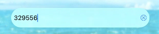

# Liquid Glass Effect in .NET MAUI NumericEntry (SfNumericEntry)

The Liquid Glass Effect introduces a modern, translucent design with adaptive color tinting and light refraction, creating a sleek, glass like user experience that remains clear and accessible. This section explains how to enable and customize the effect in the Syncfusion® .NET MAUI NumericEntry (SfNumericEntry) control.

## Apply liquid glass effect

Follow these steps to enable and configure the Liquid Glass Effect in the NumericEntry control:

### Step 1: Wrap the control inside glass effect view

To apply the Liquid Glass Effect to Syncfusion® .NET MAUI `NumericEntry` control, wrap the control inside the `SfGlassEffectView` class.

For more details, refer to the `Liquid Glass Getting Started documentation`.

### Step 2: Customize the background

To achieve a glass like background in the NumericEntry, set the `Background` property to `Transparent`. The background will then be treated as a tinted color, ensuring a consistent glass effect across the controls.

The following code snippet demonstrates how to apply the Liquid Glass Effect to the `SfNumericEntry` control:



    <Grid>
    <Image Source="Wallpaper.png" Aspect="AspectFill">
        <core:SfGlassEffectView
            CornerRadius="20"
            HeightRequest="40"
            EffectType="Regular"
            EnableShadowEffect="True">
            <inputs:SfNumericEntry
                Value="1234.56"
                FormatString="N2"
                Placeholder="Enter amount"
                Maximum="1000000"
                Background="Transparent"
                Minimum="0"
                ShowClearButton="True" />
        </core:SfGlassEffectView>
    </Grid>




using Syncfusion.Maui.Core;
using Syncfusion.Maui.Inputs;

var grid = new Grid
{
    BackgroundColor = Colors.Transparent
};

var image = new Image
{
    Source = "Wallpaper.png",
    Aspect = Aspect.AspectFill
};
grid.Children.Add(image);

var glassEffect = new SfGlassEffectView
{
    CornerRadius=20,
    HeightRequest=40,
    EffectType=LiquidGlassEffectType.Regular,
    EnableShadowEffect=true
};

var numericEntry = new SfNumericEntry
{
    Value = 1234.56,
    FormatString = "N2",
    Placeholder = "Enter amount",
    Maximum = 1_000_000,
    Minimum = 0,
    Background= Colors.Transparent,
    ShowClearButton=true
};

glassEffect.Content = numericEntry;
grid.Children.Add(glassEffect);
this.Content = grid;




The following screenshot illustrates SfNumericEntry within an acrylic container using the glass effect.

N>
This feature is supported only on .NET 10 along with iOS 26 and macOS 26 