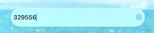

# Liquid Glass Effect in .NET MAUI NumericEntry (SfNumericEntry)

The Liquid Glass Effect introduces a modern, translucent design with adaptive color tinting and light refraction, creating a sleek, glass-like user experience that remains clear and accessible. This section explains how to enable and customize the effect in the Syncfusion® .NET MAUI NumericEntry (SfNumericEntry) control.

## Prerequisites

Before using the [SfNumericEntry](https://help.syncfusion.com/cr/maui/Syncfusion.Maui.Inputs.SfNumericEntry.html), ensure the following are set up:

1. Target `net10.0` in your .NET MAUI project. The Liquid Glass Effect is supported only on .NET 10 together with iOS 26 and macOS 26.
2. Install the [Syncfusion.Maui.Inputs](https://www.nuget.org/packages/Syncfusion.Maui.Inputs) NuGet package in your .NET MAUI project.
3. Install the [Syncfusion.Maui.Core](https://www.nuget.org/packages/Syncfusion.Maui.Core) NuGet package, which provides the `SfGlassEffectView` class.
4. Register the Syncfusion core handler in the `CreateMauiApp` method of `MauiProgram.cs`:

    ```csharp
    using Syncfusion.Maui.Core.Hosting;

    public static class MauiProgram
    {
        public static MauiApp CreateMauiApp()
        {
            var builder = MauiApp.CreateBuilder();
            builder
                .UseMauiApp<App>()
                .ConfigureSyncfusionCore();
            return builder.Build();
        }
    }
    ```

5. Add the following namespace declarations to your XAML page and `using` directives to your C# files:

    ```xml
    xmlns:editors="clr-namespace:Syncfusion.Maui.Inputs;assembly=Syncfusion.Maui.Inputs"
    xmlns:core="clr-namespace:Syncfusion.Maui.Core;assembly=Syncfusion.Maui.Core"
    ```

    ```csharp
    using Syncfusion.Maui.Inputs;
    using Syncfusion.Maui.Core;
    ```

For a step-by-step setup, refer to the [Getting Started](Getting-Started.md) documentation.

## Apply the Liquid Glass Effect

Follow these steps to enable and configure the Liquid Glass Effect in the `SfNumericEntry` control:

1. Add a sample image (for example, `Wallpaper.png`) to the `Resources/Images` folder of your .NET MAUI project. Set the build action to **MauiImage** so the image can be referenced by file name.
2. Wrap the `SfNumericEntry` control inside the [SfGlassEffectView](https://help.syncfusion.com/cr/maui/Syncfusion.Maui.Core.SfGlassEffectView.html) class.
3. Set the `Background` property of the `SfNumericEntry` to `Transparent` so the glass-like effect is preserved across the control.

For more information about the Liquid Glass Effect, refer to the [Liquid Glass Getting Started documentation](https://help.syncfusion.com/maui/liquid-glass-ui/overview).

## Configure the SfGlassEffectView properties

The following table describes the key `SfGlassEffectView` properties used to configure the effect:

| Property | Type | Description |
| --- | --- | --- |
| `CornerRadius` | `double` | The radius of the rounded corners applied to the glass container. Default is `0`. |
| `HeightRequest` | `double` | The height of the glass container. |
| `EffectType` | `LiquidGlassEffectType` | The style of the Liquid Glass Effect. See the enum members below. |
| `EnableShadowEffect` | `bool` | Indicates whether a drop shadow is rendered behind the glass container. Default is `false`. |

The `LiquidGlassEffectType` enum exposes the following members:

* `Regular`
* `Clear`

The following code snippet applies the Liquid Glass Effect to the `SfNumericEntry` control:




<ContentPage xmlns:editors="clr-namespace:Syncfusion.Maui.Inputs;assembly=Syncfusion.Maui.Inputs"
             xmlns:core="clr-namespace:Syncfusion.Maui.Core;assembly=Syncfusion.Maui.Core">
    <Grid>
        <Image Source="Wallpaper.png"
               Aspect="AspectFill" />
        <core:SfGlassEffectView CornerRadius="20"
                                HeightRequest="40"
                                EffectType="Regular"
                                EnableShadowEffect="True">
            <editors:SfNumericEntry Value="1234.56"
                                    CustomFormat="N2"
                                    Placeholder="Enter amount"
                                    Maximum="1000000"
                                    Minimum="0"
                                    Background="Transparent"
                                    ShowClearButton="True" />
        </core:SfGlassEffectView>
    </Grid>
</ContentPage>




using Microsoft.Maui;
using Microsoft.Maui.Controls;
using Microsoft.Maui.Graphics;
using Syncfusion.Maui.Core;
using Syncfusion.Maui.Inputs;

var grid = new Grid
{
    BackgroundColor = Colors.Transparent,
};

var image = new Image
{
    Source = "Wallpaper.png",
    Aspect = Aspect.AspectFill,
};
grid.Children.Add(image);

var glassEffect = new SfGlassEffectView
{
    CornerRadius = 20,
    HeightRequest = 40,
    EffectType = LiquidGlassEffectType.Regular,
    EnableShadowEffect = true,
};

var numericEntry = new SfNumericEntry
{
    Value = 1234.56,
    CustomFormat = "N2",
    Placeholder = "Enter amount",
    Maximum = 1_000_000,
    Minimum = 0,
    BackgroundColor = Colors.Transparent,
    ShowClearButton = true,
};

glassEffect.Content = numericEntry;
grid.Children.Add(glassEffect);

this.Content = grid;




The following screenshot illustrates the `SfNumericEntry` rendered inside a Liquid Glass container:



## See Also

* [Overview of .NET MAUI NumericEntry](Overview.md)
* [Basic Features in .NET MAUI NumericEntry](Basic-Features.md)
* [Formatting in .NET MAUI NumericEntry](Formatting.md)
* [Restriction in .NET MAUI NumericEntry](Restriction.md)
* [UpDown-Button in .NET MAUI NumericEntry](UpDown-Button.md)
* [SfNumericEntry API reference](https://help.syncfusion.com/cr/maui/Syncfusion.Maui.Inputs.SfNumericEntry.html)
* [SfGlassEffectView API reference](https://help.syncfusion.com/cr/maui/Syncfusion.Maui.Core.SfGlassEffectView.html)