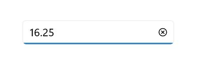

# .NET MAUI NumericEntry Overview

The .NET MAUI NumericEntry control is designed to provide a user-friendly and advanced input experience for numeric values. It supports a wide range of numeric formats, including currency, percentage, and decimals, among others. With its key features, it enables enhanced user experience and facilitates input validation.

## Control Structure

## Key Features

* Input validation triggered when focus is lost or the enter key is pressed.
* Convenient value increment and decrement using the up-down button.
* Flexible display of values in various custom formats.
* Adapts to different cultural and regional settings for value presentation.
* Placeholder text displayed when the Numeric Entry control contains an empty or null value.
