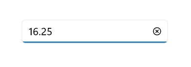

# .NET MAUI NumericEntry Overview

The [.NET MAUI NumericEntry](https://help.syncfusion.com/cr/maui/Syncfusion.Maui.Inputs.SfNumericEntry.html) control is designed to provide a user-friendly and advanced input experience for numeric values. It supports a wide range of numeric formats, including currency, percentages, decimals, and more. With its key features, it enables enhanced user experience and facilitates input validation.

## Control Structure

## Business use cases

- Financial applications that require **currency, percentage, or decimal value input with validation**.  
- Form-based applications that collect **numeric data such as quantity, price, or measurements**.  
- Business systems that enforce **accurate numeric input with formatting and validation rules**.  
- Data-driven applications that require **increment and decrement functionality for numeric adjustments**.  

## Key features

- **Validation** allows validating numeric input when focus is lost or when the enter key is pressed.  
- **Increment and decrement** allows adjusting values easily using built-in up and down buttons.  
- **Flexible formatting** allows displaying values in formats such as currency, percentage, and decimals.  
- **Culture-aware formatting** allows adapting value display based on regional and cultural settings.  
- **Placeholder** allows displaying hint text when the control contains an empty or null value.  

## Globalization

The following table summarizes the globalization support available in the [SfNumericEntry](https://www.syncfusion.com/maui-controls/maui-numeric-entry) control.

 Full Support  
 Not Applicable

<table>
<tr>
<th align="center">Control</th>
<th align="center">Localization</th>
<th align="center">RTL</th>
<th align="center">Time zone</th>
<th align="center">Screen reader</th>
<th align="center">Keyboard navigation</th>
</tr>
<tr>
<td><a href="/maui/numericentry/overview">Numeric Entry</a></td>
<td align="center"></td>
<td align="center"></td>
<td align="center"></td>
<td align="center"></td>
<td align="center"></td>
</tr>
</table>

## Related controls

- **[ComboBox](https://help.syncfusion.com/maui/combobox/overview)** for selecting values from predefined lists.
- **[MaskedEntry](https://help.syncfusion.com/maui/masked-entry/overview)** for formatted and restricted input scenarios. 

## Next steps

Explore further resources:

- [Getting Started](https://help.syncfusion.com/maui/numericentry/getting-started) - step-by-step guide to begin using the NumericEntry control.
- [Features](https://help.syncfusion.com/maui/numericentry/basic-features) - learn core capabilities like validation and culture support.
- [Formatting](https://help.syncfusion.com/maui/numericentry/formatting) - configure numeric formats and display.    
- [UI Kit](https://www.syncfusion.com/demos/maui#maui-ui-control) - explore interactive demos and ready‑made UI examples.

## Learnings

<!-- Card 1 -->
<a href="https://www.syncfusion.com/blogs/category/net-maui" class="form-card" target="_blank">
  

    <h3 class="form-title">Explore Blogs</h3>
    

      Read insights, tutorials, and developer journeys.
    

  

</a>
<!-- Card 2 -->
<a href="https://support.syncfusion.com/kb/cross-platforms/category/76" class="form-card" target="_blank">
  

    <h3 class="form-title">Explore KB's</h3>
    

      Find quick solutions and step‑by‑step guidance.
    

  

</a>
<!-- Card 3 -->
<a href="https://www.syncfusion.com/maui-controls/maui-numeric-entry" class="form-card" target="_blank">
  

    <h3 class="form-title">Feature Tour</h3>
    

      Walk through highlights and core capabilities.
    

  

</a>
<!-- Card 4 -->
<a href="https://www.syncfusion.com/tutorial-videos/maui/numeric-entry" class="form-card" target="_blank">
  

    <h3 class="form-title">Tutorial Videos</h3>
    

      Step‑by‑step guidance through video tutorials.
    

  

</a>

