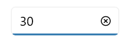

# Value change restriction in .NET MAUI NumericEntry

This section describes how to restrict the change in the value of the `NumericEntry` control using `AllowNull`, `Minimum`, and `Maximum` properties.

## Restrict null value

By default, an empty or null value is set in the `NumericEntry` control when the input is cleared, as the default value of the `AllowNull` property is **true**. When the `AllowNull` property value is **false**, the `NumericEntry` control returns the value to **0** in the editor after clearing the input.

N> When the value of the `Minimum` property is **15**, and the `AllowNull` property is **true**, the **null** value is returned in the `NumericEntry` control after clearing the input.

N> When the value of the Minimum property is **15**, and the `AllowNull` property is **false**, the `minimum` value is returned in `NumericEntry` control after clearing the input.




<editors:SfNumericEntry HorizontalOptions="Center"
                     VerticalOptions="Center" 
                     Value="10" 
                     AllowNull="False" />




SfNumericEntry sfNumericEntry = new SfNumericEntry();
sfNumeriCEntry.HorizontalOptions = LayoutOptions.Center;
sfNumericEntry.VerticalOptions = LayoutOptions.Center;
sfNumericEntry.Value = 10;
sfNumericEntry.AllowNull = false;




## Restrict value within range

You can restrict the users to enter input within a minimum and maximum range in the `NumericEntry` control using the Minimum and Maximum properties. The default value of the `Minimum` property is the **double.MinValue** and `Maximum` property is **double.MaxValue**.




<editors:SfNumericEntry HorizontalOptions="Center"
                     VerticalOptions="Center"
                     Value="50"
                     Minimum="10"
                     Maximum="30" />




SfNumericEntry sfNumericEntry = new SfNumericEntry();
sfNumericEntry.HorizontalOptions = LayoutOptions.Center;
sfNumericEntry.VerticalOptions = LayoutOptions.Center;
sfNumericEntry.Minimum = 10;
sfNumericEntry.Maximum = 30;
sfNumericEntry.Value = 50;




## Restrict text editing

You can prevent users from editing the numerical value in the editor using the `IsEditable` property. However, you can still change the value using the up-down buttons, mouse scroll, keyboard arrows, and page keys. By default, the value of the `IsEditable` property is **true**.




<editors:SfNumericEntry x:Name="sfNumericEntry" 
                     HorizontalOptions="Center"
                     VerticalOptions="Center"
                     IsEditable="True" />




SfNumericEntry sfNumericEntry = new SfNumericEntry();
sfNumericEntry.HorizontalOptions = LayoutOptions.Center;
sfNumericEntry.VerticalOptions = LayoutOptions.Center;
sfNumericEntry.IsEditable = true;




