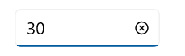

# Value Change Restriction in .NET MAUI NumericEntry

This section describes how to restrict value changes in the [SfNumericEntry](https://help.syncfusion.com/cr/maui/Syncfusion.Maui.Inputs.SfNumericEntry.html) control using the [AllowNull](https://help.syncfusion.com/cr/maui/Syncfusion.Maui.Inputs.SfNumericEntry.html#Syncfusion_Maui_Inputs_SfNumericEntry_AllowNull), [Minimum](https://help.syncfusion.com/cr/maui/Syncfusion.Maui.Inputs.SfNumericEntry.html#Syncfusion_Maui_Inputs_SfNumericEntry_Minimum), and [Maximum](https://help.syncfusion.com/cr/maui/Syncfusion.Maui.Inputs.SfNumericEntry.html#Syncfusion_Maui_Inputs_SfNumericEntry_Maximum) properties, and how to prevent text editing with the [IsEditable](https://help.syncfusion.com/cr/maui/Syncfusion.Maui.Inputs.SfNumericEntry.html#Syncfusion_Maui_Inputs_SfNumericEntry_IsEditable) property.

## Prerequisites

Before using the [SfNumericEntry](https://help.syncfusion.com/cr/maui/Syncfusion.Maui.Inputs.SfNumericEntry.html), Install the [Syncfusion.Maui.Inputs](https://www.nuget.org/packages/Syncfusion.Maui.Inputs) NuGet package in your .NET MAUI project.

For a step-by-step setup, refer to the [Getting Started](Getting-Started.md) documentation.

## Restrict null value

By default, an empty or null value is set in the `NumericEntry` control when the input is cleared, because the default value of the [AllowNull](https://help.syncfusion.com/cr/maui/Syncfusion.Maui.Inputs.SfNumericEntry.html#Syncfusion_Maui_Inputs_SfNumericEntry_AllowNull) property is `true`. The `Value` property is of type `double?`; when `AllowNull` is `true`, clearing the input sets `Value` to `null`. When `AllowNull` is `false`, the control restores the value to `0` (or to `Minimum`, if `Minimum` is greater than `0`) after the input is cleared.

N> The behavior after clearing the input depends on the combination of `AllowNull` and `Minimum`:
* When the value of the `Minimum` property is **15**, and the `AllowNull` property is **true**, the **null** value is returned in the `NumericEntry` control after clearing the input.
* When the value of the Minimum property is **15**, and the `AllowNull` property is **false**, the `minimum` value is returned in `NumericEntry` control after clearing the input.




<editors:SfNumericEntry WidthRequest="200"
                        HorizontalOptions="Center"
                        VerticalOptions="Center"
                        Value="10"
                        AllowNull="False" />




SfNumericEntry sfNumericEntry = new SfNumericEntry
{
    WidthRequest = 200,
    HorizontalOptions = LayoutOptions.Center,
    VerticalOptions = LayoutOptions.Center,
    Value = 10,
    AllowNull = false,
};




## Restrict value within range

Restrict user input to a minimum and maximum range by setting the [Minimum](https://help.syncfusion.com/cr/maui/Syncfusion.Maui.Inputs.SfNumericEntry.html#Syncfusion_Maui_Inputs_SfNumericEntry_Minimum) and [Maximum](https://help.syncfusion.com/cr/maui/Syncfusion.Maui.Inputs.SfNumericEntry.html#Syncfusion_Maui_Inputs_SfNumericEntry_Maximum) properties. The default value of `Minimum` is `double.MinValue` and the default value of `Maximum` is `double.MaxValue`. When the user enters a value outside the range, the control rejects the invalid input and keeps the previous `Value`.




<editors:SfNumericEntry WidthRequest="200"
                        HorizontalOptions="Center"
                        VerticalOptions="Center"
                        Value="20"
                        Minimum="10"
                        Maximum="30" />




SfNumericEntry sfNumericEntry = new SfNumericEntry
{
    WidthRequest = 200,
    HorizontalOptions = LayoutOptions.Center,
    VerticalOptions = LayoutOptions.Center,
    Minimum = 10,
    Maximum = 30,
    Value = 20,
};




## Prevent text editing

Prevent the user from typing in the editor by setting the [IsEditable](https://help.syncfusion.com/cr/maui/Syncfusion.Maui.Inputs.SfNumericEntry.html#Syncfusion_Maui_Inputs_SfNumericEntry_IsEditable) property to `false`. Even when text editing is disabled, the value can still be changed using the up-down buttons, the mouse scroll wheel, the keyboard arrow keys, and the Page Up/Page Down keys. The default value of `IsEditable` is `true`.




<editors:SfNumericEntry x:Name="sfNumericEntry"
                        WidthRequest="200"
                        HorizontalOptions="Center"
                        VerticalOptions="Center"
                        IsEditable="False" />




SfNumericEntry sfNumericEntry = new SfNumericEntry
{
    WidthRequest = 200,
    HorizontalOptions = LayoutOptions.Center,
    VerticalOptions = LayoutOptions.Center,
    IsEditable = false,
};




## See Also

* [Basic Features](Basic-Features.md)
* [Formatting](Formatting.md)
* [UpDown-Button](UpDown-Button.md)