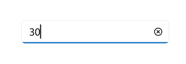

# Value Change Restriction in .NET MAUI NumericEntry

This section describes how to restrict changes to the value of the [NumericEntry](https://help.syncfusion.com/cr/maui/Syncfusion.Maui.Inputs.SfNumericEntry.html) control using [AllowNull](https://help.syncfusion.com/cr/maui/Syncfusion.Maui.Inputs.SfNumericEntry.html#Syncfusion_Maui_Inputs_SfNumericEntry_AllowNull), [Minimum](https://help.syncfusion.com/cr/maui/Syncfusion.Maui.Inputs.SfNumericEntry.html#Syncfusion_Maui_Inputs_SfNumericEntry_Minimum), and [Maximum](https://help.syncfusion.com/cr/maui/Syncfusion.Maui.Inputs.SfNumericEntry.html#Syncfusion_Maui_Inputs_SfNumericEntry_Maximum) properties.

## Restrict Null Values

By default, `NumericEntry` control sets an empty or null value when the input is cleared, as the `AllowNull` property value is typically **true**. When the [AllowNull](https://help.syncfusion.com/cr/maui/Syncfusion.Maui.Inputs.SfNumericEntry.html#Syncfusion_Maui_Inputs_SfNumericEntry_AllowNull) property is set to **false**, the `NumericEntry` control restores the value to **0** in the editor after clearing the input.

- If the `Minimum` property is set to **15** and `AllowNull` is **true**, the control returns a **null** value after clearing the input.
- If the `Minimum` property is **15** and `AllowNull` is **false**, the control returns the `minimum` value after input clearance.




<editors:SfNumericEntry WidthRequest="200"
                        HorizontalOptions="Center"
                        VerticalOptions="Center" 
                        Value="10" 
                        AllowNull="False" />




SfNumericEntry sfNumericEntry = new SfNumericEntry();
sfNumericEntry.WidthRequest = 200;
sfNumeriCEntry.HorizontalOptions = LayoutOptions.Center;
sfNumericEntry.VerticalOptions = LayoutOptions.Center;
sfNumericEntry.Value = 10;
sfNumericEntry.AllowNull = false;




## Restrict Value Within Range

To restrict user input within a specific range in the `NumericEntry` control, use the Minimum and Maximum properties. The default value for the [Minimum](https://help.syncfusion.com/cr/maui/Syncfusion.Maui.Inputs.SfNumericEntry.html#Syncfusion_Maui_Inputs_SfNumericEntry_Minimum) property is **double.MinValue**, and for [Maximum](https://help.syncfusion.com/cr/maui/Syncfusion.Maui.Inputs.SfNumericEntry.html#Syncfusion_Maui_Inputs_SfNumericEntry_Maximum) it is **double.MaxValue**.




<editors:SfNumericEntry WidthRequest="200"
                        HorizontalOptions="Center"
                        VerticalOptions="Center"
                        Value="50"
                        Minimum="10"
                        Maximum="30" />




SfNumericEntry sfNumericEntry = new SfNumericEntry();
sfNumericEntry.WidthRequest = 200;
sfNumericEntry.HorizontalOptions = LayoutOptions.Center;
sfNumericEntry.VerticalOptions = LayoutOptions.Center;
sfNumericEntry.Minimum = 10;
sfNumericEntry.Maximum = 30;
sfNumericEntry.Value = 50;




## Restrict Text Editing

You can prevent users from editing the numeric value in the editor using the [IsEditable](https://help.syncfusion.com/cr/maui/Syncfusion.Maui.Inputs.SfNumericEntry.html#Syncfusion_Maui_Inputs_SfNumericEntry_IsEditable) property. However, users can still alter the value using the up-down buttons, mouse scroll, keyboard arrows, and page keys. By default, `IsEditable` is set to **true**.




<editors:SfNumericEntry x:Name="sfNumericEntry"
                        WidthRequest="200"
                        HorizontalOptions="Center"
                        VerticalOptions="Center"
                        IsEditable="True" />




SfNumericEntry sfNumericEntry = new SfNumericEntry();
sfNumericEntry.WidthRequest = 200;
sfNumericEntry.HorizontalOptions = LayoutOptions.Center;
sfNumericEntry.VerticalOptions = LayoutOptions.Center;
sfNumericEntry.IsEditable = true;




