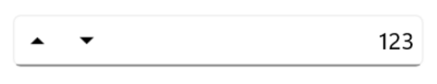
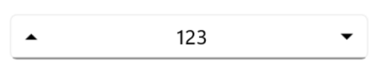
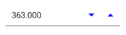

# UpDown Button in .NET MAUI NumericEntry

This section describes how to change the value in the [NumericEntry](https://help.syncfusion.com/cr/maui/Syncfusion.Maui.Inputs.SfNumericEntry.html) control using keys, mouse scrolling, and the UpDown button.

## Increase or Decrease Value

You can increment or decrement the value in the `NumericEntry` control using the **UpArrow**, **DownArrow**, **PageUp**, and **PageDown** keys. You can change the increment or decrement value when the Arrow keys are pressed using the [SmallChange](https://help.syncfusion.com/cr/maui/Syncfusion.Maui.Inputs.SfNumericEntry.html#Syncfusion_Maui_Inputs_SfNumericEntry_SmallChange) property and Page keys using the [LargeChange](https://help.syncfusion.com/cr/maui/Syncfusion.Maui.Inputs.SfNumericEntry.html#Syncfusion_Maui_Inputs_SfNumericEntry_LargeChange) property. By default, the value of the `SmallChange` property is **1**, and the `LargeChange` property is **10**. 

> Note: The value in the `NumericEntry` can also be changed by mouse scrolling. The mouse scrolling increases or decreases the value based on the `SmallChange` property.




<editors:SfNumericEntry WidthRequest="200"
                        HorizontalOptions="Center"
                        VerticalOptions="Center" 
                        SmallChange="5"
                        Value="10"
                        LargeChange="10" />




SfNumericEntry sfNumericEntry= new SfNumericEntry();
sfNumericEntry.Value=10;
sfNumericEntry.WidthRequest = 200;
sfNumericEntry.SmallChange=5;
sfNumericEntry.LargeChange=10;
sfNumericEntry.HorizontalOptions = LayoutOptions.Center;
sfNumericEntry.VerticalOptions = LayoutOptions.Center;




## UpDown Button Placement

You can increase or decrease the value of the `NumericEntry` control using the UpDown button. By default, the value of the [UpDownPlacementMode](https://help.syncfusion.com/cr/maui/Syncfusion.Maui.Inputs.SfNumericEntry.html#Syncfusion_Maui_Inputs_SfNumericEntry_UpDownPlacementMode) property is **Hidden**. You can adjust the position of the UpDown buttons by setting the `UpDownPlacementMode` property to **Inline** for horizontal orientation and **InlineVertical** for vertical orientation.

> Note: When using the UpDown button, the `NumericEntry` control value changes based on the value of the `SmallChange` property.

### UpDown Button Placement: Inline




<editors:SfNumericEntry WidthRequest="200"
                        HorizontalOptions="Center"
                        VerticalOptions="Center"
                        Value="360";
                        UpDownPlacementMode="Inline" />
                     



SfNumericEntry sfNumericEntry = new SfNumericEntry();
sfNumericEntry.WidthRequest = 200;
sfNumericEntry.HorizontalOptions = LayoutOptions.Center;
sfNumericEntry.VerticalOptions = LayoutOptions.Center;
sfNumericEntry.Value=360;
sfNumericEntry.UpDownPlacementMode = NumericEntryUpDownPlacementMode.Inline;




### UpDown Button Placement: InlineVertical




<editors:SfNumericEntry Value="360"
                        WidthRequest="200"
                        VerticalOptions="Center"
                        HorizontalOptions="Center"
                        UpDownPlacementMode="InlineVertical"/>
                     



SfNumericEntry sfNumericEntry = new SfNumericEntry();
sfNumericEntry.WidthRequest = 200;
sfNumericEntry.HorizontalOptions = LayoutOptions.Center;
sfNumericEntry.VerticalOptions = LayoutOptions.Center;
sfNumericEntry.Value=360;
sfNumericEntry.UpDownPlacementMode = NumericEntryUpDownPlacementMode.InlineVertical;




## UpDown Button Alignment

You can adjust the alignment of the UpDown buttons in the [NumericEntry](https://help.syncfusion.com/cr/maui/Syncfusion.Maui.Inputs.SfNumericEntry.html) control using the [UpDownButtonAlignment](https://help.syncfusion.com/cr/maui/Syncfusion.Maui.Inputs.SfNumericEntry.html#Syncfusion_Maui_Inputs_SfNumericEntry_UpDownButtonAlignment) property. Set its value to **Left**, **Right**, or **Both** to position the buttons on the left, right, or both sides of the entry field, respectively.

> Note: By default, the `UpDownButtonAlignment` property is set to **Right**.

### UpDown Button Alignment: Left




<editors:SfNumericEntry Value="123" HorizontalTextAlignment="End" 
                        WidthRequest="200"
                        UpDownPlacementMode="Inline" 
                        UpDownButtonAlignment="Left"/>
                     



SfNumericEntry sfNumericEntry = new SfNumericEntry();
sfNumericEntry.WidthRequest = 200;
sfNumericEntry.Value = 123;
sfNumericEntry.HorizontalTextAlignment=TextAlignment.End;
sfNumericEntry.UpDownPlacementMode = NumericEntryUpDownPlacementMode.Inline;
sfNumericEntry.UpDownButtonAlignment = UpDownButtonAlignment.Left;




### UpDown Button Alignment: Both




<editors:SfNumericEntry Value="123" HorizontalTextAlignment="Center" 
                        WidthRequest="200"
                        UpDownPlacementMode="Inline" 
                        UpDownButtonAlignment="Both"/>
                     



SfNumericEntry sfNumericEntry = new SfNumericEntry();
sfNumericEntry.WidthRequest = 200;
sfNumericEntry.Value = 123;
sfNumericEntry.HorizontalTextAlignment=TextAlignment.Center;
sfNumericEntry.UpDownPlacementMode = NumericEntryUpDownPlacementMode.Inline;
sfNumericEntry.UpDownButtonAlignment = UpDownButtonAlignment.Both;




## UpDown Button Customization

### UpDown Button Color

Customize the `NumericEntry` control button color by using the [UpDownButtonColor](https://help.syncfusion.com/cr/maui/Syncfusion.Maui.Inputs.SfNumericEntry.html#Syncfusion_Maui_Inputs_SfNumericEntry_UpDownButtonColor) property.




<editors:SfNumericEntry HeightRequest="50"
                        WidthRequest="200"
                        HorizontalOptions="Center"
                        VerticalOptions="Center"
                        Value="360"
                        UpDownPlacementMode="Inline"
                        UpDownButtonColor="Blue"/>
                     



SfNumericEntry sfNumericEntry = new SfNumericEntry();
sfNumericEntry.WidthRequest = 200;
sfNumericEntry.HorizontalOptions = LayoutOptions.Center
sfNumericEntry.VerticalOptions = LayoutOptions.Center;
sfNumericEntry.Value = 360;
sfNumericEntry.UpDownPlacementMode = NumericEntryUpDownPlacementMode.Inline;
sfNumericEntry.UpDownButtonColor = Colors.Blue;




### UpDown Button Template

The `NumericEntry` control supports customization of the UpDownButton's appearance through the use of the [UpButtonTemplate](https://help.syncfusion.com/cr/maui/Syncfusion.Maui.Inputs.SfNumericEntry.html#Syncfusion_Maui_Inputs_SfNumericEntry_UpButtonTemplate) and [DownButtonTemplate](https://help.syncfusion.com/cr/maui/Syncfusion.Maui.Inputs.SfNumericEntry.html#Syncfusion_Maui_Inputs_SfNumericEntry_DownButtonTemplate) properties.



<VerticalStackLayout Spacing="10" VerticalOptions="Center">
    <editors:SfNumericEntry x:Name="numericEntry"
                            WidthRequest="200"
                            HeightRequest="40" 
                            VerticalOptions="Center"
                            UpDownPlacementMode="Inline"
                            Value="50">
        <editors:SfNumericEntry.UpButtonTemplate>
            <DataTemplate>
                <Grid>
                    <Label Padding="10, 3, 15, 10" 
                           FontFamily="FontIcons"
                           HorizontalOptions="Center"
                           Text="&#8593;"
                           TextColor="Green"
                           FontSize="20"/>
                </Grid>
            </DataTemplate>
        </editors:SfNumericEntry.UpButtonTemplate>
        <editors:SfNumericEntry.DownButtonTemplate>
            <DataTemplate>
                <Grid>
                    <Label Padding="10, 3, 15, 10" 
                           Rotation="180"
                           FontFamily="FontIcons"
                           HorizontalOptions="Center"
                           Text="&#8593;"
                           TextColor="Red"
                           FontSize="20"/>
                </Grid>
            </DataTemplate>
        </editors:SfNumericEntry.DownButtonTemplate>
    </editors:SfNumericEntry>
</VerticalStackLayout>
                     



 public partial class MainPage : ContentPage
 {
     public MainPage()
     {
         InitializeComponent();
         var verticalStackLayout = new StackLayout
         {
             Spacing = 10,
             VerticalOptions = LayoutOptions.Center
         };
         var numericEntry = new SfNumericEntry
         {
             WidthRequest = 200,
             HeightRequest = 40,
             VerticalOptions = LayoutOptions.Center,
             UpDownPlacementMode = NumericEntryUpDownPlacementMode.Inline,
             Value = 50
         };
         var upButtonTemplate = new DataTemplate(() =>
         {
             var grid = new Grid();
             var label = new Label
             {
                 Padding = new Thickness(10, 3, 15, 10),
                 FontFamily = "FontIcons",
                 HorizontalOptions = LayoutOptions.Center,
                 Text = "\u2191", // Use Unicode directly for the icon
                 TextColor = Colors.Green,
                 FontSize = 20
             };
             grid.Children.Add(label);
             return grid;
         });
         var downButtonTemplate = new DataTemplate(() =>
         {
             var grid = new Grid();
             var label = new Label
             {
                 Padding = new Thickness(10, 3, 15, 10),
                 Rotation = 180,
                 FontFamily = "FontIcons",
                 HorizontalOptions = LayoutOptions.Center,
                 Text = "\u2191",
                 TextColor = Colors.Red,
                 FontSize = 20
             };
             grid.Children.Add(label);
             return grid;
         });
         numericEntry.UpButtonTemplate = upButtonTemplate;
         numericEntry.DownButtonTemplate = downButtonTemplate;
         verticalStackLayout.Children.Add(numericEntry);
         Content = verticalStackLayout;
     }
 }




## Auto Reverse in SfNumericEntry

[Auto-reverse](https://help.syncfusion.com/cr/maui/Syncfusion.Maui.Inputs.SfNumericEntry.html#Syncfusion_Maui_Inputs_SfNumericEntry_AutoReverse) in NumericEntry allows the control to automatically switch direction when reaching its [Minimum](https://help.syncfusion.com/cr/maui/Syncfusion.Maui.Inputs.SfNumericEntry.html#Syncfusion_Maui_Inputs_SfNumericEntry_Minimum) or [Maximum](https://help.syncfusion.com/cr/maui/Syncfusion.Maui.Inputs.SfNumericEntry.html#Syncfusion_Maui_Inputs_SfNumericEntry_Maximum) value. When incrementing, it starts at the `Minimum` and progresses to the `Maximum`, and conversely.

> Note: The default value of this property is `false`.




<editors:SfNumericEntry UpDownPlacementMode="Inline"
                        AutoReverse="True"
                        Minimum="0"
                        Maximum="10"/>
                        
                     



SfNumericEntry sfNumericEntry = new SfNumericEntry();
sfNumericEntry.WidthRequest = 200;
sfNumericEntry.UpDownPlacementMode = NumericEntryUpDownPlacementMode.Inline;
sfNumericEntry.AutoReverse = true;
sfNumericEntry.Minimum=0;
sfNumericEntry.Maximum=10;




