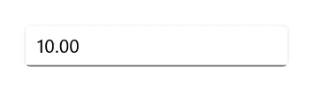
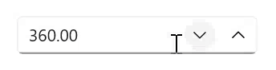
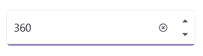
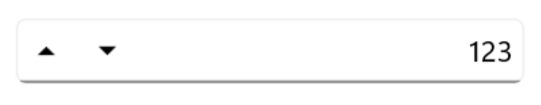
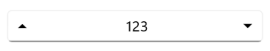
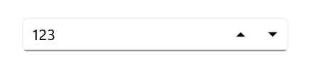
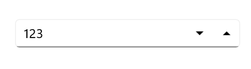
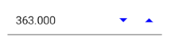
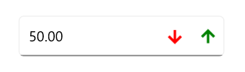
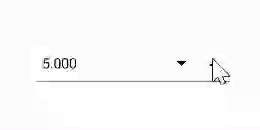

# UpDown Button in .NET MAUI NumericEntry

This section describes how to change the value of the [SfNumericEntry](https://help.syncfusion.com/cr/maui/Syncfusion.Maui.Inputs.SfNumericEntry.html) control using the keyboard, the mouse scroll wheel, and the on-screen up-down buttons. It also covers placement, alignment, ordering, color, template customization, and auto-reverse behavior.

## Prerequisites

Before using the [SfNumericEntry](https://help.syncfusion.com/cr/maui/Syncfusion.Maui.Inputs.SfNumericEntry.html), ensure the following NuGet package is installed in your .NET MAUI project:

- `Syncfusion.Maui.Inputs`

For a step-by-step setup, refer to the [Getting Started](Getting-Started.md) documentation.

## Increase or decrease value

You can increment or decrement the value in the `NumericEntry` control using the `Up`, `Down`, `PageUp`, and `PageDown` keys. Control the step size for the arrow keys with the [SmallChange](https://help.syncfusion.com/cr/maui/Syncfusion.Maui.Inputs.SfNumericEntry.html#Syncfusion_Maui_Inputs_SfNumericEntry_SmallChange) property, and for the page keys with the [LargeChange](https://help.syncfusion.com/cr/maui/Syncfusion.Maui.Inputs.SfNumericEntry.html#Syncfusion_Maui_Inputs_SfNumericEntry_LargeChange) property. Both properties accept `double` values. The default value of `SmallChange` is `1`, and the default value of `LargeChange` is `10`.

N> The value in the `NumericEntry` can also be changed by mouse scrolling. The scroll wheel increments or decrements the value based on the `SmallChange` property.




<editors:SfNumericEntry WidthRequest="200"
                        HorizontalOptions="Center"
                        VerticalOptions="Center"
                        SmallChange="5"
                        Value="10"
                        LargeChange="20" />




SfNumericEntry sfNumericEntry = new SfNumericEntry
{
    Value = 10,
    WidthRequest = 200,
    SmallChange = 5,
    LargeChange = 20,
    HorizontalOptions = LayoutOptions.Center,
    VerticalOptions = LayoutOptions.Center,
};




## UpDown button placement

You can increase or decrease the value of the `NumericEntry` control using the on-screen up-down buttons. By default, the value of the [UpDownPlacementMode](https://help.syncfusion.com/cr/maui/Syncfusion.Maui.Inputs.SfNumericEntry.html#Syncfusion_Maui_Inputs_SfNumericEntry_UpDownPlacementMode) property is `Hidden` (the buttons are not displayed). Set `UpDownPlacementMode` to `Inline` for a horizontal layout, or to `InlineVertical` for a vertical layout.

N> When the up-down buttons are visible, the value changes by the `SmallChange` step each time a button is pressed.

### UpDown button placement: Inline




<editors:SfNumericEntry WidthRequest="200"
                        HorizontalOptions="Center"
                        VerticalOptions="Center"
                        Value="360"
                        UpDownPlacementMode="Inline" />




SfNumericEntry sfNumericEntry = new SfNumericEntry
{
    WidthRequest = 200,
    HorizontalOptions = LayoutOptions.Center,
    VerticalOptions = LayoutOptions.Center,
    Value = 360,
    UpDownPlacementMode = NumericEntryUpDownPlacementMode.Inline,
};




### UpDown button placement: InlineVertical




<editors:SfNumericEntry Value="360"
                        WidthRequest="200"
                        VerticalOptions="Center"
                        HorizontalOptions="Center"
                        UpDownPlacementMode="InlineVertical" />




SfNumericEntry sfNumericEntry = new SfNumericEntry
{
    WidthRequest = 200,
    HorizontalOptions = LayoutOptions.Center,
    VerticalOptions = LayoutOptions.Center,
    Value = 360,
    UpDownPlacementMode = NumericEntryUpDownPlacementMode.InlineVertical,
};




## UpDown button alignment

You can adjust the alignment of the up-down buttons in the [NumericEntry](https://help.syncfusion.com/cr/maui/Syncfusion.Maui.Inputs.SfNumericEntry.html) control using the [UpDownButtonAlignment](https://help.syncfusion.com/cr/maui/Syncfusion.Maui.Inputs.SfNumericEntry.html#Syncfusion_Maui_Inputs_SfNumericEntry_UpDownButtonAlignment) property. Set its value to `Left`, `Right`, or `Both` to position the buttons on the left, right, or both sides of the entry field, respectively. The default value of `UpDownButtonAlignment` is `Right`.

### UpDown button alignment: Left




<editors:SfNumericEntry Value="123"
                        HorizontalTextAlignment="End"
                        WidthRequest="200"
                        UpDownPlacementMode="Inline"
                        UpDownButtonAlignment="Left" />




SfNumericEntry sfNumericEntry = new SfNumericEntry
{
    WidthRequest = 200,
    Value = 123,
    HorizontalTextAlignment = TextAlignment.End,
    UpDownPlacementMode = NumericEntryUpDownPlacementMode.Inline,
    UpDownButtonAlignment = UpDownButtonAlignment.Left,
};




### UpDown button alignment: Right (default)




<editors:SfNumericEntry Value="123"
                        HorizontalTextAlignment="Start"
                        WidthRequest="200"
                        UpDownPlacementMode="Inline"
                        UpDownButtonAlignment="Right" />




SfNumericEntry sfNumericEntry = new SfNumericEntry
{
    WidthRequest = 200,
    Value = 123,
    HorizontalTextAlignment = TextAlignment.Start,
    UpDownPlacementMode = NumericEntryUpDownPlacementMode.Inline,
    UpDownButtonAlignment = UpDownButtonAlignment.Right,
};




### UpDown button alignment: Both




<editors:SfNumericEntry Value="123"
                        HorizontalTextAlignment="Center"
                        WidthRequest="200"
                        UpDownPlacementMode="Inline"
                        UpDownButtonAlignment="Both" />




SfNumericEntry sfNumericEntry = new SfNumericEntry
{
    WidthRequest = 200,
    Value = 123,
    HorizontalTextAlignment = TextAlignment.Center,
    UpDownPlacementMode = NumericEntryUpDownPlacementMode.Inline,
    UpDownButtonAlignment = UpDownButtonAlignment.Both,
};




## UpDown button order

You can change the order of the up-down buttons in the `NumericEntry` control using the [UpDownOrder](https://help.syncfusion.com/cr/maui/Syncfusion.Maui.Inputs.SfNumericEntry.html#Syncfusion_Maui_Inputs_SfNumericEntry_UpDownOrder) property. Set its value to `UpThenDown` or `DownThenUp` to position the up button above the down button, or vice-versa.

> The default value of `UpDownOrder` is `UpThenDown`.

### UpDown button order: UpThenDown




<editors:SfNumericEntry Value="123"
                        WidthRequest="200"
                        UpDownOrder="UpThenDown"
                        UpDownPlacementMode="Inline"
                        UpDownButtonAlignment="Right" />




SfNumericEntry sfNumericEntry = new SfNumericEntry
{
    WidthRequest = 200,
    Value = 123,
    UpDownOrder = UpDownOrder.UpThenDown,
    UpDownPlacementMode = NumericEntryUpDownPlacementMode.Inline,
    UpDownButtonAlignment = UpDownButtonAlignment.Right,
};




### UpDown button order: DownThenUp




<editors:SfNumericEntry Value="123"
                        WidthRequest="200"
                        UpDownOrder="DownThenUp"
                        UpDownPlacementMode="Inline"
                        UpDownButtonAlignment="Right" />




SfNumericEntry sfNumericEntry = new SfNumericEntry
{
    WidthRequest = 200,
    Value = 123,
    UpDownOrder = UpDownOrder.DownThenUp,
    UpDownPlacementMode = NumericEntryUpDownPlacementMode.Inline,
    UpDownButtonAlignment = UpDownButtonAlignment.Right,
};




## UpDown button color

Customize the color of the up-down buttons using the [UpDownButtonColor](https://help.syncfusion.com/cr/maui/Syncfusion.Maui.Inputs.SfNumericEntry.html#Syncfusion_Maui_Inputs_SfNumericEntry_UpDownButtonColor) property. The property accepts a `Microsoft.Maui.Graphics.Color` value (or a color string in XAML).




<editors:SfNumericEntry HeightRequest="50"
                        WidthRequest="200"
                        HorizontalOptions="Center"
                        VerticalOptions="Center"
                        Value="360"
                        UpDownPlacementMode="Inline"
                        UpDownButtonColor="Blue" />




SfNumericEntry sfNumericEntry = new SfNumericEntry
{
    WidthRequest = 200,
    HorizontalOptions = LayoutOptions.Center,
    VerticalOptions = LayoutOptions.Center,
    Value = 360,
    UpDownPlacementMode = NumericEntryUpDownPlacementMode.Inline,
    UpDownButtonColor = Colors.Blue,
};




## UpDown button template

Customize the appearance of the up-down buttons using the [UpButtonTemplate](https://help.syncfusion.com/cr/maui/Syncfusion.Maui.Inputs.SfNumericEntry.html#Syncfusion_Maui_Inputs_SfNumericEntry_UpButtonTemplate) and [DownButtonTemplate](https://help.syncfusion.com/cr/maui/Syncfusion.Maui.Inputs.SfNumericEntry.html#Syncfusion_Maui_Inputs_SfNumericEntry_DownButtonTemplate) properties, which accept a `DataTemplate`.

> The custom font used in the following example (`FontIcons`) must be registered in your project before it can be referenced. Add the font file under `Resources/Fonts` and include it in the `MauiProgram.cs` call to `.ConfigureFonts(fonts => { ... })`.




<VerticalStackLayout Spacing="10" VerticalOptions="Center">
    <editors:SfNumericEntry x:Name="numericEntry"
                            WidthRequest="200"
                            HeightRequest="40"
                            VerticalOptions="Center"
                            UpDownPlacementMode="Inline"
                            Value="50">
        <editors:SfNumericEntry.UpButtonTemplate>
            <DataTemplate>
                <Grid>
                    <Label Padding="10, 3, 15, 10"
                            FontFamily="FontIcons"
                            HorizontalOptions="Center"
                            Text="&#8593;"
                            TextColor="Green"
                            FontSize="20" />
                </Grid>
            </DataTemplate>
        </editors:SfNumericEntry.UpButtonTemplate>
        <editors:SfNumericEntry.DownButtonTemplate>
            <DataTemplate>
                <Grid>
                    <Label Padding="10, 3, 15, 10"
                            FontFamily="FontIcons"
                            HorizontalOptions="Center"
                            Text="&#8595;"
                            TextColor="Red"
                            FontSize="20" />
                </Grid>
            </DataTemplate>
        </editors:SfNumericEntry.DownButtonTemplate>
    </editors:SfNumericEntry>
</VerticalStackLayout>




var verticalStackLayout = new VerticalStackLayout
{
    Spacing = 10,
    VerticalOptions = LayoutOptions.Center,
};
var numericEntry = new SfNumericEntry
{
    WidthRequest = 200,
    HeightRequest = 40,
    VerticalOptions = LayoutOptions.Center,
    UpDownPlacementMode = NumericEntryUpDownPlacementMode.Inline,
    Value = 50,
};

var upButtonTemplate = new DataTemplate(() =>
{
    var grid = new Grid();
    var label = new Label
    {
        Padding = new Thickness(10, 3, 15, 10),
        FontFamily = "FontIcons",
        HorizontalOptions = LayoutOptions.Center,
        Text = "\u2191",
        TextColor = Colors.Green,
        FontSize = 20,
    };
    grid.Children.Add(label);
    return grid;
});

var downButtonTemplate = new DataTemplate(() =>
{
    var grid = new Grid();
    var label = new Label
    {
        Padding = new Thickness(10, 3, 15, 10),
        FontFamily = "FontIcons",
        HorizontalOptions = LayoutOptions.Center,
        Text = "\u2193",
        TextColor = Colors.Red,
        FontSize = 20,
    };
    grid.Children.Add(label);
    return grid;
});

numericEntry.UpButtonTemplate = upButtonTemplate;
numericEntry.DownButtonTemplate = downButtonTemplate;
verticalStackLayout.Add(numericEntry);
Content = verticalStackLayout;




## Auto reverse in SfNumericEntry

The [AutoReverse](https://help.syncfusion.com/cr/maui/Syncfusion.Maui.Inputs.SfNumericEntry.html#Syncfusion_Maui_Inputs_SfNumericEntry_AutoReverse) property causes the `NumericEntry` control to automatically switch direction when it reaches the [Minimum](https://help.syncfusion.com/cr/maui/Syncfusion.Maui.Inputs.SfNumericEntry.html#Syncfusion_Maui_Inputs_SfNumericEntry_Minimum) or [Maximum](https://help.syncfusion.com/cr/maui/Syncfusion.Maui.Inputs.SfNumericEntry.html#Syncfusion_Maui_Inputs_SfNumericEntry_Maximum) value. When incrementing, the value progresses from `Minimum` to `Maximum`; when decrementing, it progresses from `Maximum` to `Minimum`. The default value of `AutoReverse` is `false`.




<editors:SfNumericEntry WidthRequest="200"
                        UpDownPlacementMode="Inline"
                        AutoReverse="True"
                        Minimum="0"
                        Maximum="10" />




SfNumericEntry sfNumericEntry = new SfNumericEntry
{
    WidthRequest = 200,
    UpDownPlacementMode = NumericEntryUpDownPlacementMode.Inline,
    AutoReverse = true,
    Minimum = 0,
    Maximum = 10,
};




## See Also

* [Basic Features](Basic-Features.md)
* [Formatting](Formatting.md)
* [Restriction](Restriction.md)
