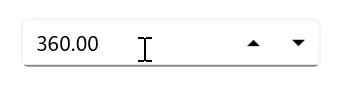

# UpDown Button in .NET MAUI NumericEntry

This section describes how to change the value in the [NumericEntry](https://help.syncfusion.com/cr/maui/Syncfusion.Maui.Inputs.SfNumericEntry.html) control using keys, mouse scrolling, and the up-down button

## Increase or decrease value

You can increment or decrement the value in the `NumericEntry` control using the **UpArrow**, **DownArrow**, **PageUp**, and **PageDown** keys. You can change the increment or decrement value when the Arrow keys are pressed using the [SmallChange](https://help.syncfusion.com/cr/maui/Syncfusion.Maui.Inputs.SfNumericEntry.html#Syncfusion_Maui_Inputs_SfNumericEntry_SmallChange) property and Page keys using the [LargeChange](https://help.syncfusion.com/cr/maui/Syncfusion.Maui.Inputs.SfNumericEntry.html#Syncfusion_Maui_Inputs_SfNumericEntry_LargeChange) property. By default, the value of the `SmallChange` property is **1**, and the `LargeChange` property is **10**. 

N> The value in the `NumericEntry` can also be changed by mouse scrolling. The mouse scrolling increases or decreases the value based on the `SmallChange` property.




<editors:SfNumericEntry HorizontalOptions="Center"
                        VerticalOptions="Center" 
                        SmallChange="5"
                        Value="10"
                        LargeChange="10" />




SfNumericEntry sfNumericEntry= new SfNumericEntry();
sfNumericEntry.Value=10;
sfNumericEntry.SmallChange=5;
sfNumericEntry.LargeChange=10;
sfNumericEntry.HorizontalOptions = LayoutOptions.Center;
sfNumericEntry.VerticalOptions = LayoutOptions.Center;




## UpDown button placement

You can increase or decrease the value of the `NumericEntry` control using the up-down button. By default, the value of the [UpDownPlacementMode](https://help.syncfusion.com/cr/maui/Syncfusion.Maui.Inputs.SfNumericEntry.html#Syncfusion_Maui_Inputs_SfNumericEntry_UpDownPlacementMode) property is **Hidden**. You can change the up-down button position by assigning the value `UpDownPlacementMode` property as **Inline**.

N> When using the up-down button, the `NumericEntry` control value changes based on the value of the `SmallChange` property.




<editors:SfNumericEntry HorizontalOptions="Center"
                        VerticalOptions="Center"
                        Value="360";
                        UpDownPlacementMode="Inline" />
                     



SfNumericEntry sfNumericEntry = new SfNumericEntry();
sfNumericEntry.HorizontalOptions = LayoutOptions.Center;
sfNumericEntry.VerticalOptions = LayoutOptions.Center;
sfNumericEntry.Value=360;
sfNumericEntry.UpDownPlacementMode = NumericEntryUpDownPlacementMode.Inline;




## UpDown button customization

# UpDown button color

You can customize the `NumericEntry` control button color by using the `UpDownButtonColor` property.




<editors:SfNumericEntry HorizontalOptions="Center"
                        VerticalOptions="Center"
                        Value="360"
                        UpDownPlacementMode="Inline"
                        UpDownButtonColor="Aqua"/>
                     



SfNumericEntry sfNumericEntry = new SfNumericEntry();
sfNumericEntry.HorizontalOptions = LayoutOptions.Center;
sfNumericEntry.VerticalOptions = LayoutOptions.Center;
sfNumericEntry.Value = 360;
sfNumericEntry.UpDownPlacementMode = NumericEntryUpDownPlacementMode.Inline;
sfNumericEntry.UpDownButtonColor = Colors.Aqua;




# UpDown button template

The `NumericEntry` control supports customization of the UpDownButton's appearance through the use of the `UpButtonTemplate` and `DownButtonTemplate` properties.



<VerticalStackLayout Spacing="10" VerticalOptions="Center">
    <editors:SfNumericEntry x:Name="numericEntry"
                            WidthRequest="200"
                            HeightRequest="40" 
                            VerticalOptions="Center"
                            UpDownPlacementMode="Inline"
                            Value="50">
        <editors:SfNumericEntry.UpButtonTemplate>
            <DataTemplate>
                <Grid>
                    <Label Padding="0,6.5,0,0" 
                           Rotation="90"
                           FontFamily="FontIcons"
                           HorizontalOptions="Center"
                           Text="&#xe74a;"
                           TextColor="Green"
                           FontSize="20"/>
                </Grid>
            </DataTemplate>
        </editors:SfNumericEntry.UpButtonTemplate>
        <editors:SfNumericEntry.DownButtonTemplate>
            <DataTemplate>
                <Grid>
                    <Label Padding="0,5,0,0" 
                           Rotation="270"
                           FontFamily="FontIcons"
                           HorizontalOptions="Center"
                           Text="&#xe74a;"
                           TextColor="Red"
                           FontSize="20"/>
                </Grid>
            </DataTemplate>
        </editors:SfNumericEntry.DownButtonTemplate>
    </editors:SfNumericEntry>
</VerticalStackLayout>
                     



 public partial class MainPage : ContentPage
 {
     public MainPage()
     {
         InitializeComponent();
         var verticalStackLayout = new StackLayout
         {
             Spacing = 10,
             VerticalOptions = LayoutOptions.Center
         };
         var numericEntry = new SfNumericEntry
         {
             WidthRequest = 200,
             HeightRequest = 40,
             VerticalOptions = LayoutOptions.Center,
             UpDownPlacementMode = NumericEntryUpDownPlacementMode.Inline,
             Value = 50
         };
         var upButtonTemplate = new DataTemplate(() =>
         {
             var grid = new Grid();
             var label = new Label
             {
                 Padding = new Thickness(0, 6.5, 0, 0),
                 Rotation = 90,
                 FontFamily = "FontIcons",
                 HorizontalOptions = LayoutOptions.Center,
                 Text = "\ue74a", // Use Unicode directly for the icon
                 TextColor = Colors.Green,
                 FontSize = 20
             };
             grid.Children.Add(label);
             return grid;
         });
         var downButtonTemplate = new DataTemplate(() =>
         {
             var grid = new Grid();
             var label = new Label
             {
                 Padding = new Thickness(0, 5, 0, 0),
                 Rotation = 270,
                 FontFamily = "FontIcons",
                 HorizontalOptions = LayoutOptions.Center,
                 Text = "\ue74a",
                 TextColor = Colors.Red,
                 FontSize = 20
             };

             // Add the Label to the Grid
             grid.Children.Add(label);

             // Return the Grid as the root of the DataTemplate
             return grid;
         });
         numericEntry.UpButtonTemplate = upButtonTemplate;
         numericEntry.DownButtonTemplate = downButtonTemplate;
         verticalStackLayout.Children.Add(numericEntry);
         Content = verticalStackLayout;
     }
 }




## Auto reverse in SfNumericEntry

Auto-reverse in `NumericEntry` allows the control to automatically switch direction when reaching its `minimum` or `maximum` value. When incrementing, it starts at the `minimum` and progresses to the `maximum,` and conversely.

N> The default value of this property is `false.`



<editors:SfNumericEntry UpDownPlacementMode="Inline"
                        AutoReverse="True"
                        Minimum="0"
                        Maximum="10"/>
                        
                     



SfNumericEntry sfNumericEntry = new SfNumericEntry();
sfNumericEntry.UpDownPlacementMode = NumericEntryUpDownPlacementMode.Inline;
sfNumericEntry.AutoReverse = true;
sfNumericEntry.Minimum=0;
sfNumericEntry.Maximum=10;




