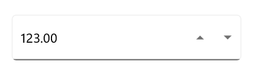
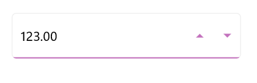
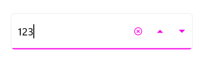
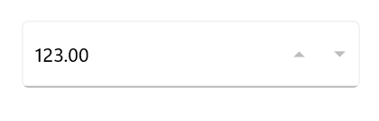

# Visual States in .NET MAUI Numeric Entry

Visual states let you change the appearance of [.NET MAUI Numeric Entry](https://help.syncfusion.com/cr/maui/Syncfusion.Maui.Inputs.SfNumericEntry.html) in response to user interaction. Use them to apply different colors, borders, or other properties for each state without writing code-behind handlers.

`Numeric Entry` supports the following visual states through the [`VisualStateManager`](https://learn.microsoft.com/en-us/dotnet/maui/user-interface/visual-states?view=net-maui-10.0):

* `Normal` - The default resting state of the Numeric Entry.
* `Focused` - The Numeric Entry has keyboard or input focus.
* `Disabled` - The Numeric Entry is disabled (`IsEnabled` is `false`).
* `Hover` - The pointer is over the Numeric Entry (desktop platforms).

## Prerequisites

Before using the  [SfNumericEntry](https://help.syncfusion.com/cr/maui/Syncfusion.Maui.Inputs.SfNumericEntry.html), ensure the following NuGet package is installed in your .NET MAUI project:

- `Syncfusion.Maui.Inputs`

For a step-by-step setup, refer to the [Getting Started](https://help.syncfusion.com/maui/numericentry/getting-started) documentation.

## Defining visual states

`SfNumericEntry` exposes its visual states through a single `VisualStateGroup` named `CommonStates`. Each `VisualState` contains a collection of `Setter` objects that target bindable properties on the Numeric Entry. Commonly customized properties include `Stroke`, `TextColor`, `ClearButtonColor`, and `UpDownButtonColor`.




<editors:SfNumericEntry x:Name="numericEntry"
                       WidthRequest="250" 
                       HeightRequest="50"
                       UpDownPlacementMode="Inline"
                       Placeholder="Enter a value">
    <VisualStateManager.VisualStateGroups>
        <VisualStateGroup x:Name="CommonStates">
            <VisualState x:Name="Normal">
                <VisualState.Setters>
                    <Setter Property="Stroke" Value="#707070" />
                    <Setter Property="TextColor" Value="Black" />
                    <Setter Property="ClearButtonColor" Value="#707070" />
                    <Setter Property="UpDownButtonColor" Value="#707070" />
                </VisualState.Setters>
            </VisualState>
            <VisualState x:Name="Focused">
                <VisualState.Setters>
                    <Setter Property="Stroke" Value="#f903e9" />
                    <Setter Property="TextColor" Value="Black" />
                    <Setter Property="ClearButtonColor" Value="#f903e9" />
                    <Setter Property="UpDownButtonColor" Value="#f903e9" />
                </VisualState.Setters>
            </VisualState>
            <VisualState x:Name="PointerOver">
                <VisualState.Setters>
                    <Setter Property="Stroke" Value="#c372bd" />
                    <Setter Property="TextColor" Value="Black" />
                    <Setter Property="ClearButtonColor" Value="#c372bd" />
                    <Setter Property="UpDownButtonColor" Value="#c372bd" />
                </VisualState.Setters>
            </VisualState>
            <VisualState x:Name="Disabled">
                <VisualState.Setters>
                    <Setter Property="Stroke" Value="#BDBDBD" />
                    <Setter Property="TextColor" Value="Black" />
                    <Setter Property="ClearButtonColor" Value="#BDBDBD" />
                    <Setter Property="UpDownButtonColor" Value="#BDBDBD" />
                </VisualState.Setters>
            </VisualState>
        </VisualStateGroup>
    </VisualStateManager.VisualStateGroups>
</editors:SfNumericEntry>
            



SfNumericEntry numericEntry = new SfNumericEntry
{
    WidthRequest = 250,
    HeightRequest = 50,
    UpDownPlacementMode = UpDownPlacementMode.Inline,
    Placeholder = "Enter a value",
};
VisualStateGroupList visualStateGroupList = new VisualStateGroupList();
VisualStateGroup commonStateGroup = new VisualStateGroup { Name = "CommonStates" };

VisualState normalState = new VisualState { Name = "Normal" };
normalState.Setters.Add(new Setter { Property = SfNumericEntry.StrokeProperty, Value = Color.FromArgb("#707070") });
normalState.Setters.Add(new Setter { Property = SfNumericEntry.TextColorProperty, Value = Colors.Black });
normalState.Setters.Add(new Setter { Property = SfNumericEntry.ClearButtonColorProperty, Value = Color.FromArgb("#707070") });
normalState.Setters.Add(new Setter { Property = SfNumericEntry.UpDownButtonColorProperty, Value = Color.FromArgb("#707070") });

VisualState focusedState = new VisualState { Name = "Focused" };
focusedState.Setters.Add(new Setter { Property = SfNumericEntry.StrokeProperty, Value = Color.FromArgb("#f903e9") });
focusedState.Setters.Add(new Setter { Property = SfNumericEntry.TextColorProperty, Value = Colors.Black });
focusedState.Setters.Add(new Setter { Property = SfNumericEntry.ClearButtonColorProperty, Value = Color.FromArgb("#f903e9") });
focusedState.Setters.Add(new Setter { Property = SfNumericEntry.UpDownButtonColorProperty, Value = Color.FromArgb("#f903e9") });

VisualState pointerOverState = new VisualState { Name = "PointerOver" };
pointerOverState.Setters.Add(new Setter { Property = SfNumericEntry.StrokeProperty, Value = Color.FromArgb("#c372bd") });
pointerOverState.Setters.Add(new Setter { Property = SfNumericEntry.TextColorProperty, Value = Colors.Black });
pointerOverState.Setters.Add(new Setter { Property = SfNumericEntry.ClearButtonColorProperty, Value = Color.FromArgb("#c372bd") });
pointerOverState.Setters.Add(new Setter { Property = SfNumericEntry.UpDownButtonColorProperty, Value = Color.FromArgb("#c372bd") });

VisualState disabledState = new VisualState { Name = "Disabled" };
disabledState.Setters.Add(new Setter { Property = SfNumericEntry.StrokeProperty, Value = Color.FromArgb("#BDBDBD") });
disabledState.Setters.Add(new Setter { Property = SfNumericEntry.TextColorProperty, Value = Colors.Black });
disabledState.Setters.Add(new Setter { Property = SfNumericEntry.ClearButtonColorProperty, Value = Color.FromArgb("#BDBDBD") });
disabledState.Setters.Add(new Setter { Property = SfNumericEntry.UpDownButtonColorProperty, Value = Color.FromArgb("#BDBDBD") });

commonStateGroup.States.Add(normalState);
commonStateGroup.States.Add(focusedState);
commonStateGroup.States.Add(pointerOverState);
commonStateGroup.States.Add(disabledState);

visualStateGroupList.Add(commonStateGroup);

VisualStateManager.SetVisualStateGroups(numericEntry, visualStateGroupList);

Content = numericEntry;




### Normal visual state

### Hover visual state

### Focused visual state

### Disabled visual state

## See Also

* [Basic Features](https://help.syncfusion.com/maui/numericentry/basic-features)
* [Formatting](https://help.syncfusion.com/maui/numericentry/formatting)
* [Restriction](https://help.syncfusion.com/maui/numericentry/restriction)
