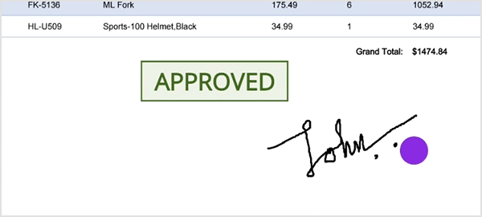
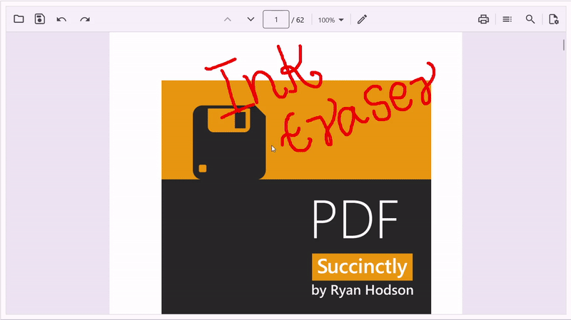

# Ink or Freehand Drawing Eraser in .NET MAUI PDF Viewer (SfPdfViewer)

The [SfPdfViewer](https://help.syncfusion.com/cr/maui/Syncfusion.Maui.PdfViewer.SfPdfViewer.html) allows you to erase all or portions of an ink annotation, which will help correct mistakes in freehand drawings.

## Enabling the ink eraser

Enable the ink eraser by setting the [AnnotationMode](https://help.syncfusion.com/cr/maui/Syncfusion.Maui.PdfViewer.SfPdfViewer.html#Syncfusion_Maui_PdfViewer_SfPdfViewer_AnnotationMode) property of the [SfPdfViewer](https://help.syncfusion.com/cr/maui/Syncfusion.Maui.PdfViewer.SfPdfViewer.html) to [InkEraser](https://help.syncfusion.com/cr/maui/Syncfusion.Maui.PdfViewer.AnnotationMode.html#Syncfusion_Maui_PdfViewer_AnnotationMode_InkEraser). In the ink eraser mode, drag the pointer over the portions of the ink annotations you want to erase.




void EnableInkEraserMode() 
{ 
	// Set the annotation mode to ink eraser using the [SfPdfViewer](https://help.syncfusion.com/cr/maui/Syncfusion.Maui.PdfViewer.SfPdfViewer.html) instance. 
	PdfViewer.AnnotationMode = AnnotationMode.InkEraser; 
}




## Disabling the ink eraser

Once you have erased the ink, disable the ink eraser by setting the [AnnotationMode](https://help.syncfusion.com/cr/maui/Syncfusion.Maui.PdfViewer.SfPdfViewer.html#Syncfusion_Maui_PdfViewer_SfPdfViewer_AnnotationMode) property of the [SfPdfViewer](https://help.syncfusion.com/cr/maui/Syncfusion.Maui.PdfViewer.SfPdfViewer.html) to [None](https://help.syncfusion.com/cr/maui/Syncfusion.Maui.PdfViewer.AnnotationMode.html#Syncfusion_Maui_PdfViewer_AnnotationMode_None).




void DisableInkEraserMode() 
{ 
	PdfViewer.AnnotationMode = AnnotationMode.None; 
}




## How to erase ink annotation and customize the ink eraser thickness using toolbar

On the built-in toolbar, an ink eraser tool is available. Using that, you can easily erase all or portions of the ink annotation. Additionally, the toolbar shows the option to customize the ink eraser thickness.

The following image demonstrates how to use the ink eraser tool from the toolbar on the desktop to remove ink annotations.

## How to erase ink annotation only using stylus

The ink eraser operation can be customized so that the ink strokes can be added only using a stylus by setting the [AnnotationSettings.Ink.TouchScreenInputMode](https://help.syncfusion.com/cr/maui/Syncfusion.Maui.PdfViewer.TouchScreenInputMode.html) property to TouchScreenInputMode.Stylus. When TouchScreenInputMode is set to TouchScreenInputMode.Stylus, users can easily erase ink strokes using a stylus. However, zooming and scrolling functionality will still be available using their fingers.

By default, the TouchScreenInputMode property is set to TouchScreenInputMode.FingerAndStylus, where both finger and stylus inputs are recognized as ink erasing operations.




PdfViewer.AnnotationSettings.Ink.TouchScreenInputMode = TouchScreenInputMode.Stylus;




N> * At present, this feature is available only in iOS and Android.

## Customize the ink eraser thickness

The default thickness of the ink eraser is 40. You can adjust the thickness using the [InkEraser.Thickness](https://help.syncfusion.com/cr/maui/Syncfusion.Maui.PdfViewer.InkEraserSettings.html#Syncfusion_Maui_PdfViewer_InkEraserSettings_Thickness) property in the annotation settings.  




PdfViewer.AnnotationSettings.InkEraser.Thickness = 50;




N> When the [AnnotationMode](https://help.syncfusion.com/cr/maui/Syncfusion.Maui.PdfViewer.SfPdfViewer.html#Syncfusion_Maui_PdfViewer_SfPdfViewer_AnnotationMode) is [InkEraser](https://help.syncfusion.com/cr/maui/Syncfusion.Maui.PdfViewer.AnnotationMode.html#Syncfusion_Maui_PdfViewer_AnnotationMode_InkEraser)., only the ink annotations will be erased. Other types of annotations will not be erased. 

