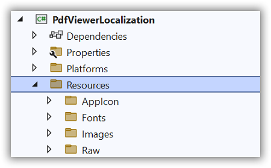
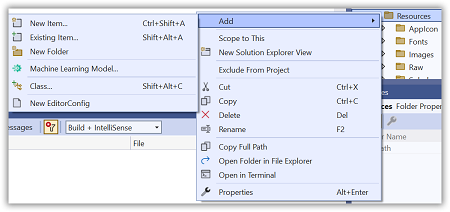
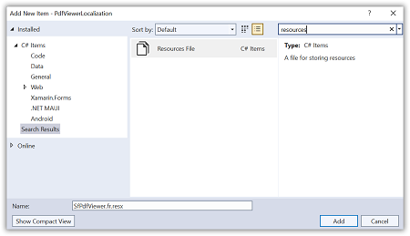
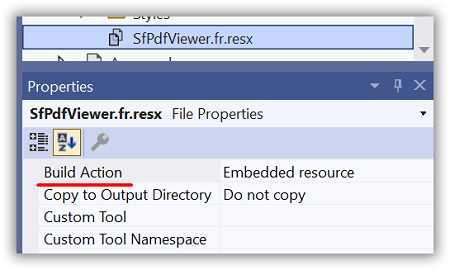

# Localization in .NET MAUI PDF Viewer (SfPdfViewer)

Localization is the process of translating the application resources into a different language for the specific cultures. [SfPdfViewer](https://help.syncfusion.com/cr/maui/Syncfusion.Maui.PdfViewer.SfPdfViewer.html) is set up by default with the language code `en-US`. However, by including a resource file (.resx) in the application with the language code, the static text used in the `SfPdfViewer` can be localized to a different language. 

Follow the instructions given to apply localization to the `SfPdfViewer`.

## Change the current user interface culture

Set the [CurrentUICulture](https://learn.microsoft.com/en-us/dotnet/api/system.globalization.cultureinfo.currentuiculture?view=net-7.0) property in the `App.xaml.cs` file to the desired user interface culture. Refer to the following code sample to change the current culture to `French`.




using System.Globalization;

namespace PdfViewerLocalization;

public partial class App : Application
{
	public App()
	{
		InitializeComponent();
        CultureInfo.CurrentUICulture = new CultureInfo("fr-FR");
        MainPage = new AppShell();
	}
}




## Create and add the resource file to the application

Follow the given steps to create and add the resource file to the application.

1. Right-click on the `Resources` folder in the application.

    

2. Click the `Add` option and then select `NewItem`.

    

3. In the `Add New Item` wizard, select the `Resource File` option and name the file in the format `<control name>.<culture name>.resx`. For example, name the file as SfPdfViewer.fr.resx for `French` culture.

    

4. Click the `Add` option to add the resource file in the Resources folder.

5. Change the `Build Action` of the resource file as `Embedded resource`.

    

6. Double tap on the resource file to add the name and value details in the Resource Designer.
	
7. Set the `ResourceManager` as shown in the following code example, that looks up the resource file with the specified root name.
 



using System.Resources;
using System.Globalization;
using Syncfusion.Maui.PdfViewer;

namespace PdfViewerLocalization;

public partial class App : Application
{
	public App()
	{
		InitializeComponent();
        CultureInfo.CurrentUICulture = new CultureInfo("fr-FR");
        SfPdfViewerResources.ResourceManager = new ResourceManager("PdfViewerLocalization.Resources.SfPdfViewer", 
			Application.Current.GetType().Assembly);
        MainPage = new AppShell();
	}
}




## Default names and values

The following table contains the default name and value details used in the SfPdfViewer in the `en-US` 

<table>
<tr>
<th>Name</th>
<th>Value</th>
</tr>
<tr>
<td>Cancel</td>
<td>Cancel</td>
</tr>
<tr>
<td>CanOpenWebPage</td>
<td>Do you want to open</td>
</tr>
<tr>
<td>Close</td>
<td>CLOSE</td>
</tr>
<tr>
<td>DocumentLoadFailed</td>
<td>Failed to load the PDF document.</td>
</tr>
<tr>
<td>EnterPassword</td>
<td>Enter Password</td>
</tr>
<tr>
<td>Error</td>
<td>Error</td>
</tr>
<tr>
<td>NoOutline</td>
<td>No outline</td>
</tr>
<tr>
<td>Ok</td>
<td>OK</td>
</tr>
<tr>
<td>Open</td>
<td>OPEN</td>
</tr>
<tr>
<td>OpenWebPage</td>
<td>Open Web Page</td>
</tr>
<tr>
<td>Outline</td>
<td>Outline</td>
</tr>
<tr>
<td>PasswordErrorHint</td>
<td>Check your password</td>
</tr>
<tr>
<td>RequestPassword</td>
<td>This PDF file is protected. Please enter the password to open it.</td>
</tr>
<tr>
<td>Copy</td>
<td>Copy</td>
</tr>
<tr>
<td>Highlight</td>
<td>Highlight</td>
</tr>
<tr>
<td>Save</td>
<td>Save</td>
</tr>
<tr>
<td>Squiggly</td>
<td>Squiggly</td>
</tr>
<tr>
<td>Strikeout</td>
<td>Strikeout</td>
</tr>
<tr>
<td>Underline</td>
<td>Underline</td>
</tr>
<tr>
<td>StickyNoteEditorPlaceholder</td>
<td>Write Your Note...</td>
</tr>
<tr>
<td>FreeTextEditorPlaceHolder</td>
<td>Text...</td>
</tr>
<tr>
<td>AddFreeTextToastMessage</td>
<td>Tap on the page to add the free text annotation</td>
</tr>
<tr>
<td>Draw your signature</td>
<td>Draw your signature</td>
</tr>
<tr>
<td>Color</td>
<td>Color</td>
</tr>
<tr>
<td>Clear</td>
<td>Clear</td>
</tr>
<tr>
<td>Add Signature</td>
<td>Add Signature</td>
</tr>
<tr>
<td>Draw</td>
<td>Draw</td>
</tr>
<tr>
<td>Type</td>
<td>Type</td>
</tr>
<tr>
<td>Upload</td>
<td>Upload</td>
</tr>
<tr>
<td>Type your signature</td>
<td>Type your signature</td>
</tr>
<tr>
<td>Signature</td>
<td>Signature</td>
</tr>
<tr>
<td>Create</td>
<td>Create</td>
</tr>
<tr>
<td>Insert</td>
<td>Insert</td>
</tr>
<tr>
<td>Upload an image</td>
<td>Upload an image</td>
</tr>
<tr>
<td>Drag and drop an image here</td>
<td>Drag and drop an image here</td>
</tr>
<tr>
<td>AddHighlightToastMessage</td>
<td>Drag over a text to highlight it</td>
</tr>
<tr>
<td>AddSignature</td>
<td>Add signature</td>
</tr>
<tr>
<td>AddSignatureToastMessage</td>
<td>Tap to add the signature</td>
</tr>
<tr>
<td>AddSquigglyToastMessage</td>
<td>Drag over a text to add a squiggly underline</td>
</tr>
<tr>
<td>AddStampToastMessage</td>
<td>Tap to add the stamp</td>
</tr>
<tr>
<td>AddStickyNoteToastMessage</td>
<td>Tap to add a sticky note</td>
</tr>
<tr>
<td>AddStrikeoutToastMessage</td>
<td>Drag over a text to strike it through</td>
</tr>
<tr>
<td>AddUnderlineToastMessage</td>
<td>Drag over a text to underline it</td>
</tr>
<tr>
<td>Annotations</td>
<td>Annotations</td>
</tr>
<tr>
<td>Arrow</td>
<td>Arrow</td>
</tr>
<tr>
<td>Border</td>
<td>Border</td>
</tr>
<tr>
<td>Circle</td>
<td>Circle</td>
</tr>
<tr>
<td>Cloud</td>
<td>Cloud</td>
</tr>
<tr>
<td>ColorPicker</td>
<td>Color picker</td>
</tr>
<tr>
<td>Comment</td>
<td>Comment</td>
</tr>
<tr>
<td>ContinuousPage</td>
<td>Continuous page</td>
</tr>
<tr>
<td>CreateStamps</td>
<td>Create Stamps</td>
</tr>
<tr>
<td>Delete</td>
<td>Delete</td>
</tr>
<tr>
<td>DragAndDropImage</td>
<td>Drag and drop an image here.</td>
</tr>
<tr>
<td>DrawArrowToastMessage</td>
<td>Drag to draw an arrow</td>
</tr>
<tr>
<td>DrawCircleToastMessage</td>
<td>Drag to draw a circle</td>
</tr>
<tr>
<td>DrawCloudToastMessage</td>
<td>Tap to begin drawing a cloud</td>
</tr>
<tr>
<td>DrawInkToastMessage</td>
<td>Drag to draw an ink</td>
</tr>
<tr>
<td>DrawLineToastMessage</td>
<td>Drag to draw a line</td>
</tr>
<tr>
<td>DrawPolygonToastMessage</td>
<td>Tap to begin drawing a polygon</td>
</tr>
<tr>
<td>DrawPolylineToastMessage</td>
<td>Tap to begin drawing a polyline</td>
</tr>
<tr>
<td>DrawSquareToastMessage</td>
<td>Drag to draw a square</td>
</tr>
<tr>
<td>EraseInkToastMessage</td>
<td>Drag over an ink to erase it</td>
</tr>
<tr>
<td>Fill</td>
<td>Fill</td>
</tr>
<tr>
<td>FitToPage</td>
<td>Fit to Page</td>
</tr>
<tr>
<td>FitToWidth</td>
<td>Fit to Width</td>
</tr>
<tr>
<td>FontSize</td>
<td>Font size</td>
</tr>
<tr>
<td>FreeText</td>
<td>Free text</td>
</tr>
<tr>
<td>FreeTextEditorPlaceHolder</td>
<td>Text…</td>
</tr>
<tr>
<td>Help</td>
<td>Help</td>
</tr>
<tr>
<td>Ink</td>
<td>Ink</td>
</tr>
<tr>
<td>InkEraser</td>
<td>Ink eraser</td>
</tr>
<tr>
<td>InvalidPageNumber</td>
<td>Invalid page number</td>
</tr>
<tr>
<td>Key</td>
<td>Key</td>
</tr>
<tr>
<td>Line</td>
<td>Line</td>
</tr>
<tr>
<td>NewParagraph</td>
<td>New Paragraph</td>
</tr>
<tr>
<td>NextPage</td>
<td>Next page</td>
</tr>
<tr>
<td>NoBookmark</td>
<td>No Bookmark</td>
</tr>
<tr>
<td>NoColor</td>
<td>No Color</td>
</tr>
<tr>
<td>NoMatchesWereFoundToastMessage</td>
<td>No matches were found.</td>
</tr>
<tr>
<td>NoMoreMatchesWereFoundToastMessage</td>
<td>No more matches were found</td>
</tr>
<tr>
<td>Note</td>
<td>Note</td>
</tr>
<tr>
<td>Opacity</td>
<td>Opacity</td>
</tr>
<tr>
<td>PageByPage</td>
<td>Page by page</td>
</tr>
<tr>
<td>PageCount</td>
<td>Page count</td>
</tr>
<tr>
<td>PageLayoutMode</td>
<td>Page layout mode</td>
</tr>
<tr>
<td>PageNumberEntry</td>
<td>Page number entry</td>
</tr>
<tr>
<td>PageNumberHint</td>
<td>Enter page number here</td>
</tr>
<tr>
<td>Paragraph</td>
<td>Paragraph</td>
</tr>
<tr>
<td>Polygon</td>
<td>Polygon</td>
</tr>
<tr>
<td>Polyline</td>
<td>Polyline</td>
</tr>
<tr>
<td>PreviousPage</td>
<td>Previous page</td>
</tr>
<tr>
<td>Print</td>
<td>Print</td>
</tr>
<tr>
<td>Redo</td>
<td>Redo</td>
</tr>
<tr>
<td>Rename</td>
<td>Rename</td>
</tr>
<tr>
<td>Search</td>
<td>Search</td>
</tr>
<tr>
<td>Shapes</td>
<td>Shapes</td>
</tr>
<tr>
<td>Square</td>
<td>Square</td>
</tr>
<tr>
<td>Stamps</td>
<td>Stamps</td>
</tr>
<tr>
<td>StickyNote</td>
<td>Sticky note</td>
</tr>
<tr>
<td>StickyNoteIcons</td>
<td>Sticky note icons</td>
</tr>
<tr>
<td>Stroke</td>
<td>Stroke</td>
</tr>
<tr>
<td>Text</td>
<td>Text</td>
</tr>
<tr>
<td>TextMarkups</td>
<td>Text markups</td>
</tr>
<tr>
<td>Thickness</td>
<td>Thickness</td>
</tr>
<tr>
<td>TypeSignaturePlaceHolder</td>
<td>Type your signature</td>
</tr>
<tr>
<td>Undo</td>
<td>Undo</td>
</tr>
<tr>
<td>UploadImage</td>
<td>Upload an image</td>
</tr>
<tr>
<td>ZoomMode</td>
<td>Zoom mode</td>
</tr>
</table>