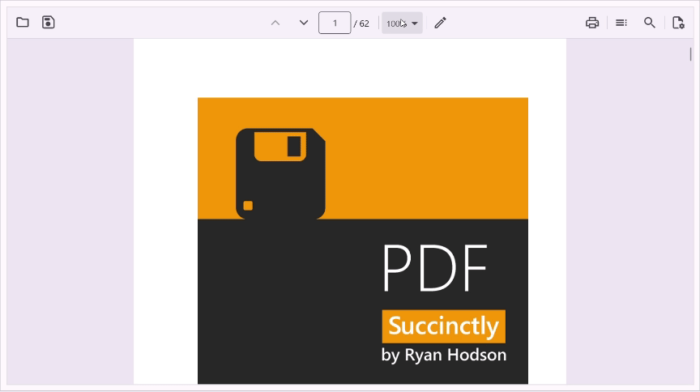

# Magnification .NET MAUI PDF Viewer (SfPdfViewer)

The content of a PDF document can be efficiently zoomed in and out by pinching or changing the zoom factor programmatically. This section walks through the magnification functionalities supported in the [SfPdfViewer](https://help.syncfusion.com/cr/maui/Syncfusion.Maui.PdfViewer.SfPdfViewer.html).

## Change the zoom factor

You can change or control the zoom in the PDF Viewer using the [ZoomFactor](https://help.syncfusion.com/cr/maui/Syncfusion.Maui.PdfViewer.SfPdfViewer.html#Syncfusion_Maui_PdfViewer_SfPdfViewer_ZoomFactor) property. Refer to the following code example.



<syncfusion:SfPdfViewer x:Name="PdfViewer" DocumentSource="{Binding PdfDocumentStream}" ZoomFactor ="3" />



PdfViewer.ZoomFactor = 3;



You can also obtain the current zoom factor at which the document is displayed in the PDF Viewer using the `ZoomFactor` property.

## Change the minimum and maximum zoom factor

By default, the zoom factor can be adjusted or set between 1 and 4 to magnify the document displayed in the PDF Viewer. But it can also be restricted to a certain level by adjusting the [minimum](https://help.syncfusion.com/cr/maui/Syncfusion.Maui.PdfViewer.SfPdfViewer.html#Syncfusion_Maui_PdfViewer_SfPdfViewer_MinZoomFactor) and [maximum](https://help.syncfusion.com/cr/maui/Syncfusion.Maui.PdfViewer.SfPdfViewer.html#Syncfusion_Maui_PdfViewer_SfPdfViewer_MaxZoomFactor) zoom factors.

The following code example explains restricting the zoom factor between 0.5 and 2.



<syncfusion:SfPdfViewer x:Name="PdfViewer" DocumentSource="{Binding PdfDocumentStream}"  MinZoomFactor = “0.5” MaxZoomFactor ="2" />



PdfViewer.MinZoomFactor = 0.5;
PdfViewer.MaxZoomFactor = 2;



N>If the `ZoomFactor` value is set beyond the [MinZoomFactor](https://help.syncfusion.com/cr/maui/Syncfusion.Maui.PdfViewer.SfPdfViewer.html#Syncfusion_Maui_PdfViewer_SfPdfViewer_MinZoomFactor) and [MaxZoomFactor](https://help.syncfusion.com/cr/maui/Syncfusion.Maui.PdfViewer.SfPdfViewer.html#Syncfusion_Maui_PdfViewer_SfPdfViewer_MaxZoomFactor) limits, then it will not be effective.

The example project with the zoom or magnification functionalities can be downloaded [here](https://github.com/SyncfusionExamples/maui-pdf-viewer-examples).

## Zoom modes 

The .NET MAUI PDF Viewer supports the below zoom modes: 
1. Fit to Page
2. Fit to Width

Fit-to-page ensures that users can see the entire page content to get a quick overview without having to scroll. Fit-to-width is helpful when reading documents with narrow columns, such as newspaper articles or other multicolumn layouts.
You can change the zoom mode using the `SfPdfViewer.ZoomMode` property of the PDF Viewer, default value for `SfPdfViewer.ZoomMode` is `ZoomMode.Default`.

### Change zoom mode from the toolbar

#### Using the magnification drop-down tool on the desktop 

On the desktop built-in toolbar, a magnifying tool is available that shows the current zoom percentage of the document. Using the tool, you can choose a zoom percentage from a predefined set of values. Additionally, you can choose the fit-to-width or fit-to-page option.

#### Using the zoom mode tool on the mobile

On the mobile built-in toolbar, by default, the magnifying tool is not visible. When the document `ZoomFactor` is changed, it becomes visible. Using the tool, you can choose the `Fit to Width` or `Fit to Page` option. When an option is selected, the icon will no longer be visible until the zoom percentage changes again. 

### Setting zoom mode programmatically 

#### Change to fit-to-page

You can change the `SfPdfViewer.ZoomMode` using the `ZoomMode.FitToPage` enumeration. It will magnify the PDF document so that the entire PDF page is visible in the view port. 
Refer to the following code example: 



<Syncfusion:PdfViewer x:Name="pdfViewer" ZoomMode="FitToPage"/> 



// To apply fit-to-page zoom mode. 
pdfViewer.ZoomMode = ZoomMode.FitToPage; 



#### Change to fit-to-width 

You can change the `SfPdfViewer.ZoomMode` using the `ZoomMode.FitToWidth` enumeration. It will magnify the PDF document so that the widest page of the PDF document fits the width of the view port. 
Refer to the following code example:



<Syncfusion:PdfViewer x:Name="pdfViewer" ZoomMode="FitToWidth"/> 



// To apply fit-to-page zoom mode. 
pdfViewer.ZoomMode = ZoomMode.FitToWidth; 



N> When the zoom factor of a PDF is changed, the zoom mode automatically changes to the default setting. After this change, you can manually adjust the zoom mode to either "Fit to Page" or "Fit to Width" as needed. 
