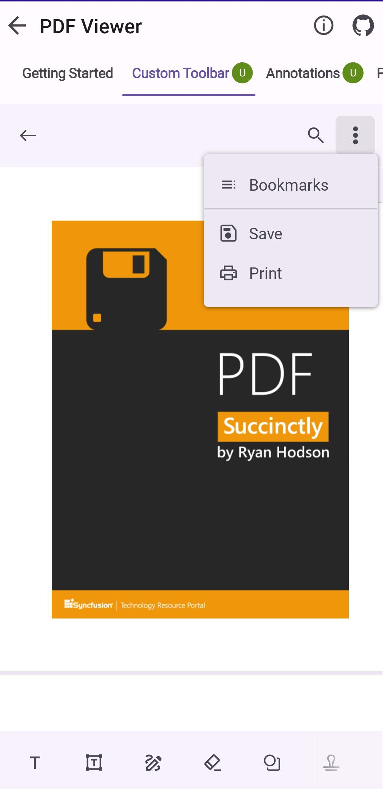

# Printing PDF Files in .NET MAUI PDF Viewer (SfPdfViewer)

The print feature of [SfPdfViewer](https://help.syncfusion.com/cr/maui/Syncfusion.Maui.PdfViewer.SfPdfViewer.html) allows you to effortlessly print PDF documents directly from your application code.

Moreover, when performing a print operation, the default device print dialog opens, providing users with familiar options and settings to customize their printing experience.

To print a PDF programmatically, you can use the `PrintDocument` method provided by [SfPdfViewer](https://help.syncfusion.com/cr/maui/Syncfusion.Maui.PdfViewer.SfPdfViewer.html).Refer to the following code example.



// Prints the PDF document.
PdfViewer.PrintDocument();



Also, [SfPdfViewer](https://help.syncfusion.com/cr/maui/Syncfusion.Maui.PdfViewer.SfPdfViewer.html) provides another way to print through command binding using the `PrintDocumentCommand`. This makes printing easier, especially when used with buttons.



<!-- Prints the PDF document. -->
<Button Text="Print" Command="{Binding Source={x:Reference PdfViewer},Path=PrintDocumentCommand}"/>
 


The following image represents the print preview dialogue.

## Limitations

Currently, when printing a document that contains sticky note annotations, the sticky note icon always appears as the default [comment](https://help.syncfusion.com/cr/maui/Syncfusion.Maui.PdfViewer.StickyNoteIcon.html#Syncfusion_Maui_PdfViewer_StickyNoteIcon_Comment) icon appearance in the printed document.