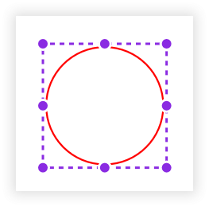
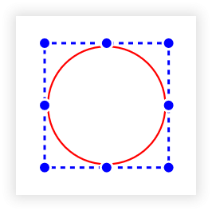

# Select and Deselect Annotations in .NET MAUI PDF Viewer (SfPdfViewer)

This section will go through the various functions available in the [SfPdfViewer](https://help.syncfusion.com/cr/maui/Syncfusion.Maui.PdfViewer.SfPdfViewer.html) for selecting and deselecting annotations in a PDF document.

## Select an annotation

You can select an annotation by simply tapping on the annotation using touch or a mouse. When the annotation is selected, the selection border (selector) appears, indicating that the annotation is selected. It also lets you move or resize the annotation if the actions are supported by the annotation type. The following image represents that the circle annotation is selected.

### Select an annotation programmatically

You can select an annotation programmatically by providing the annotation instance as the parameter to the [SelectAnnotation](https://help.syncfusion.com/cr/maui/Syncfusion.Maui.PdfViewer.SfPdfViewer.html#Syncfusion_Maui_PdfViewer_SfPdfViewer_SelectAnnotation_Syncfusion_Maui_PdfViewer_Annotation_) method. The annotation instance can be found in the Annotations property of the [SfPdfViewer](https://help.syncfusion.com/cr/maui/Syncfusion.Maui.PdfViewer.SfPdfViewer.html). The following example explains how to select the first annotation in the annotation collection.



void SelectAnnotation()
{
    // Obtain the annotation collection using [SfPdfViewer](https://help.syncfusion.com/cr/maui/Syncfusion.Maui.PdfViewer.SfPdfViewer.html) instance.
    ReadOnlyObservableCollection<Annotation> annotations = PdfViewer.Annotations;
    
    // Select the first annotation in the collection using the `SelectAnnotation` method of the `SfPdfViewer` instance.
    PdfViewer.SelectAnnotation(annotations[0]);
}



### Customizing selector appearance

The [AnnotationSettings](https://help.syncfusion.com/cr/maui/Syncfusion.Maui.PdfViewer.SfPdfViewer.html#Syncfusion_Maui_PdfViewer_SfPdfViewer_AnnotationSettings) property of SfPdfViewer allows you to customize the default selector color. The following example explains how to customize the selector color for locked and unlocked annotations.



void CustomizeSelectorAppearance()
{
    // Customize the selector color for unlocked annotations using the [AnnotationSettings](https://help.syncfusion.com/cr/maui/Syncfusion.Maui.PdfViewer.SfPdfViewer.html#Syncfusion_Maui_PdfViewer_SfPdfViewer_AnnotationSettings) property of [SfPdfViewer](https://help.syncfusion.com/cr/maui/Syncfusion.Maui.PdfViewer.SfPdfViewer.html) instance.
    PdfViewer.AnnotationSettings.Selector.Color = Colors.Blue;

    // Customize the selector color for locked annotations using the `AnnotationSettings` property of `SfPdfViewer` instance..
    PdfViewer.AnnotationSettings.Selector.LockedColor = Colors.LightGray;
}	



The following images represent the customized selector color of an unlocked and locked circle annotation. 

### AnnotationSelected event

The [AnnotationSelected](https://help.syncfusion.com/cr/maui/Syncfusion.Maui.PdfViewer.SfPdfViewer.html#Syncfusion_Maui_PdfViewer_SfPdfViewer_AnnotationSelected) event occurs when an annotation is selected interactively or programmatically. The selected annotation instance will be provided through the [Annotation](https://help.syncfusion.com/cr/maui/Syncfusion.Maui.PdfViewer.AnnotationEventArgs.html#Syncfusion_Maui_PdfViewer_AnnotationEventArgs_Annotation) property of the event arguments. The following example explains how to wire the event to obtain and modify the selected annotation properties.



void WireAnnotationSelectedEvent()
{
    // Wire the annotation selected event of [SfPdfViewer](https://help.syncfusion.com/cr/maui/Syncfusion.Maui.PdfViewer.SfPdfViewer.html).
    PdfViewer.AnnotationSelected += OnAnnotationSelected;
}

private void OnAnnotationSelected(object sender, AnnotationEventArgs e)
{
    // Obtain the selected annotation.
    Annotation selectedAnnotation = e.Annotation;
    // Modify the selected annotation properties.
    selectedAnnotation.Color = Colors.Blue;
    selectedAnnotation.Opacity = 0.5f; // 50% Opacity
}



### Remove the selected annotation

You can remove the selected annotation programmatically by providing the selected annotation instance as the parameter to the [RemoveAnnotation](https://help.syncfusion.com/cr/maui/Syncfusion.Maui.PdfViewer.SfPdfViewer.html#Syncfusion_Maui_PdfViewer_SfPdfViewer_RemoveAnnotation_Syncfusion_Maui_PdfViewer_Annotation_) method. The selected annotation instance may be obtained from the [AnnotationSelected](https://help.syncfusion.com/cr/maui/Syncfusion.Maui.PdfViewer.SfPdfViewer.html#Syncfusion_Maui_PdfViewer_SfPdfViewer_AnnotationSelected) event. The following example shows how to remove the selected annotation.



/// 

/// Remove the selected annotation.
/// 

/// <param name="selectedAnnotation">The selected annotation instance that may be obtained from the annotation selected event</param>
void RemoveSelectedAnnotation(Annotation selectedAnnotation)
{
    // Remove the annotation using the RemoveAnnotation method of the SfPdfViewer instance.
    PdfViewer.RemoveAnnotation(selectedAnnotation);
}



* In desktop platforms like macOS and Windows, you can also use the keyboard shortcut `Delete` to remove the selected annotation from the PDF document directly.

### Edit the selected annotation

You can edit the properties of the selected annotation programmatically by accessing the selected annotation instance. The selected annotation instance may be obtained from the [AnnotationSelected](https://help.syncfusion.com/cr/maui/Syncfusion.Maui.PdfViewer.SfPdfViewer.html#Syncfusion_Maui_PdfViewer_SfPdfViewer_AnnotationSelected) event. The following example shows how to edit the selected annotation, assuming that the annotation is a circle type.



/// 

/// Edits the selected annotation.
/// 

/// <param name="selectedAnnotation">The selected annotation instance may be obtained from the annotation selected event</param>
void EditSelectedAnnotation(Annotation selectedAnnotation)
{
    // Edit the annotation properties.
    selectedAnnotation.Color = Colors.Green; //Stroke color.
    selectedAnnotation.Opacity = 0.75f; // 75% Opacity

    // Type cast to edit the properties of the specific annotation type. Here, the first annotation is a circle annotation.
    if (selectedAnnotation is CircleAnnotation circleAnnotation)
    {
        circleAnnotation.FillColor = Colors.Red; //Inner fill color.
        circleAnnotation.BorderWidth = 2; //Stroke thickness.
        circleAnnotation.Bounds = new RectF(0, 0, 100, 100); // Bounds in PDF coordinates.
    }
}



## Deselect an annotation

You can deselect an annotation by simply tapping outside of its bounds using touch or a mouse. When the annotation is deselected, the selection border (selector) disappears, indicating that the annotation is deselected.

* In desktop platforms like macOS and Windows, you can also use the keyboard shortcut `Esc` to deselect an annotation.

### Deselect an annotation programmatically 

You can deselect the annotation programmatically by providing the selected annotation instance as the parameter to the [DeselectAnnotation](https://help.syncfusion.com/cr/maui/Syncfusion.Maui.PdfViewer.SfPdfViewer.html#Syncfusion_Maui_PdfViewer_SfPdfViewer_DeselectAnnotation_Syncfusion_Maui_PdfViewer_Annotation_) method. The selected annotation instance may be obtained from the [AnnotationSelected](https://help.syncfusion.com/cr/maui/Syncfusion.Maui.PdfViewer.SfPdfViewer.html#Syncfusion_Maui_PdfViewer_SfPdfViewer_AnnotationSelected) event. The following example shows how to deselect the selected annotation. 



/// 

/// Deselect the selected annotation.
/// 

/// <param name="selectedAnnotation">The selected annotation instance that may be obtained from the annotation selected event</param>
void DeselectAnnotation(Annotation selectedAnnotation)
{
    // Deselect the annotation using the DeSelectAnnotation method of the [SfPdfViewer](https://help.syncfusion.com/cr/maui/Syncfusion.Maui.PdfViewer.SfPdfViewer.html) control.
    PdfViewer.DeselectAnnotation(selectedAnnotation);
}



### AnnotationDeselected event

The [AnnotationDeselected](https://help.syncfusion.com/cr/maui/Syncfusion.Maui.PdfViewer.SfPdfViewer.html#Syncfusion_Maui_PdfViewer_SfPdfViewer_AnnotationDeselected) event occurs when an annotation is selected interactively or programmatically. The following example explains how to wire the event to obtain the deselected annotation.



void WireAnnotationDeselectedEvent()
{
    // Wire the annotation deselected event of the [SfPdfViewer](https://help.syncfusion.com/cr/maui/Syncfusion.Maui.PdfViewer.SfPdfViewer.html) control.
    PdfViewer.AnnotationDeselected += OnAnnotationDeselected;
}

private void OnAnnotationDeselected(object sender, AnnotationEventArgs e)
{
    // Obtain the deselected annotation if required.
    Annotation deselectedAnnotation = e.Annotation;
              
    // You can handle your logics here…
}

