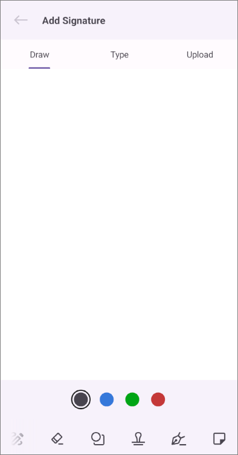
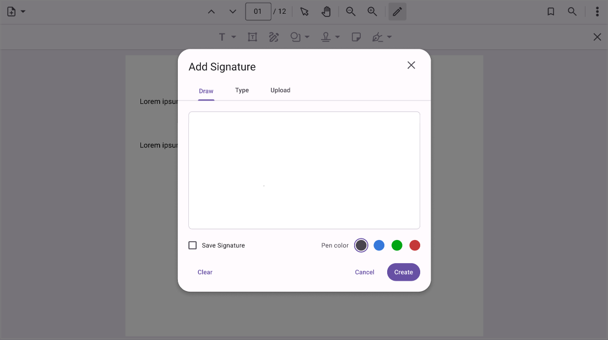

# Electronic Signature in .NET MAUI PDF Viewer (SfPdfViewer)

The electronic signature feature of [SfPdfViewer](https://help.syncfusion.com/cr/maui/Syncfusion.Maui.PdfViewer.SfPdfViewer.html) allows you to add, remove signatures in the PDF document. This section will go through the various types and functions available in PDF Viewer for working with signature.

## Types of electronic signature

The following signature types are now available in the PDF Viewer.

1.	Handwritten signature.
2.	Text signature.
3.  Image signature.

## Add signature by UI interaction

This section will go through how to add a signature by UI interaction to a PDF document.

You can add a signature to a PDF document with UI interaction using the signature dialog. The following steps explain how to add signature on a PDF.

1. Set the AnnotationMode property of the SfPdfViewer to [Signature](https://help.syncfusion.com/cr/maui/Syncfusion.Maui.PdfViewer.AnnotationMode.html#Syncfusion_Maui_PdfViewer_AnnotationMode_Signature). It activates the signature mode on the control and signature dialog box will be open.
2. Create a signature in any one of the types.
3. You can customize the color of the signature for handwritten and text signature types.
4. Tap on the page to add the created signatures.
5. After creating the signature or closing the dialog, the signature mode will be disabled, and the AnnotationMode will be changed to None.
6. You can later move, resize, or delete the signature.

The following code explains how to enable the [Signature](https://help.syncfusion.com/cr/maui/Syncfusion.Maui.PdfViewer.AnnotationMode.html#Syncfusion_Maui_PdfViewer_AnnotationMode_Signature) annotation mode.



// Enable or activate the signature mode.
void EnableSignatureMode()
{
    // Set the annotation mode to signature using the [SfPdfViewer](https://help.syncfusion.com/cr/maui/Syncfusion.Maui.PdfViewer.SfPdfViewer.html) instance.
    PdfViewer.AnnotationMode = AnnotationMode.Signature;
}



Similarly, refer to the following code to disable the signature mode.



// Disable or deactivate the ink drawing mode.
void DisableSignatureMode()
{
    // Set the annotation mode to none using the [SfPdfViewer](https://help.syncfusion.com/cr/maui/Syncfusion.Maui.PdfViewer.SfPdfViewer.html) instance.
    PdfViewer.AnnotationMode = AnnotationMode.None;
}



## Add a signature programmatically

This section will go through how to add a signature programmatically to a PDF document.

### Add a handwritten signature 

To add a handwritten signature, you can create and add an ink annotation to a PDF document programmatically using the AddAnnotation method of the SfPdfViewer. Additionally, in the case of a signature, you should set the [IsSignature](https://help.syncfusion.com/cr/maui/Syncfusion.Maui.PdfViewer.InkAnnotation.html#Syncfusion_Maui_PdfViewer_InkAnnotation_IsSignature) API of the ink annotation to true. The following example explains how to create an ink annotation and add it as a signature to the first page of a PDF document.



int pageNumber = 1;
    
// Provide the points collection to draw a stroke. Here, a single stroke is created.
List<List<float>> pointsCollection = new List<List<float>>()
{
   new List<float> { 40, 300, 60, 100, 40, 50, 40, 300 }
};

// Create an ink annotation.
InkAnnotation annotation = new InkAnnotation(pointsCollection, pageNumber);

// Set [IsSignature](https://help.syncfusion.com/cr/maui/Syncfusion.Maui.PdfViewer.InkAnnotation.html#Syncfusion_Maui_PdfViewer_InkAnnotation_IsSignature) as true
annotation.IsSignature = true;

// Add the ink annotation to the PDF page as a signature
PdfViewer.AddAnnotation(annotation);



### Add image signature

To add an image signature, you can create and add a custom stamp annotation to a PDF document programmatically using the AddAnnotation method of the SfPdfViewer. Additionally, in the case of a signature, you should set the [IsSignature](https://help.syncfusion.com/cr/maui/Syncfusion.Maui.PdfViewer.InkAnnotation.html#Syncfusion_Maui_PdfViewer_InkAnnotation_IsSignature) API of the stamp annotation to true. The following example explains how to create a custom stamp annotation and add it as a signature to the first page of a PDF document



int pageNumber = 1;

// Define the position and size for the stamp to be placed in the PDF page.
RectF bounds = new RectF(50, 50, 200, 100);

// Create an image stream from the image to be used as a stamp.
Stream imageStream = this.GetType().Assembly.GetManifestResourceStream("Annotations.Assets." + "Logo.png");

// Create a custom stamp annotation using the image stream.
StampAnnotation customStamp = new StampAnnotation(imageStream,pageNumber,bounds);

// Set [IsSignature](https://help.syncfusion.com/cr/maui/Syncfusion.Maui.PdfViewer.InkAnnotation.html#Syncfusion_Maui_PdfViewer_InkAnnotation_IsSignature) as true
customStamp.IsSignature = true;

// Add the stamp annotation to the PDF page as a signature
PdfViewer.AddAnnotation(customStamp);



N> To add a text signature, you can use an image containing the signature text . You can then add it in the same manner as an image signature.

## Signature modal view

The signature modal view appears when a signature needs to be created. The [Sfpdfviewer](https://help.syncfusion.com/cr/maui/Syncfusion.Maui.PdfViewer.SfPdfViewer.html) notifies when the modal view is appearing and disappearing through events. The events help you in hiding and showing elements that are part of the app UI that are not necessary as long as the modal view is visible.

**Mobile:**

**Desktop:**

The `Sfpdfviewer.SignatureModalViewAppearing` event is triggered whenever the modal view opens. 




pdfviewer.SignatureModalViewAppearing += PdfViewer_SignatureModalViewAppearing;

private void PdfViewer_SignatureModalViewAppearing(object? Sender, FormFieldModalViewAppearingEventArgs e)
{
    // Implement the logic to hide unwanted UI elements such as toolbar items add in the app UI. 
}




The `Sfpdfviewer.SignatureModalViewDisappearing` event is triggered when the modal view is closing.




pdfviewer.SignatureModalViewDisappearing += PdfViewer_SignatureModalViewDisappearing;

Private void PdfViewer_SignatureModalViewDisappearing(object? Sender, EventArgs e)
{
    // Implement the logic to show the UI elements that were hidden from the SignatureModalViewAppearing event handler.
}

 


### Supressing the signature modal view and implement your own UI

The [Sfpdfviewer](https://help.syncfusion.com/cr/maui/Syncfusion.Maui.PdfViewer.SfPdfViewer.html) allows you to supress the signature modal view and use your own UI in its place. This can be achieved by setting the `FormFieldModalViewAppearingEventArgs.Cancel` property to `true` in the `SignatureModalViewAppearing` event handler. 

The below code snippet illustrates supressing the signature modal view and using a UI implemented in the app in its place. In this illustration, it is assumed that the signature is produced in the form of an image stream when the user completes drawing the signature in the custom dialog. When the PDF viewer is tapped, the created signature is added as a stamp annotation.  




Stream signatureImageStream;
pdfviewer.SignatureModalViewAppearing += PdfViewer_SignatureModalViewAppearing;
pdfViewer.Tapped += PdfViewer_Tapped;

private void PdfViewer_SignatureModalViewAppearing(object? Sender, FormFieldModalViewAppearingEventArgs e)
{
    e.Cancel = true;
    // Implement your own UI for creating a signature.
    ShowCustomDialog();
}

Private void customDialogOkButton_Clicked(object sender, EventArgs e)
{
   //Get the signature in the form of a Stream instance (possibly converted from an image of the user's free hand drawing) 
   signatureImageStream = GetSignatureImageStream();
}

private void PdfViewer_Tapped(object sender, GestureEventArgs e)
{
    PointF position = e.PagePosition;
    int pageNumber = e.PageNumber;
    StampAnnotation stamp = new StampAnnotation(stampImageStream, pageNumber,  new RectF(position.X, position.Y, 200, 200));
    pdfViewer.AddAnnotation(stamp);
}

 


