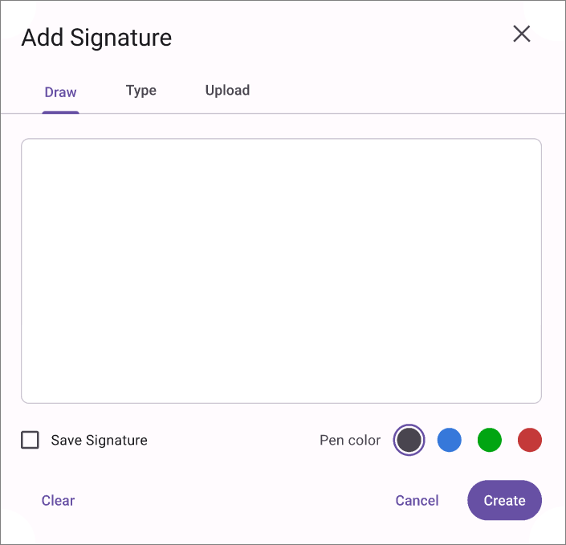

# Electronic Signature in .NET MAUI PDF Viewer (SfPdfViewer)

The electronic signature feature of [SfPdfViewer](https://help.syncfusion.com/cr/maui/Syncfusion.Maui.PdfViewer.SfPdfViewer.html) allows you to add, remove signature in the PDF document. This section will go through the various types and functions available in PDF Viewer for working with signature.

## Types of electronic signature

The following signature types are now available in the PDF Viewer.

1.	Handwritten signature.
2.	Text signature.
3.  Image signature.

## Add signature by UI interaction

This section will go through how to add signature by UI interaction to a PDF document.

You can add signature to a PDF document with UI interaction using signature dialog. The following steps explains how to add signature on a PDF.

1. Set the AnnotationMode property of the SfPdfViewer to `Signature`. It activates the signature mode on the control and signature dialog box will be open.
2. create a signature in any one of the types
3. You can customize the color of the signature for handwritten and text signature types
4. Tap on the page to add the created signatures.
5. After creating the signature or closing the dialog, the signature mode will be disabled, and the AnnotationMode will be changed to None.
6. You can later move, resize, or delete the signature.

The following code explains how to enable the `Signature` annotation mode.



// Enable or activate the signature mode.
void EnableSignatureMode()
{
    // Set the annotation mode to signature using the `SfPdfViewer` instance.
    PdfViewer.AnnotationMode = AnnotationMode.Signature;
}



Similarly, refer to following code to disable the signature mode.



// Disable or deactivate the ink drawing mode.
void DisableSignatureMode()
{
    // Set the annotation mode to none using the `SfPdfViewer` instance.
    PdfViewer.AnnotationMode = AnnotationMode.None;
}



## Add signature programmatically

This section will go through how to add signature programmatically to a PDF document.

### Add handwritten signature 

To add a handwritten signature, You can create and add an ink annotation to a PDF document programmatically using the AddAnnotation method of the SfPdfViewer. Additionally in the case of signature you should set the `IsSignature` API of the ink annotation true. The following example explains how to create an ink annotation and add it as a signature to the first page of a PDF document.



int pageNumber = 1;
    
// Provide the points collection to draw a stroke. Here a single stroke is created.
List<List<float>> pointsCollection = new List<List<float>>()
{
   new List<float> { 40, 300, 60, 100, 40, 50, 40, 300 }
};

// Create an ink annotation.
InkAnnotation annotation = new InkAnnotation(pointsCollection, pageNumber);

// Set `IsSignature` as true
annotation.IsSignature = true;

// Add the ink annotation to the PDF page as signature
PdfViewer.AddAnnotation(annotation);



### Add image signature

To add an image signature You can create and add a custom stamp annotation to a PDF document programmatically using the AddAnnotation method of the SfPdfViewer. Additionally in the case of signature you should set the `IsSignature` API of the stamp annotation true. The following example explains how to create a custom stamp annotation and add it as a signature to the first page of a PDF document



int pageNumber = 1;

// Define the position and size for the stamp to be placed in the PDF page.
RectF bounds = new RectF(50, 50, 200, 100);

// Create image stream from the image to be used as stamp.
Stream imageStream = this.GetType().Assembly.GetManifestResourceStream("Annotations.Assets." + "Logo.png");

// Create a custom stamp annotation using the image steeam.
StampAnnotation customStamp = new StampAnnotation(imageStream,pageNumber,bounds);

// Set `IsSignature` as true
customStamp.IsSignature = true;

// Add the stamp annotation to the PDF page as signature
PdfViewer.AddAnnotation(customStamp);



N> To add a text signature, you can use an image containing the signature text . You can then add it in the same manner as an image signature.

#### Signature pad modal view 

The `Sfpdfviewer.SignatureModalViewAppearing` event is triggered whenever the modal view opens for signature pad. You can cancel the opening of the modal view for the current signature pad being edited by setting `e.Cancel = true`, allowing you to display your own custom dialog.




FormField formField;
CustomIcon customIcon;
……..
pdfviewer.SignatureModalViewAppearing += PdfViewer_SignatureModalViewAppearing;
……..

private void PdfViewer_SignatureModalViewAppearing(object? sender, FormFieldModalViewAppearingEventArgs e)
 {
     e.Cancel = true;
     formField = e.FormField;
    // Implement your own UI for signature pad annotation and show it.
    ShowCustomDialog();
    customIcon.IsVisible = false;
 }

Private void customDialogOkButton_Clicked(object sender, EventArgs e)
{
   if(formField is SignatureFormField signatureField)
  {
     List<List<float>> inkPointsCollection  = customDialog.InkPointsCollection;
     InkAnnotation inkSignature = new InkAnnotation(inkPointsCollection, signature.PageNumber);

     inkSignature.Color = Colors.Red;
      // Add the created handwritten signature to the signature form field.
     signatureField.Signature = inkSignature;
  }  
}

 


The `Sfpdfviewer.SignatureModalViewDisappearing` event is triggered whenever the modal view for signature pad is closing.




pdfviewer.SignatureModalViewDisappearing += PdfViewer_SignatureModalViewDisappearing;
…..
private void PdfViewer_SignatureModalViewDisappearing(object? sender, EventArgs e)
 {
      // Show your icons / custom dialog while disappearing the modal view at application level. 
      customIcon.IsVisible = true;     
 }

 


