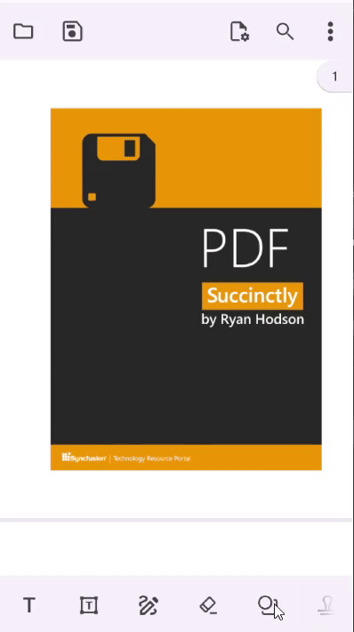
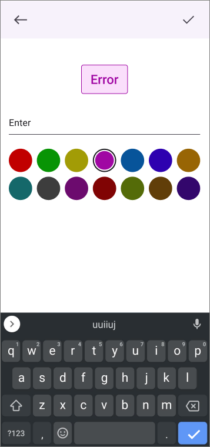
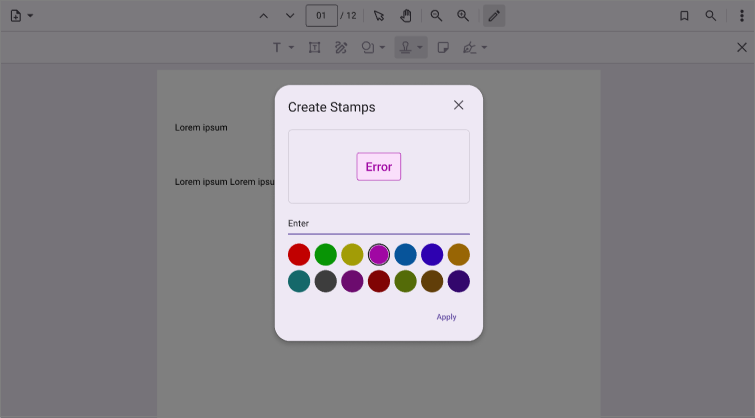

# Stamp Annotations in .NET MAUI PDF Viewer (SfPdfViewer)

The stamp annotations feature of [SfPdfViewer](https://help.syncfusion.com/cr/maui/Syncfusion.Maui.PdfViewer.SfPdfViewer.html) allows you to add, remove and modify stamps or custom images in the PDF document. This section will go through the various types and functions available in PDF Viewer for working with stamp annotations.

## Types of stamps

The following stamp annotation types are now available in the PDF Viewer.

1.	Standard (or built-in) stamps.
2.	Custom (or image) stamps.

## Add stamps to a PDF document

This section will go through how to add stamp annotations to a PDF page using toolbar as well as programmatically.

### Add standard stamps using the toolbar

On the built-in toolbar, a tool for standard stamps is available that contains 18 standard stamps, which are most commonly used in documents. Using that, you can choose your standard stamp and add it to the tapped position.

The following example explains how to choose a standard stamp and add it to the first page of a PDF document using the built-in toolbar on the mobile.

### Add custom stamps using the toolbar

On the built-in toolbar, you can create your own custom stamp using the built-in dialog box and add it to a PDF document.

The following example explains how to create a custom stamp using the built-in dialog box and add it to a PDF document on the desktop.

The following example explains how to create a custom stamp using the built-in dialog box and add it to a PDF document on the mobile.

### Add standard stamps without using the toolbar

There are 18 standard stamp types available in the [SfPdfViewer](https://help.syncfusion.com/cr/maui/Syncfusion.Maui.PdfViewer.SfPdfViewer.html) that are most commonly used in documents. The appropriate standard stamp type can be selected from the [StampType](https://help.syncfusion.com/cr/maui/Syncfusion.Maui.PdfViewer.StampType.html) enumeration. 

The following example explains how to create an [Approved](https://help.syncfusion.com/cr/maui/Syncfusion.Maui.PdfViewer.StampType.html#Syncfusion_Maui_PdfViewer_StampType_Approved) standard stamp and add it to the first page of a PDF document using the [AddAnnotation](https://help.syncfusion.com/cr/maui/Syncfusion.Maui.PdfViewer.SfPdfViewer.html#Syncfusion_Maui_PdfViewer_SfPdfViewer_AddAnnotation_Syncfusion_Maui_PdfViewer_Annotation_) method of the [SfPdfViewer](https://help.syncfusion.com/cr/maui/Syncfusion.Maui.PdfViewer.SfPdfViewer.html).



StampAnnotation CreateApprovedStandardStamp()
{
    int pageNumber = 1;

    // Define the position to place the stamp.
    PointF position = new PointF(100, 100);

    // Create an approved standard stamp.
    StampAnnotation approvedStamp = new StampAnnotation(StampType.Approved, pageNumber, position);
    
    //return the stamp
    return approvedStamp;
}

void AddStampAnnotation()
{
    StampAnnotation stampAnnotation = CreateApprovedStandardStamp();

    // Add the stamp to the PDF document using the `SfPdfViewer` instance.
    PdfViewer.AddAnnotation(stampAnnotation);
}



The following image represents the approved standard stamp appearance in the PDF document.

### Add custom stamps without using toolbar

You can create a custom stamp from any image and add it to a PDF document. The following example explains how to create a custom stamp from an image in the application and add it to a PDF document using the [AddAnnotation](https://help.syncfusion.com/cr/maui/Syncfusion.Maui.PdfViewer.SfPdfViewer.html#Syncfusion_Maui_PdfViewer_SfPdfViewer_AddAnnotation_Syncfusion_Maui_PdfViewer_Annotation_) method of the [SfPdfViewer](https://help.syncfusion.com/cr/maui/Syncfusion.Maui.PdfViewer.SfPdfViewer.html).



StampAnnotation CreateCustomStamp()
{
    int pageNumber = 1;

    // Define the position and size for the stamp to be placed on the PDF page.
    RectF bounds = new RectF(50, 50, 200, 100);

    // Create an image stream from the image to be used as a stamp.
    Stream imageStream = this.GetType().Assembly.GetManifestResourceStream("Annotations.Assets." + "Logo.png");

    // Create a custom stamp annotation using the image stream.
    StampAnnotation customStamp = new StampAnnotation(imageStream,pageNumber,bounds);

    // Return the stamp annotation.
    return customStamp;
}

void AddCustomStampAnnotation()
{
    StampAnnotation stampAnnotation = CreateCustomStamp();

    // Add the stamp to the PDF document using the `SfPdfViewer` instance.
    PdfViewer.AddAnnotation(stampAnnotation);
}



### Add a view as custom stamps programmatically

You can create a custom stamp from any view, such as Button, Entry, Label, Image, or any other view, and add it to a PDF document. The following example explains how to create a custom stamp from a button view in the application and add it to a PDF document using the [AddAnnotation](https://help.syncfusion.com/cr/maui/Syncfusion.Maui.PdfViewer.SfPdfViewer.html#Syncfusion_Maui_PdfViewer_SfPdfViewer_AddAnnotation_Syncfusion_Maui_PdfViewer_Annotation_) method of the [SfPdfViewer](https://help.syncfusion.com/cr/maui/Syncfusion.Maui.PdfViewer.SfPdfViewer.html).



StampAnnotation CreateCustomStamp()
{
    int pageNumber = 1;

    // Define the bounds for the stamp to be placed in the PDF page.
    RectF bounds = new RectF(100, 100, 200, 100);

    // Create a button to be used as the visual content of the stamp.
    var button = new Button
   {
    Text = "Click Me",
    BackgroundColor = Colors.Blue,
   };

    // Create a custom stamp annotation using the button view.
    StampAnnotation customStamp = new StampAnnotation(button,pageNumber,bounds);

    // Return the stamp annotation.
    return customStamp;
}

void AddCustomStampAnnotation()
{
    StampAnnotation stampAnnotation = CreateCustomStamp();

    // Add the stamp to the PDF document using `SfPdfViewer` instance.
    PdfViewer.AddAnnotation(stampAnnotation);
}



N> * The view will be converted as an image in the saved PDF document. The view becomes read only once saved, and its contents cannot be edited after saving the document.  
N> * Interactions within the view such as button clicks or text entry will not function inside the PDF Viewer.

## Edit the selected stamp

You can edit the properties of the selected stamp annotation programmatically by accessing the selected annotation instance. The selected annotation instance may be obtained from the [AnnotationSelected](https://help.syncfusion.com/cr/maui/Syncfusion.Maui.PdfViewer.SfPdfViewer.html#Syncfusion_Maui_PdfViewer_SfPdfViewer_AnnotationSelected) event. 

The following example shows how to edit some of the properties of the selected stamp annotation. Similarly, you can modify the other properties if required.



/// 

/// Edit the selected stamp annotation.
/// 

/// <param name="selectedAnnotation">The selected annotation instance that may be obtained from the annotation selected event</param>
void EditSelectedStampAnnotation(Annotation selectedAnnotation)
{
    // Typecast the selected annotation as stamp annotation.
    if (selectedAnnotation is StampAnnotation stampAnnotation)
    {
        // Change the opacity to 75%.
        stampAnnotation.Opacity = 0.75f;
    }
}



N> Changing the color of a stamp annotation after it has been added to a PDF is not supported, due to the predefined nature of standard stamps. These stamps use fixed colors to maintain consistency and convey distinct meanings. To work around this limitation, you can use the stamp with specific color, by creating [Custom stamp](Stamp Annotations in .NET MAUI PDF Viewer control | Syncfusion). Custom stamps allow users to design and apply stamps with user-defined colors and texts.

## Custom stamp modal view

The custom stamp modal view appears when the user wants to create a custom stamp from a typed text. The [SfPdfViewer](https://help.syncfusion.com/cr/maui/Syncfusion.Maui.PdfViewer.SfPdfViewer.html) notifies when the modal view is appearing and disappearing through events. The events help you in hiding and showing elements that are part of the app UI that are not necessary as long as the modal view is visible.

**Mobile:**

**Desktop:**

The `SfPdfViewer.CustomStampModalViewAppearing` event is triggered when the modal view opens for creating a custom stamp.




PdfViewer.CustomStampModalViewAppearing += PdfViewer_CustomStampModalViewAppearing;

private void PdfViewer_CustomStampModalViewAppearing(object? sender, AnnotationModalViewAppearingEventArgs e)
{
    // Implement the logic to hide unwanted UI elements such as toolbar items added to the app UI. 
}

 


The `SfPdfViewer.CustomStampModalViewDisappearing` event is triggered whenever the modal view for stamp annotation is closing.




pdfviewer.CustomStampModalViewDisappearing += PdfViewer_CustomStampModalViewDisappearing;

private void PdfViewer_CustomStampModalViewDisappearing(object? sender, EventArgs e)
{
    // Implement the logic to show the UI elements that were hidden from the CustomStampModalViewAppearing event handler.
}

 


### Suppressing the custom stamp modal view and implementing your own UI

The [SfPdfViewer](https://help.syncfusion.com/cr/maui/Syncfusion.Maui.PdfViewer.SfPdfViewer.html) allows you to suppress the custom stamp modal view and use your own UI in its place. This can be achieved by setting the `AnnotationModalViewAppearingEventArgs.Cancel` property to `true` in the `CustomStampModalViewAppearing` event handler. 

The below code snippet illustrates suppressing the custom stamp modal view and using a UI implemented in the app in its place. In this illustration, when the user types a text in your own dialog and clicks the ok button, the text is converted into an image stream and a StampAnnotation instance is created. When the PDF viewer is tapped, the stamp annotation is added in the tapped position. 




Stream stampImageStream;
pdfviewer.CustomStampModalViewAppearing += PdfViewer_CustomStampModalViewAppearing;
pdfViewer.Tapped += PdfViewer_Tapped;

private void PdfViewer_CustomStampModalViewAppearing(object? Sender, AnnotationModalViewAppearingEventArgs e)
{
    e.Cancel = true;
    // Implement your own UI for the sticky note editor and show it.
    ShowCustomDialog();
}

Private void customDialogOkButton_Clicked(object sender, EventArgs e)
{
   //Get the typed text from the custom dialog 
   string newText = customDialog.Text;

   // Implement the logic to create an image stream instance from the typed text. 
   stampImageStream = GetStampAnnotationFromText();
}

private void PdfViewer_Tapped(object sender, GestureEventArgs e)
{
    PointF position = e.PagePosition;
    int pageNumber = e.PageNumber;
    StampAnnotation stamp = new StampAnnotation(stampImageStream, pageNumber,  new RectF(position.X, position.Y, 200, 200));
    pdfViewer.AddAnnotation(stamp);
}

 

