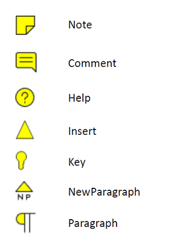
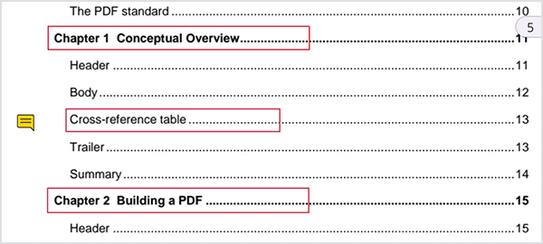

# Sticky Note Annotation in .NET MAUI PDF Viewer (SfPdfViewer)

The sticky note annotation feature of [SfPdfViewer](https://help.syncfusion.com/cr/maui/Syncfusion.Maui.PdfViewer.SfPdfViewer.html) allows you to add, remove, and modify sticky notes in a PDF document. This feature will help add comments or notes to specific parts of a document to clarify complex concepts, terms, or ideas. This section will cover the various functions available in [SfPdfViewer](https://help.syncfusion.com/cr/maui/Syncfusion.Maui.PdfViewer.SfPdfViewer.html) for working with sticky note annotations.

## Types of sticky notes

The following sticky note icon types are currently available in [SfPdfViewer](https://help.syncfusion.com/cr/maui/Syncfusion.Maui.PdfViewer.SfPdfViewer.html). The icon types can be selected from the `StickyNoteIcon` enumeration.

## Add sticky notes

Currently, there is no support for a sticky note annotation mode in the [AnnotationMode](https://help.syncfusion.com/cr/maui/Syncfusion.Maui.PdfViewer.SfPdfViewer.html#Syncfusion_Maui_PdfViewer_SfPdfViewer_AnnotationMode) property.  However, the sticky notes can be added programmatically using the [AddAnnotation](https://help.syncfusion.com/cr/maui/Syncfusion.Maui.PdfViewer.SfPdfViewer.html#Syncfusion_Maui_PdfViewer_SfPdfViewer_AddAnnotation_Syncfusion_Maui_PdfViewer_Annotation_) method of the [SfPdfViewer](https://help.syncfusion.com/cr/maui/Syncfusion.Maui.PdfViewer.SfPdfViewer.html).

The following example explains how to create a sticky note with a comment icon and add it to the first page of a PDF document.



StickyNoteAnnotation CreateCommentStickyNote()
{
    int pageNumber = 1;
        
    // Set the position of the sticky note on the PDF page. 
    PointF position = new PointF(100, 100);

    // Set the icon as Comment.
    StickyNoteIcon icon = StickyNoteIcon.Comment;

    // Set the text for the sticky note.
    string text = "Links are not working and need to be updated";
        
    return new StickyNoteAnnotation(icon, text, pageNumber, position);
}

void AddStickyNote()
{
    StickyNoteAnnotation stickyNote = CreateCommentStickyNote();
    PdfViewer.AddAnnotation(stickyNote);
}




## Edit the selected sticky note annotation

### Edit the text using UI interaction

When you double-tap the selected sticky note, the text editor opens. Edit the text and click &#34;Save&#34; to modify the text.

### Edit sticky note properties programmatically

Edit the properties of the selected sticky note annotation programmatically by accessing the selected annotation instance. The selected annotation instance may be obtained from the [AnnotationSelected](https://help.syncfusion.com/cr/maui/Syncfusion.Maui.PdfViewer.SfPdfViewer.html#Syncfusion_Maui_PdfViewer_SfPdfViewer_AnnotationSelected) event. The following example shows how to edit the text and icon of the selected sticky note annotation. Similarly, you can modify the other properties.



/// 
 
/// Edit the selected sticky note annotation. 
/// 
 
/// <param name="selectedAnnotation">The selected annotation instance that may be obtained from the annotation selected event</param>    

void EditSelectedStickyNoteAnnotation(Annotation selectedAnnotation)
{
    if (selectedAnnotation is StickyNoteAnnotation selectedStickyNote)
    {
        selectedStickyNote.Icon = StickyNoteIcon.Note;
        selectedStickyNote.Text = "Changed the comment to note.";
    }
}



## Sticky note modal view

The `Sfpdfviewer.StickyNoteModalViewAppearing` event is triggered whenever the modal view opens for sticky note annotation. You can cancel the opening of the modal view for the current sticky note annotation being edited by setting `e.Cancel = true`, allowing you to display your own custom dialog.




Annotation editedAnnotation;
CustomIcon customIcon;
pdfviewer.StickyNoteModalViewAppearing += PdfViewer_StickyNoteModalViewAppearing;
……
private void PdfViewer_StickyNoteModalViewAppearing(object? Sender, AnnotationModalViewAppearingEventArgs e)
 {
    e.Cancel = true;
    editedAnnotation = e.Annotation;
    // Implement your own UI for sticky note editor and show it.
    ShowCustomDialog();
    customIcon.IsVisible = false;

}
….
Private void customDialogOkButton_Clicked(object sender, EventArgs e)
{
   //Get the typed text in the custom dialog 
   string newText = customDialog.Text; 
   if(editedAnnotation is StickyNoteAnnotation stickyNote)
   stickyNote.Text = newText;
}

 


The `Sfpdfviewer.StickyNoteModalViewDisappearing` event is triggered whenever the modal view for sticky note annotation is closing.




Pdfviewer.StickyNoteModalViewDisappearing += PdfViewer_StickyNoteModalViewDisappearing;
….
Private void PdfViewer_StickyNoteModalViewDisappearing(object? Sender, EventArgs e)
{
     // Show your own icons / custom dialog while disappearing the modal view at application level. 
      customIcon.IsVisible = true;
}

 


N> These notifications are only available on Android and iOS platforms. 