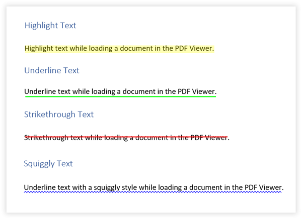
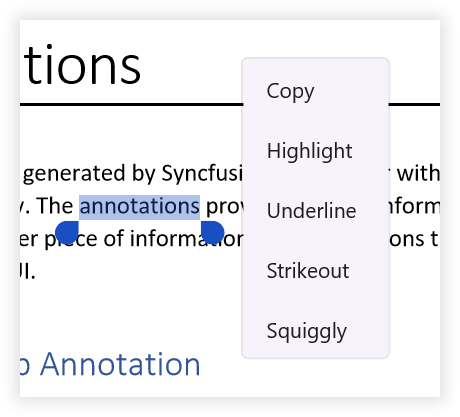

# Text Markup Annotations

The text markup annotations feature of `SfPdfViewer` allows you to add, remove and modify text markups in the PDF document. This is useful for making corrections or emphasizing important texts in the document. This section will go through the various types and functions available in PDF Viewer for working with text markup annotations.

## Types of Text Markups

The following text markup annotation types are now available in the PDF Viewer.

1.	Highlight.
2.	Squiggly.
3.	Strike-out.
4.	Underline.

The following image shows the appearance of the text markup annotation types.

## Adding Text Markups

This section will go through how to add text markup annotations to a PDF document interactively as well as programmatically to a PDF document.

### Adding Annotations using Annotation Mode

You can add text markup annotations to a PDF document by touch (or mouse down) and drag using `AnnotationMode` property of the `SfPdfViewer`. The following steps explains how to add text markup  annotation on a text in a PDF.

1.	Set the `AnnotationMode` property of the SfPdfViewer to any text markups (say `Highlight`). It activates the highlight annotation mode on the control.
2.	Place your finger (or mouse) on the text in the PDF document, where you want to start adding the text markup.
3.	Drag the finger (or cursor) across the text to select.
4.	Complete adding the text markup to the selected text by releasing the finger (or cursor).
5.	Repeat the steps 2-4, if you want to add multiple text markups on other areas during the annotation mode.
6.	Once you have done, set the `AnnotationMode` to `None`. It will disable the annotation mode. 
7.	You can later select and edit the annotations if required.

The following code explains how to enable the highlight annotation mode. Similarly, you can change the annotation mode for adding other text markups.




<syncfusion:SfPdfViewer x:Name="PdfViewer" AnnotationMode="Highlight"/>



// Enable or activate the highlight annotation mode.
void EnableHighlightAnnotationMode()
{
    // Set the `AnnotationMode` of the `SfPdfViewer` to `Highlight`
    PdfViewer.AnnotationMode = AnnotationMode.Highlight;
}



Similarly, refer to following code to disable the highlight annotation mode.




<syncfusion:SfPdfViewer x:Name="PdfViewer" AnnotationMode="None"/>



// Disable or deactivate the highlight annotation mode.
void DisableHighlightMode()
{
    // Set the `AnnotationMode` of the `SfPdfViewer` to `None`
    PdfViewer.AnnotationMode = AnnotationMode.None;
}



### Adding Annotation using Text Selection

Text markups can be added to a PDF document using the text selection without enabling the `AnnotationMode`. Select the text you want in a PDF document, and a context menu with the text markup options will appear after you complete your selection. You can select any of the text markup options to add annotation to a text in the PDF document. 

The following image represents the text selection context menu with text markup options.

### Adding Annotations Programmatically

You can create and add a text markup annotation to a PDF document programmatically using the `AddAnnotation` method of the `SfPdfViewer`. The following example explains how to create a highlight annotation and add it to the first page of a PDF document. Similarly, you can create other text markup annotation types.



HighlightAnnotation CreateHighlightAnnotation()
{
    int pageNumber = 1;

    // Create a list of text bounds that represents a multiple lines of text markups. Here a single line text markup are created.
    List<RectF> textBoundsCollection = new List<RectF> { new RectF(100, 100, 100, 20) };

    // Create an highlight annotation.
    HighlightAnnotation annotation = new HighlightAnnotation(pageNumber, textBoundsCollection);

    // Set the appearance for the highlight annotation
    annotation.Color = Colors.Yellow; // set the highlight color
    annotation.Opacity = 0.5f; // set the opacity to 50%

    return annotation;
}

void AddHighlightAnnotation()
{
    // Create a highlight annotation.
    Annotation highlightAnnotation = CreateHighlightAnnotation();

    // Add the highlight annotation to the PDF document using the AddAnnotation method of the `SfPdfViewer` instance.
    PdfViewer.AddAnnotation(highlightAnnotation);
}



## Annotation Settings

In the text markup annotation mode, the text markups will be added with a default appearance. You can modify the annotation after it has been added to the pages. However, if you need to define the appearance before adding text markups on the document, you can change its default settings using the `AnnotationSettings` property of the `SfPdfViewer`. For that you need to obtain the default text markup annotation settings.

The following example explains how to obtain the default highlight annotation settings and modify some of its properties. Similarly, you can modify properties of other text markup annotations also.



void CustomizeDefaultHighlightSettings()
{
    // Obtain the default highlight annotation settings from the `SfPdfViewer` instance.
    TextMarkupAnnotationSettings highlightAnnotationSettings = PdfViewer.AnnotationSettings.Highlight;

    // Modify the default properties.

    // Set the default stroke color to blue.
    highlightAnnotationSettings.Color = Colors.Blue; 
     // Set the default opacity to 75%.
    highlightAnnotationSettings.Opacity = 0.75f;
}



## Edit the Selected Annotation

You can edit the properties of the selected text markup annotation programmatically by accessing the selected annotation instance. The selected annotation instance may be obtained from the `AnnotationSelected` event. The following example shows how to edit some of the properties of the selected highlight annotation. Similarly, you can modify the other text markup annotations properties.



/// 

/// Edit the selected highlight annotation.
/// 

/// <param name="selectedAnnotation">The selected annotation instance that may be obtained from the annotation selected event</param>
void EditSelectedHighlightAnnotation(Annotation selectedAnnotation)
{
    // Type cast the selected annotation as highlight annotation.
    if (selectedAnnotation is HighlightAnnotation highlightAnnotation)
    {
        // Change the color to blue.
        highlightAnnotation.Color = Colors.Blue;
        // Change the opacity to 75%.
        highlightAnnotation.Opacity = 0.75f;
    }
}

