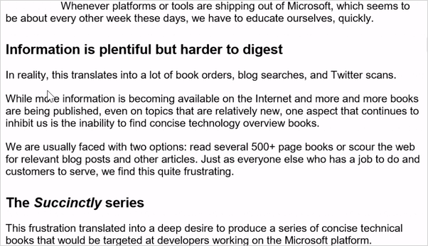
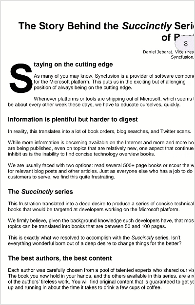

# Selecting text from a PDF document in .NET MAUI PDF Viewer (SfPdfViewer)

Using [SfPdfViewer](https://help.syncfusion.com/cr/maui/Syncfusion.Maui.PdfViewer.SfPdfViewer.html), you can select text from a PDF document and copy it to the clipboard. This process allows you to easily extract a text from the PDF and paste it to other applications.

## Selection using mouse

In desktop platforms like macOS and Windows, you can select text using the mouse pointer by clicking and dragging over the text you want to select. You will notice that the selected text is highlighted when you move the pointer. 

## Selection using touch

In mobile platforms such as Android and iOS, the long press text selection feature allows you to select text by pressing and holding the finger on the screen. Refer to the following steps for long-press text selection on a mobile device.

1.	Locate the text you want to select.
2.	Place your finger on the screen and hold it against the text you wish to select.
3.	The word is highlighted and there are selection handles that appear at the start and end of the selection.
4.	You can move the selection handles to modify or extend the text selection.

## Copy the selected text

After you have selected the desired text, click the <b>Copy</b> option that appears to copy it to the clipboard.  The selected text is now copied to the clipboard and ready for pasting into other applications.

N> In desktop platforms, you can also use the keyboard shortcut <code>Ctrl</code> + <code>C</code> (<code>Command</code> + <code>C</code> on MAC) to copy the text.

## Disabling text selection

The [EnableTextSelection](https://help.syncfusion.com/cr/maui/Syncfusion.Maui.PdfViewer.SfPdfViewer.html#Syncfusion_Maui_PdfViewer_SfPdfViewer_EnableTextSelection) property allows you to enable or disable the text selection in the `SfPdfViewer`. You can assign it a value of `False` to disable the text selection. This can be helpful in situations when you want to prevent users from selecting and copying text contents from the PDF files that are being displayed.

Refer to the following code example to disable the text selection.




<syncfusion:SfPdfViewer x:Name="PdfViewer" EnableTextSelection="False"/>




	SfPdfViewer PdfViewer = new SfPdfViewer();
	PdfViewer.EnableTextSelection = false;




## Customize the text selection highlight color

The [TextSelectionSettings](https://help.syncfusion.com/cr/maui/Syncfusion.Maui.PdfViewer.TextSelectionSettings.html) provides the customizable options for the text selection. The [HighlightColor](https://help.syncfusion.com/cr/maui/Syncfusion.Maui.PdfViewer.TextSelectionSettings.html#Syncfusion_Maui_PdfViewer_TextSelectionSettings_HighlightColor) property of the ‘TextSelectionSettings’ allows you to customize the color of the text highlight when you selected it. 

Refer to the following code sample to change the highlight color.




    <syncfusion:SfPdfViewer x:Name="PdfViewer">
        <syncfusion:SfPdfViewer.TextSelectionSettings>
            <syncfusion:TextSelectionSettings 
                    HighlightColor="#43FFFF00"/>
        </syncfusion:SfPdfViewer.TextSelectionSettings>
    </syncfusion:SfPdfViewer>




	SfPdfViewer PdfViewer = new SfPdfViewer();
	PdfViewer.TextSelectionSettings.HighlightColor = Color.FromRgba(255, 255, 0, 127);




N> The color of the selection handles also will be modified to match the text highlight color, but with full opacity.

## Handling selected text from application

The [TextSelectionChanged](https://help.syncfusion.com/cr/maui/Syncfusion.Maui.PdfViewer.SfPdfViewer.html#Syncfusion_Maui_PdfViewer_SfPdfViewer_TextSelectionChanged) event occurs when the text selection is completed, or when the selected text is modified in any way. This event provides the selected text and the way to prevent the display of the default context menu by handling the selected text from the application level.

The event arguments properties that are listed below are available in the text selection changed event.

1.	<b>[SelectedText](https://help.syncfusion.com/cr/maui/Syncfusion.Maui.PdfViewer.TextSelectionChangedEventArgs.html#Syncfusion_Maui_PdfViewer_TextSelectionChangedEventArgs_SelectedText)</b> - Provides the selected text.

2.	<b>[PageNumber](https://help.syncfusion.com/cr/maui/Syncfusion.Maui.PdfViewer.TextSelectionChangedEventArgs.html#Syncfusion_Maui_PdfViewer_TextSelectionChangedEventArgs_PageNumber)</b> - Provides the page number at which the text is selected.

3.	<b>[Handled](https://help.syncfusion.com/cr/maui/Syncfusion.Maui.PdfViewer.TextSelectionChangedEventArgs.html#Syncfusion_Maui_PdfViewer_TextSelectionChangedEventArgs_Handled)</b> -  A boolean value indicating whether the event has been handled or processed by an event handler. By setting the `Handled` property to true, you indicate that the event is handled at the application-level event handler and no further action is necessary. So that the default copy context menu will not appear.

Refer to the following code sample that explains how to wire the event to handle the selected text at the application level and prevent the default copy context menu from appearing.




	public MainPage()
	{
		InitializeComponent();
        PdfViewer.TextSelectionChanged += PdfViewer_TextSelectionChanged;
    }

    private void PdfViewer_TextSelectionChanged(object sender, TextSelectionChangedEventArgs e)
    {
        string selectedText = e.SelectedText;
        int pageNumber = e.PageNumber;
        // Write your logic to handle the selected text and set the ‘Handled’ to true, to prevent the default copy context menu from appearing.
        e.Handled = true;
    }




## Limitations

The text from the images cannot be selected and, the multiple-page text selection is not supported for now.
