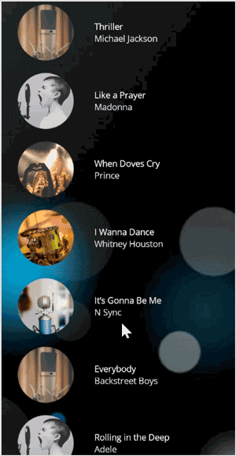

# Getting Started with .NET MAUI Parallax View (SfParallaxView)

This section explains the steps required to configure the [`SfParallaxView`]() control and add basic elements to it using various APIs.

## Creating an application using .NET MAUI Parallax View control

1. Create a new .NET MAUI application in Visual studio.
2. Syncfusion .NET MAUI components are available in [nuget.org](https://www.nuget.org/). To add SfParallaxView to your project, open the NuGet package manager in Visual Studio, search for Syncfusion.Maui.ParallaxView and then install it.
3. To initialize the control, import the Parallax View namespace.
4. Initialize [SfParallaxView]().

 



    <ContentPage
        . . .    
        xmlns:parallaxView="clr-namespace:Syncfusion.Maui.ParallaxView;assembly=Syncfusion.Maui.ParallaxView">
        <Grid>
            <parallaxView:SfParallaxView/>
        </Grid>
    </ContentPage>
 




    using Syncfusion.Maui.ParallaxView;
    namespace ParallaxView_GettingStarted
    {
        public partial class MainPage : ContentPage
        {
            public MainPage()
            {
                InitializeComponent();           
                SfParallaxView parallaxView = new SfParallaxView(); 
                this.Content = parallaxView;
            }
        }   
    }





## Register the handler

Syncfusion.Maui.Core Nuget is a dependent package for all Syncfusion controls of .NET MAUI. In the MauiProgram.cs file, register the handler for Syncfusion core.



    using Microsoft.Extensions.Logging;
    using Syncfusion.Maui.Core.Hosting;

    namespace ParallaxView_GettingStarted
    {
        public static class MauiProgram
        {
            public static MauiApp CreateMauiApp()
            {
                var builder = MauiApp.CreateBuilder();
                builder
                .UseMauiApp<App>()
                .ConfigureSyncfusionCore()
                .ConfigureFonts(fonts =>
                {
                    fonts.AddFont("OpenSans-Regular.ttf", "OpenSansRegular");
                });

                return builder.Build();
            }
        }
    }



## Add content to the parallax view

### Content

The [`Content`]() represents the background view of a parallax view. Set any kind of view to the [`Content`]() property, such as Image and StackLayout.

The following code sample demonstrates how to set the content property to the parallax view.





   <ContentPage xmlns="http://schemas.microsoft.com/dotnet/2021/maui"
             xmlns:x="http://schemas.microsoft.com/winfx/2009/xaml"
             xmlns:local="clr-namespace:ParallaxSample"
             xmlns:parallax="clr-namespace:Syncfusion.Maui.ParallaxView;assembly=Syncfusion.Maui.ParallaxView"
             x:Class="ParallaxView_GettingStarted.MainPage">
      
    <ContentPage.Content>
        <Grid>            
        <parallax:SfParallaxView x:Name="parallaxview">
            <parallax:SfParallaxView.Content>
                <Image Source="{Binding Image}" BackgroundColor="Transparent" HorizontalOptions="Fill" VerticalOptions="Fill" Aspect="AspectFill" />
            </parallax:SfParallaxView.Content>
        </parallax:SfParallaxView>       
        </Grid>
    </ContentPage.Content>
	
    </ContentPage>





    using Syncfusion.Maui.ParallaxView;

    namespace ParallaxView_GettingStarted
    {
        public partial class MainPage : ContentPage
        {
            public MainPage()
            {
                InitializeComponent();
                BindingContext = new ParallaxViewModel();
            }
        }

        public class ParallaxViewModel
        {
            public ImageSource Image { get; set; }

            public ParallaxViewModel()
            {
                Image = ImageSource.FromResource("ParallaxView_GettingStarted.ParallaxGuitar1.png", typeof(MainPage).GetTypeInfo().Assembly);
            }
        }  
    }  




## Bind source to the parallax view

### Source

The [`Source`]() represents the foreground view of the parallax view. The value of the [`Source`]() should be a scrollable content or the view which implements the [IParallaxView]() interface.

Currently, the [SfParallaxView]() directly supports the following controls. Bind the control to the [`Source`]() property.

    1. ScrollView
    2. ListView

The following code sample demonstrates how to bind the ListView to the [`Source`]() property.





  <ContentPage xmlns="http://schemas.microsoft.com/dotnet/2021/maui"
             xmlns:x="http://schemas.microsoft.com/winfx/2009/xaml"
             xmlns:local="clr-namespace:ParallaxSample"
             xmlns:parallax="clr-namespace:Syncfusion.Maui.ParallaxView;assembly=Syncfusion.Maui.ParallaxView"
             x:Class="ParallaxView_GettingStarted.MainPage">
      
    <ContentPage.Content>
        <Grid>
            <parallax:SfParallaxView Source="{x:Reference Name = listview}" x:Name="parallaxview" >
                <parallax:SfParallaxView.Content>
                <Image BackgroundColor="Transparent" Source="{Binding Image}" HorizontalOptions="Fill" VerticalOptions="Fill" Aspect="AspectFill" />
                </parallax:SfParallaxView.Content>
            </parallax:SfParallaxView>
     
            <ListView x:Name="listview" ItemsSource="{Binding Items}" BackgroundColor="Transparent" ItemSize="100">
                <ListView.ItemTemplate>
                    <DataTemplate>
                        <ViewCell>
                            <Grid Padding="20,0,20,0" RowSpacing="50">
                                <StackLayout BackgroundColor="Transparent" Grid.Column="1" Padding="0,0,0,0" VerticalOptions="CenterAndExpand" HorizontalOptions="StartAndExpand" Orientation="Vertical">
                                    <Label HorizontalOptions="Start" TextColor="White" Text="{Binding Name}" Font="25">
                                    </Label>
                                    <Label HorizontalOptions="Start" Text="{Binding Author}" TextColor="White">
                                    </Label>
                                </StackLayout>
                            </Grid>
                        </ViewCell>
                    </DataTemplate>
                </ListView.ItemTemplate>
            </ListView>
        </Grid>
    </ContentPage.Content>
	
    </ContentPage>





    public partial class MainPage : ContentPage
    {
        public MainPage()
        {
            InitializeComponent();
            BindingContext = new ParallaxViewModel();
        }
    }

    public class ParallaxViewModel
    {
        public ImageSource Image { get; set; }

        public ObservableCollection<Contacts> Items { get; set; }
        public ParallaxViewModel()
        {
            Image = ImageSource.FromResource("ParallaxView_GettingStarted.ParallaxGuitar1.png", typeof(MainPage).GetTypeInfo().Assembly);
            Items = new ObservableCollection<Contacts>()
            {
                new Contacts() { Name = "Thriller", Author = "Michael Jackson" },
                new Contacts() { Name = "Like a Prayer", Author = "Madonna" },
                new Contacts() { Name = "When Doves Cry", Author = "Prince" },
                new Contacts() { Name = "I Wanna Dance", Author = "Whitney Houston" },
                new Contacts() { Name = "It’s Gonna Be Me", Author = "N Sync"},
                new Contacts() { Name = "Everybody", Author = "Backstreet Boys"},
                new Contacts() { Name = "Rolling in the Deep", Author = "Adele" },
                new Contacts() { Name = "Don’t Stop Believing", Author = "Journey" },
                new Contacts() { Name = "Billie Jean", Author = "Michael Jackson" },             
                new Contacts() { Name = "Firework", Author = "Katy Perry"},               
                new Contacts() { Name = "Thriller", Author = "Michael Jackson" },
                new Contacts() { Name = "Like a Prayer", Author = "Madonna" },
                new Contacts() { Name = "When Doves Cry", Author = "Prince" },
                new Contacts() { Name = "I Wanna Dance", Author = "Whitney Houston" },
                new Contacts() { Name = "It’s Gonna Be Me", Author = "N Sync" },
                new Contacts() { Name = "Everybody", Author = "Backstreet Boys" },
                new Contacts() { Name = "Rolling in the Deep", Author = "Adele" },
                new Contacts() { Name = "Don’t Stop Believing", Author = "Journey"},
            };
        }
    }

    public class Contacts
    {
        public string Name
        {
            get;
            set;
        }
        public string Author
        {
            get;
            set;
        }
    }





N> The size of the [`Content`]() view will automatically be stretched to the size of the [`Source`]() view.

You can find the complete getting started sample from this link: [Sample]()
